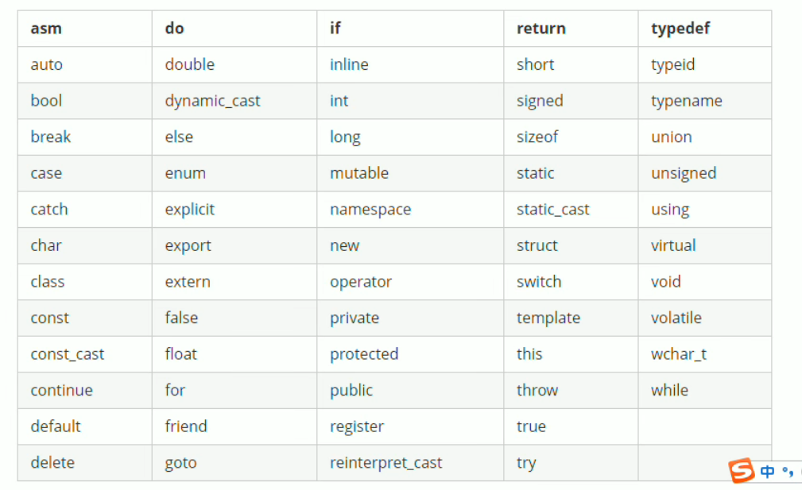
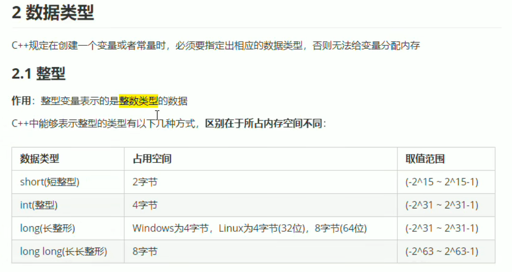
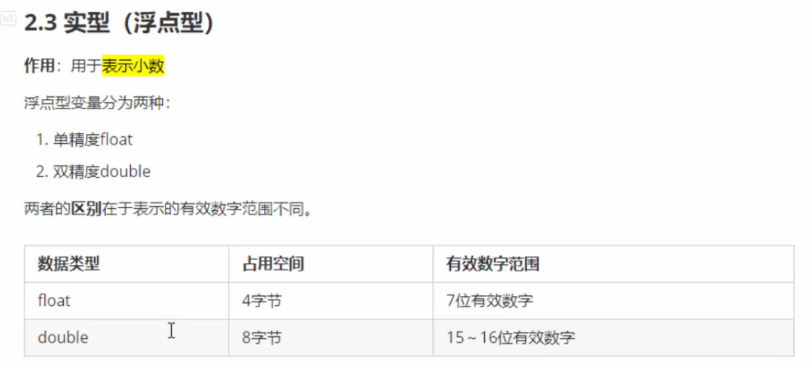

## 关键字

- 

## 数据类型

- 

- 

## C++核心编程

### 1 内存分区模型

---

C＋+程序在执行时，将内存大方向划分为4个区域

- 代码区: 存放函数体的二进制代码，由操作系统进行管理的
- 全局区:存放全局变量和静态变量以及常量
- 栈区:由编译器自动分配释放,存放函数的参数值,局部变量等
- 堆区:由程序员分配和释放,若程序员不释放,程序结束时由操作系统回收

**内存四区意义:**

​	不同区域存放的数据，赋予不同的生命周期,给我们更大的灵活编程

#### 1.1程序运行前

#### 1.2 程序运行后

### 2 引用

### 3 函数提高

### 4 类和对象

### 5 文件操作

