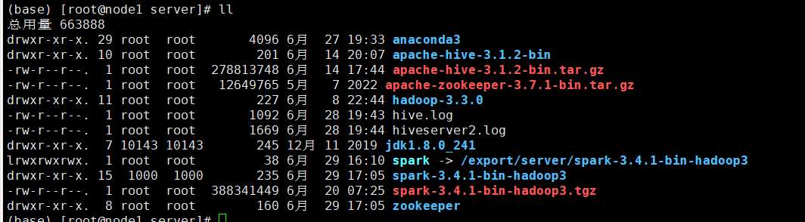
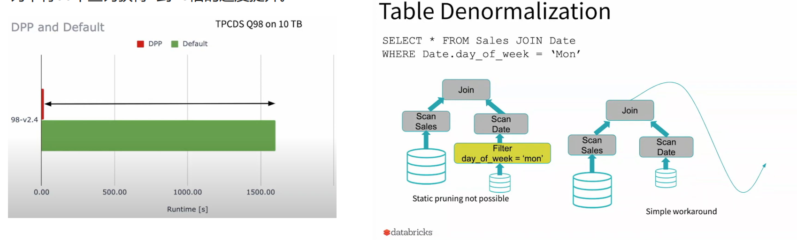

[TOC]


# 数据库范式建模

- 星形模型

  

- 雪花模型

  


# 数仓分层设计


# Hadoop三大组件：

1. HDFS

   - 主从架构：

   - 分布式文件存储系统，可以通过网络访问文件，设置文件备份数量，缺点：占用存储较大

2. MapReduce

   - 是Hadoop中的分布式计算组件

   - 分为Map和Reduce接口，Map：主要提供数据的并行计算，Reduce：主要提供数据的聚合，汇总得到结果。

   - 运行机制：将执行的任务分为多个 Map 任务和 Reduce 任务，然后将他们分配到对应的机器上去执行。
   - MapReduce基于yarn运行

3. Yarn

   - 主从架构：

   - 作用：集群的资源调度
   - 通过创建容器来占用资源，让应用运行在容器内
   - 辅助角色：
     - 代理服务器（ProxyServer）：应用程序代理，Yarn在公网运行时，可能会被网络工具，开启后可以提高安全性
     - 历史服务器（JobHistoryServer）：记录Yarn运行过的应用程序历史信息记录


# 1. Hadoop命令记录

## 1.1 Hadoop系统基础命令

- 启动系统全部的软件

  ```shell
  [root@node1 ~]# start-all.sh 
  Starting namenodes on [node1]
  上一次登录：三 6月 14 10:14:32 CST 2023从 10.10.10.1pts/0 上
  Starting datanodes
  上一次登录：三 6月 14 10:14:50 CST 2023pts/0 上
  Starting secondary namenodes [node2]
  上一次登录：三 6月 14 10:14:53 CST 2023pts/0 上
  Starting resourcemanager
  上一次登录：三 6月 14 10:14:56 CST 2023pts/0 上
  Starting nodemanagers
  上一次登录：三 6月 14 10:14:59 CST 2023pts/0 上
  ```

- hdfs

  ```shell
  # 显示hdfs文件系统的根目录
  [root@node1 ~]# hadoop fs -ls /
  Found 3 items
  drwxr-xr-x   - root supergroup          0 2023-06-08 22:55 /Temp
  drwx------   - root supergroup          0 2023-06-08 23:00 /tmp
  drwxr-xr-x   - root supergroup          0 2023-06-08 23:00 /user
  
  # 创建文件
  [root@node1 ~]# hadoop fs -mkdir -p /T/t.sh
  [root@node1 ~]# hadoop fs -ls /T
  Found 1 items
  drwxr-xr-x   - root supergroup          0 2023-06-14 10:16 /T/t.sh
  
  # 显示本地文件系统
  [root@node1 ~]# hadoop fs -ls file:///
  Found 20 items
  dr-xr-xr-x   - root root      24576 2023-06-08 17:36 file:///bin
  dr-xr-xr-x   - root root       4096 2023-06-07 23:50 file:///boot
  drwxr-xr-x   - root root       3200 2023-06-14 10:12 file:///dev
  drwxr-xr-x   - root root       8192 2023-06-14 10:12 file:///etc
  ....
  
  # put上传文件到hdfs
  [root@node1 ~]# hadoop fs -put anaconda-ks.cfg /Temp
  [root@node1 ~]# hadoop fs -ls /Temp
  Found 1 items
  -rw-r--r--   3 root supergroup       1217 2023-06-14 10:30 /Temp/anaconda-ks.cfg
  
  # get下载hdfs文件到本地
  [root@node1 ~]# hadoop fs -get /Temp .
  [root@node1 ~]# ls
  anaconda-ks.cfg  Temp
  
  # 副本和block
  # 上传文件时修改副本数
  [root@node1 ~]# hadoop dfs -D dfs.replication=2 -put test.txt /temp
  # 修改已存在的副本数
  [root@node1 ~]# hadoop fs -setrep 2 /temp/test.txt
  # 检查文件状态
  [root@node1 ~]# hdfs fsck path [-files [-blocks [-location]]]
  ```

- MapReduce

  ```shell
  [root@node1 mapreduce]# hadoop jar hadoop-mapreduce-examples-3.3.0.jar pi 10 10
  ```

- Hive

  ```shell
  # metastore 前台启动  关闭ctrl+c
  /export/server/apache-hive-3.1.2-bin/bin/hive --service metastore
  
  # metastore 前台启动开启debug日志
  /export/server/apache-hive-3.1.2-bin/bin/hive --service metastore --hiveconf hive.root.logger=DEBUG,console  
  
  # metastore 后台启动 进程挂起  关闭使用jps+ kill -9
  nohup /export/server/apache-hive-3.1.2-bin/bin/hive --service metastore >metastore.log  2>&1 &
  
  # hiveserver2
  nohup /export/server/apache-hive-3.1.2-bin/bin/hive --service hiveserver2 >hiveserver2.log 2>&1 &
  
  #注意 启动hiveserver2需要一定的时间  不要启动之后立即beeline连接 可能连接不上
  ```

- beeline：SQL客户端

  ```shell
  # 进入beeline
  /export/server/apache-hive-3.1.2-bin/bin/beeline
  
  # 链接node1的hive
  beeline> ! connect jdbc:hive2://node1:10000
  beeline> root
  beeline> 直接回车
  ```

  - load：加载文件


  ```shell
  # 从本地加载(复制)  [OVERWRITE]:可选，覆盖表的内容
  load data local inpath '/root/Hive-data/students.txt' [OVERWRITE] into table database_name.table_name;
  
  # 从hdfs文件系统加载（移动）
  load data inpath '/tmp/students.txt' [OVERWRITE] into table database_name.table_name;
  ```


# 2. Hive数据库

> 基于MapReduce，将SQL转换为MapReduce来运行

## 2.1启动Hive

1. 启动metastore服务

   元数据服务，存储表的基本信息，有哪些表，分隔符，数据类型等等

```shell
#后台启动 进程挂起  关闭使用jps+ kill -9
nohup /export/server/apache-hive-3.1.2-bin/bin/hive --service metastore > /export/server/hive.log 2>&1 &
```

2. 启动hiveserver2服务

   Hive的ThriftServer服务，提供接口给别的客户端连接使用hive

```shell
#注意 启动hiveserver2需要一定的时间  不要启动之后立即beeline连接 可能连接不上
nohup /export/server/apache-hive-3.1.2-bin/bin/hive --service hiveserver2 > /export/server/hiveserver2.log 2>&1 &
```

3. beeline客户端连接

```shell
# 打开beeline
/export/server/apache-hive-3.1.2-bin/bin/beeline
# 访问node1
beeline> ! connect jdbc:hive2://node1:10000
beeline> root
beeline> 直接回车
```


## 2.2 内部表和外部表

|        | 创建                                     | 存储位置                                 | 删除数据             | 理念                   |
| :----- | :--------------------------------------- | :--------------------------------------- | :------------------- | :--------------------- |
| 内部表 | CREATE TABLE ....                        | Hive管理，默认位置：/user/hive/warehouse | 删除`元数据`和`数据` | Hive管理的表，持久使用 |
| 外部表 | CREATE EXTERNAL TABLE .... LOCALTION ... | 随意，由`LOCALTION`关键字指定            | 仅删除`元数据`       | 临时表，外部数据使用   |


## 2.3 基本函数

- ```hive
  -----------------Hive 常用的内置函数----------------------
  
  -- 显示有哪些函数
  show functions;
  # 查看函数的介绍
  describe function extended count;
  
  ------------String Functions 字符串函数------------
  select length("temp");
  select reverse("itcast");
  
  select concat("angela", "baby");
  --带分隔符字符串连接函数：concat_ws(separator, [string | array(string)]+)
  select concat_ws('.', 'www', array('itcast', 'cn'));
  -- 统计长度
  select length(column_name) from table;
  -- 小写
  select lower(column_name) from table;
  select upper(column_name) from table;  -- 大写
  -- 去除收尾的空格
  select trim('   aaa  ') from table;
  
  --字符串截取函数：substr(str, pos[, len]) 或者  substring(str, pos[, len])
  select substr("angelababy", -2); --pos是从1开始的索引，如果为负数则倒着数
  select substr("angelababy", 2, 2);
  --分割字符串函数: split(str, regex)
  --split针对字符串数据进行切割  返回是数组array  可以通过数组的下标取内部的元素 注意下标从0开始的
  select split('apache hive', ' ');
  select split('apache hive', ' ')[0];
  select split('apache hive', ' ')[1];
  
  -- 加密
  select mask_hash('hadoop');  -- hash加密,返回16进制
  select hash('aaa');  -- hash加密，返回数字
  select md5(‘aaa);  -- md5加密
  -- 查看当前用户
  select current_user();
  -- 当前use的数据库
  select current_database();
  select version();  -- 版本
  
  
  ----------- Date Functions 日期函数 -----------------
  --获取当前日期: current_date
  select current_date();
  --获取当前UNIX时间戳函数: unix_timestamp
  select unix_timestamp();
  --日期转UNIX时间戳函数: unix_timestamp
  select unix_timestamp("2011-12-07 13:01:03");
  --指定格式日期转UNIX时间戳函数: unix_timestamp
  select unix_timestamp('20111207 13:01:03', 'yyyyMMdd HH:mm:ss');
  --UNIX时间戳转日期函数: from_unixtime
  select from_unixtime(1618238391);
  select from_unixtime(0, 'yyyy-MM-dd HH:mm:ss');
  
  --日期比较函数: datediff  日期格式要求'yyyy-MM-dd HH:mm:ss' or 'yyyy-MM-dd'
  select datediff('2012-12-08', '2012-05-09');
  --日期增加函数: date_add
  select date_add('2012-02-28', 10);
  --日期减少函数: date_sub
  select date_sub('2012-01-1', 10);
  -- 获取当前时间戳
  select current_timestamp();
  -- 当前日期
  select current_date();
  -- 时间戳转日期
  select to_date(current_timestamp());
  -- 年月日季度
  select year('2020-01-11');
  select month('2020-01-11');
  select day('2020-01-11');
  select quarter('2020-01-11');  -- 季度
  select dayofmonth('2020-01-11');
  select hour('2020-01-11');
  select minute('2020-01-11');
  select second('2020-01-11');
  select weekofyear('2020-01-11');
  
  
  ----Mathematical Functions 数学函数-------------
  --取整函数: round  返回double类型的整数值部分 （遵循四舍五入）
  select round(3.1415926);
  --指定精度取整函数: round(double a, int d) 返回指定精度d的double类型
  select round(3.1415926, 4);
  --取随机数函数: rand 每次执行都不一样 返回一个0到1范围内的随机数
  select rand();
  --指定种子取随机数函数: rand(int seed) 得到一个稳定的随机数序列
  select rand(3);
  
  select abs(-1); -- 绝对值
  select pi(); -- 圆周率
  -- array 排序
  select *,sort_array(column_name) from test_array;
  -- 类型转换
  select binary('hadoop'); -- 转换为二进制
  select cast('1' as bigint)  -- 自由转换，1转换为bigint，如果类型转换失败，则返回null
  
  
  -----Conditional Functions 条件函数------------------
  --使用之前课程创建好的student表数据
  select *
  from student
  limit 3;
  
  --if条件判断: if(boolean testCondition, T valueTrue, T valueFalseOrNull)
  select if(1 = 2, 100, 200); -- 三元表达式
  select if(sex = '男', 'M', 'W')
  from student
  limit 3;
  
  -- 空值判断, 返回true，false
  select isnull(column_name) from table;
  select isnotnull(column_name) from table;
  --空值转换函数: nvl(T value, T default_value)
  select nvl("allen", "itcast");
  select nvl(null, "itcast");
  
  --条件转换函数: CASE a WHEN b THEN c [WHEN d THEN e]* [ELSE f] END
  select name, case age when 10 then 'child' when 100 then 'old' else 'people' end from table;
  select name, case sex when sex='男' then 'male' else 'femalshoe' end from table;
  -- 判断 name是否等于NULL，如果相等则返回null，也就是替换为null
  select name, nullif(name, NULL) from table;
  -- 类似 python的 assert
  select assert_true(0 < 1);
  
  ```
  
- 自定义函数

  

## 2.4 SQL

### 2.4.1 数据类型

```hive
-- hive数据类型-array、map、struct
create table big_data.test_array(name string, works_loc array<sting>)
row format delimited fields terminated by '\t'  -- 表字段使用\t分割
collection items terminated by ',';  -- array类型的数据使用 , 分割
-- 查询单个array内的数据
select name,works_loc[0] from big_data.test_array;
-- 查询array中包含的数据
select * from big_data.test_array where ARRAY_CONTAINS(word_loc, 'value');
-- 查询array中的个数
select name,SIZE(word_loc) from big_data.test_array;

-- map
create table big_data.test_map(id int,name string, members map<string,string>, age int)
row format delimited fields termainated by ','
COLLECTION ITEMS TERMINATED BY '#'  -- 分开每条数据
MAP KEYS TERMINATED BY ':';  --  k:v
-- 查询指定key
select id,name,members['key'] from big_data.test_map;
-- 查询所有的key,返回的类型是array
select map_keys(members) from  big_data.test_map;
select map_values(members) from  big_data.test_map;
-- 查看键值对的个数
select name, SIZE(members) from  big_data.test_map;
-- 查询包含map-keys或者values的数据
select * from  big_data.test_map where ARRAY_CONTAINS(MAP_KEYS(members), 'key-value');

-- struct,符合数据类型，一个列中允许包含另一个子列
create table  big_data.test_struct(
	id int,
    info struct<name:string, age:int>
) row format delimited fields termainated by '#'
COLLECTION ITEMS TERMINATED BY ':'  -- struct中的二级分隔符
select id,info.name form big_data.test_struct;
```

### 总结


### 2.4.2 基本操作

```hive
--查询当前数据库
select current_database();

-- 查看表类型
DESC formatted table_name;

-- 类外部表类型转换
alter table table_name set tblproperties('EXTENAL'='TRUE');
-- 修改表注释
alter table table_name set tblproperties('commemt'='table comment');

-- 修改表名
alter table old_name rename to new_name;

-- 添加分区,不会有数据，但是会创建相关文件夹
alter table table_name add partition(year='2019', month='10', day='01')
-- 修改分区值-- 修改元数据记录，文件夹不会改变
alter table table_name partition(year='2019', month='10', day='01') rename to partition(year='2011', month='11'. day='11')
-- 删除分区，只是删除元数据
alter table table_name drop partition(year='2019', month='10', day='01')

-- 添加列
alter table table_name add columns(v1 int, v2 string);
-- 修改列,只能修改名字，不能修改类型
alter table table_name change v1 v1_new_name int);
-- 删除表
drop table table_name;
-- 清空表数据,外部表无法清空
truncate table table_name;

-- 正则匹配  (反斜杠需要两个一起写)
select * from table_name where column_name RLIKE '正则表达式';

-- 联合查询, UNION默认会对数据去重
select * from table_name where name ='aa'
UNION
select * from table_name2 where name='bb';
-- UNION ALL 不去重
select * from table_name where name ='aa';
UNION ALL
select * from table_name2 where name='bb';
```

### 2.4.4 语法例子

```hive

--step1:建表，内部表
create table student_local
(
    num  int,
    name string,
    sex  string,
    age  int,
    dept string
) row format delimited fields terminated by ',';  -- 设置文件分隔符，默认分隔符是 \001
-- 建表：外部表
create EXTERNAL table student_local
(
    num  int,
    name string,
    sex  string,
    age  int,
    dept string
) row format delimited fields terminated by ','
location '/tmp/test1'; -- 设置外部表存储的位置

--step2:本地加载数据
-- 语法：LOAD DATA [LOCAL] INPATH 'filepath' [OVERWRITE] INTO TABLE table_name;
LOAD DATA LOCAL INPATH '/root/hivedata/students.txt' INTO TABLE student_local;
-- 从hdfs加载数据
LOAD DATA INPATH '/students.txt' INTO TABLE student_HDFS;

--数据导出到文件
--语法：insert overwrite [local] directory 'path' select * from stu;
insert overwrite local directory '~/temp/export2/export2.txt' select * from stu;
-- 将查询的结果导出到HDFS上，并指定分隔符
insert overwrite directory '/tmp/export' row format delimited fields terminated by '\t' select * from stu;
-- 使用 hive 可执行文件导出，shell
bin/hive -e "SELECT * FROM stu" > ~/temp/export3/export3.txt
bin/hive -f xxx.sql > ~/temp/export4/export4.txt


--使用insert+select插入数据到新表中
insert into table student_from_insert
select sno, sname
from student_from_insert;

-- where
--注意：where条件中不能使用聚合函数  可以使用Having实现
--而where子句还处于“确定”结果集的过程中，因而不能使用聚合函数。
select *
from t_usa_covid19
where 1 > 2; -- 1 > 2 返回false

--找出来自于California州的疫情数据
select *
from t_usa_covid19
where state = 'California';
--where条件中使用函数 找出州名字母长度超过10位的有哪些
select *
from t_usa_covid19
where length(state) > 10;

--可以使用Having实现
select state, sum(deaths)
from t_usa_covid19
group by state
having sum(deaths) > 100;

-- 去重 distinct
select count( distinct county) as county_cnts
from t_usa_covid19;


-- 分组
--先where分组前过滤，再进行group by分组， 分组后每个分组结果集确定 再使用having过滤
select state, sum(deaths)
from t_usa_covid19
where count_date = "2021-01-28"
group by state
having sum(deaths) > 10000;
--这样写更好 即在group by的时候聚合函数已经作用得出结果 having直接引用结果过滤 不需要再单独计算一次了
select state, sum(deaths) as cnts
from t_usa_covid19
where count_date = "2021-01-28"
group by state
having cnts > 10000;

-- 排序  limit
--不写排序规则 默认就是asc升序
select *
from t_usa_covid19
order by cases asc limit 2,10;


--1、inner join 等价于 join
select e.id, e.name, e_a.city, e_a.street
from employee e
         inner join employee_address e_a
                    on e.id = e_a.id;
                    
--等价于 隐式连接表示法
select e.id, e.name, e_a.city, e_a.street
from employee e,
     employee_address e_a
where e.id = e_a.id;

--2、left join  等价于 left outer join
select e.id, e.name, e_conn.phno, e_conn.email
from employee e
         left join employee_connection e_conn
                   on e.id = e_conn.id;
```


## 2.5分区表

> 分区表可以提高数据查询的效率
>
> 可以选择字段作为分区
>
> 分区就是存储在HDFS上的不同的子文件夹

```hive
-- 单级分区表
create table bigdata.score(id string, cid string, score int) partitioned by (month string)
row format delimited fields terminated by '\t';

load data local inpath '/home/hadoop/score.txt'
into table bigdata.score partition(month='01');

-- 多级分区表
create table bigdata.score2(id string, cid string, score int) partitioned by (year string, month string, day string)
row format delimited fields terminated by '\t';

load data local inpath '/home/hadoop/score.txt'
into table bigdata.score2 partition(year='2023', month='01', day='01'); -- 有几个分区就要指定几个
```

## 2.6分桶表

> 存储在同一文件夹，不同文件中，按照固定的数量来拆分
>
> 数据的拆分是根据 分桶列的值进行hash取模计算来拆分的，load data只是单纯的移动数据，没有经过计算，所以不能使用load data向分桶的表中加载数据，insert select 会 调用 MapReduce，才能使用计算，来计算数据应该分配到的桶。

```hive
-- 开启分桶自动优化
set hive.enforce.bucketing=true;
-- 创建分桶表
create table course(c_id string, c_name string, t_id string) clustered by(c_id)
into 3 buckets row format delimited fields terminated by '\t';
-- 加载数据，只能通过 insert select 加载
-- 使用 load data 向临时表加载数据，然后  insert select 加载到正式表
load data local inpath '/home/hadoop/course.txt' into table bigdata.course_temp;
insert overwrite tagble course select * from bigdata.course_temp cluster by(c_id);
```

##  总结

分区的优势：在指定分区列的前提下，减少被操作的数据量，带来性能的提升。

分桶的优势：基于分桶列的特定操作，如：单值过滤、join、分组都可以带来性能的提升，可以提前通过计算来确定只需要的桶，取只需要的数据。

分区和分桶可以同时使用，如果同时使用了，那么每个分区都有n个桶。


## 函数

### 随机分桶抽样 TABLESAMPLE


```hive
-- 根据 Column 列抽样，使用hash取模，然后去抽样，每次取的数据是固定的
select * from employee_connection tablesample(bucket 3 out of 10 on name);
-- 完全随机，每一次的结果不一样
select * from employee_connection tablesample(bucket 3 out of 10 on rand());
```

### 分块抽样


```hive
-- 取前100条数据
select * from employee_connection tablesample(100 rows);
-- 取前10%的数据
select * from employee_connection tablesample(10 percent);
-- 取1kb的数据
select * from employee_connection tablesample(1k);
```

### 虚拟列

- INPUT_FILE_NAME：显示数据行所在的具体文件
- BLOCK_OFFSET_INSIDE_FILE：显示数据行所在文件的偏移量
- ROW_OFFSET_INSIDE_BLOCK：显示数据所在的HDFS块的偏移量
  - 此虚拟列需要设置：`SET hive.exec.rowoffset=true` 才能使用

```hive
select *,INPUT_FILE_NAME,BLOCK_OFFSET_INSIDE_FILE,ROW_OFFSET_INSIDE_BLOCK from table;
```

## 


## Q&A

- 查询结果或者注释显示中文乱码

  ```sql
  -- 注意 下面sql语句是需要在MySQL中执行  修改Hive存储的元数据信息（metadata）
  use hive3;
  show tables;
  
  alter table hive3.COLUMNS_V2 modify column COMMENT varchar(256) character set utf8;
  alter table hive3.TABLE_PARAMS modify column PARAM_VALUE varchar(4000) character set utf8;
  alter table hive3.PARTITION_PARAMS modify column PARAM_VALUE varchar(4000) character set utf8 ;
  alter table hive3.PARTITION_KEYS modify column PKEY_COMMENT varchar(4000) character set utf8;
  alter table hive3.INDEX_PARAMS modify column PARAM_VALUE varchar(4000) character set utf8;
  ```

  


# 3. zookeeper安装

> **注意**：zk的版本和spark和hadoop的版本得对得上才行！！！

然后安装步骤看word文档

版本对应说明：




# 4.Spark

## 4.1 Spark基础

> 定义：Apache Spark是用于**大规模数据**处理的**统一分析引擎**


### 4.1.1Spark是什么

- 统一分析引擎？
- Spark是一款分布式内存计算的统一分析引擎。
- 其特点就是对任意类型的数据进行自定义计算。
- Spark可以计算：结构化、半结构化、非结构化等各种类型的数据结构，同时也支持使用Python、 Java、 Scala、 R以及SQL语言去开发应用程序计算数据。
- Spark的适用面非常广泛，所以，被称之为 统一的（适用面广）的分析引擎（数据处理）  


### 4.1.2 Spark VS Hadoop(MapReduce)  

|              | Hadoop                                    | Spark                                                        |
| ------------ | ----------------------------------------- | ------------------------------------------------------------ |
| 类型         | 基础平台, 包含计算, 存储, 调度            | 纯计算工具（分布式）                                         |
| 场景         | 海量数据批处理（磁盘迭代计算）            | 海量数据的批处理（内存迭代计算、交互式计算）、海量数 据流计算 |
| 价格         | 对机器要求低, 便宜                        | 对内存有要求, 相对较贵                                       |
| 编程范式     | Map+Reduce, API 较为底层, 算法适应性差    | RDD组成DAG有向无环图, API 较为顶层, 方便使用                 |
| 数据存储结构 | MapReduce中间计算结果在HDFS磁盘上, 延迟大 | RDD中间运算结果在内存中 , 延迟小                             |
| 运行方式     | Task以进程方式维护, 任务启动慢            | Task以线程方式维护, 任务启动快，可批量创建提高并行能 力      |

- 在计算层面， Spark相比较MR（MapReduce）有巨大的性能优势，但至今仍有许多计算工具基于MR构架，比如非常成熟的Hive
- Spark仅做计算，而Hadoop生态圈不仅有计算（MR）也有存储（HDFS）和资源管理调度（YARN）， HDFS和YARN仍是许多大数据
  体系的核心架构  


### 4.1.3 总结

- Spark解决什么问题？

  海量数据的计算，可以进行离线批处理以及实时流计算

- Spark有哪些模块？

  核心SparkCore、 SQL计算（SparkSQL）、流计算（SparkStreaming
  ）、图计算（GraphX）、机器学习（MLlib）

- Spark特点有哪些？

  速度快、使用简单、通用性强、多种模式运行  


### 4.1.4 Spark的运行模式？

- 本地模式

  ```shell
  (base) [root@node1 spark]# bin/pyspark 
  ```

  

- 集群模式（StandAlone、 YARN、 K8S）

  ```shell
  # StandAlone
  # 1，启动spark集群
  # 修改后台配置：`conf/spark-env.sh：SPARK_MASTER_WEBUI_PORT=8080`: 
  # 后台访问地址   http://node1:8080
  /export/server/spark/sbin/start-all.sh
  # 2. 绑定spark到集群
  ./pyspark --master spark://node1:7077
  
  
  # YARN
  (base) [root@node1 spark]# bin/pyspark --master yarn
  
  
  # HA 高可用性，多个备用master
  # node1
  /export/server/spark/sbin/start-all.sh
  # node2
  /export/server/spark/sbin/start-master.sh
  ```

  

- 云模式


### 4.1.5 Spark的运行角色（对比YARN）？
• Master：集群资源管理（类同ResourceManager）
• Worker：单机资源管理（类同NodeManager）
• Driver：单任务管理者（类同ApplicationMaster）
• Executor：单任务执行者（类同YARN容器内的Task）  


### 4.1.6 Spark基础使用


- 在执行spark可执行文件时，可以进入后台访问地址：http://node1:4040

- `pyspark`: python-spark，可以运行python代码调用pyspark的api

- `spark-shell`: spark终端，默认语言是`scala`

- `spark-submit`: 执行已经写好的代码到spark运行

  - ```shell
    # 执行pi.py， 迭代次数为20
    ./spark-submit /export/server/spark/examples/src/main/python/pi.py 20
    ```


### 4.1.7 HistoryServer:历史服务器

- ```shell
  # 启动 HistoryServer
  /export/server/spark/sbin/start-history-server.sh
  ```

- http://node1:18080

  


### 4.1.8 Spark程序运行层次结构  

- 后台页面有4040,有8080,有18080,它们有何区别吗?
  - 4040: 是一个运行的Application在运行的过程中临时绑定的端口,用以查看当前任务的状态.4040被占用会顺延到4041.4042等。**4040是一个临时端口,当前程序运行完成后, 4040就会被注销**
  - 8080: 默认是StandAlone下, Master角色(进程)的WEB端口,用以查看当前Master(集群)的状态
  - 18080: 默认是历史服务器的端口, 由于每个程序运行完成后,4040端口就被注销了. 在以后想回看某个程序的运行状态就可以通过历史
    服务器查看,历史服务器长期稳定运行,可供随时查看被记录的程序的运行过程.  


### 4.1.9 总结

#### 理论

- StandAlone的原理?

  Master和Worker角色以独立进程的形式存在,并组成Spark运行时环境(集群)

- Spark角色在StandAlone中的分布？
  Master角色:Master进程, Worker角色:Worker进程, Driver角色和Executor角色:
  以线程运行在Worker中

- Standalone如何提交Spark应用？
  bin/spark-submit --master spark://server:7077  

- 4040\8080\18080分别是什么?
  4040是单个程序运行的时候绑定的端口可供查看本任务运行情况

  8080是spark集群web端口

  18080是历史服务器的web端口

- Job\State\Task的关系?
  一个Spark程序会被分成多个子任务(Job)运行, 每一个Job会分成多个State(阶段)来
  运行, 每一个State内会分出来多个Task(线程)来执行具体任务  


#### Spark on yarn集群模式和客户端模式区别

Client模式和Cluster模式最最本质的区别是： Driver程序运行在哪里。

- Client模式：学习测试时使用，生产不推荐(要用也可以,性能略低,稳定性略低)
  1. Driver运行在Client上,和集群的通信成本高
  2. Driver输出结果会在客户端显示
- Cluster模式：生产环境中使用该模式
  1. Driver程序在YARN集群中，和集群的通信成本低
  2. Driver输出结果不能在客户端显示
  3. 该模式下Driver运行ApplicattionMaster这个节点上,由Yarn管理，如果出现问题， yarn会重启
     ApplicattionMaster(Driver)  


#### SparkOnYarn的本质

Master由ResourceManager代替
Worker由NodeManager代替
Driver可以运行在容器内(Cluster模式)或客户端进程中(Client模式)
Executor全部运行在YARN提供的容器内

Why Spark On YARN?
	提高资源利用率, 在已有YARN的场景下让Spark收到YARN的调度可以更好的管控
资源提高利用率并方便管理  


#### Spark集群角色分析


#### 分布式代码特征

- 代码在集群上运行, 是被分布式运行的.
- 在Spark中, 非任务处理部分由Driver执行(非RDD代码)
- 任务处理部分由Executor执行(RDD代码).
- Executor的数量可以很多,所以任务的计算是分布式在运行的.

#### PySpark的架构体系

- Python On Spark Driver端由JVM执行, Executor端由JVM做命令转发, 底层由
- Python解释器进行工作  


## 4.2 PYspark

```python
# coding:utf8
from pyspark import SparkConf, SparkContext

# 本地运行需要设置环境变量
# import os
# os.environ['PYSPARK_PYTHON'] = r'D:\anaconda3\envs\pyspark\python.exe'


if __name__ == '__main__':
    # 通过 SparkConf 对象，创建spark应用程序
    conf = (
        SparkConf()
        # .setMaster('local[*]')  # 使用spark-submit时不要使用 setMaster,直接在cmd里设置提交
        .setAppName('WordCountHelloWorld')
    )
    # 通过SparkConf对象构建SparkContext对象
    sc = SparkContext(conf=conf)
    # 设置Spark日志等级
    # sc.setLogLevel('INFO')

    # 需求：wordcount技术，读取HDFS下的words.txt文件，对其统计每个单词出现的次数
    # 1.读取文件, 需要所有的node都能读取到此文件
    file_rdd = sc.textFile('hdfs://node1:8020/input/words.txt')
    # file_rdd = sc.textFile('./data/word.txt')

    # 将单词进行切割，得到一个存储全部单词的集合对象
    words_rdd = file_rdd.flatMap(lambda line: line.split())

    # 将单词转换为元组，key是单词，value默认为1
    words_with_one_rdd = words_rdd.map(lambda x: (x, 1))

    # 将元组的value按照key来分组，对所有的value执行聚合操作(相加)
    result_rdd = words_with_one_rdd.reduceByKey(lambda a, b: a + b)

    # 获取结果
    print(result_rdd.collect())

    res = (
        sc.textFile('hdfs://node1:8020/input/words.txt')
        .flatMap(lambda line: line.split())
        .map(lambda x: (x, 1))
        .reduceByKey(lambda a, b: a + b)
        .collect()
    )
    print(res)

```


##  4.3. RDD

> RDD（Resilient Distributed Dataset）叫做弹性分布式数据集，是Spark中最基本的数据抽象，代表一个不可变、可分区、里面的元素可并行计算的集合。

- Dataset：一个数据集合，用于存放数据的。

- Distributed： RDD中的数据是分布式存储的，可用于分布式计算。

- Resilient： RDD中的数据可以存储在内存中或者磁盘中。  

  

### groupBuKey和reduceByKey的区别

- groupBuKey：只是分组

- reduceByKey：分组+聚合

- 性能：

  - reduceByKey的性能远远大于groupBuKey+单独的聚合逻辑
  - 

  - 

  - reduceByKey是先内部做了聚合再传输数据分组，传输IO小，而groupBuKey是先分组再聚合


### 总结

1. RDD创建有哪几种方法？
     通过并行化集合的方式(本地集合转分布式集合)
     或者读取数据的方式创建(TextFile\WholeTextFile)
2. RDD分区数如何查看？
     通过 getNumPartitions API 查看, 返回值Int
3. Transformation 和 Action的区别?
     转换算子的返回值100%是RDD, 而Action算子的返回值100%不是RDD.
     转换算子是懒加载的, 只有遇到Action才会执行. Action就是转换算子处理链条的开关.
4. 哪两个Action算子的结果不经过Driver, 直接输出?
     foreach 和 saveAsTextFile 直接由Executor执行后输出
     不会将结果发送到Driver上去  

5. reduceByKey 和 groupByKey的区别?
   reduceByKey自带聚合逻辑, groupByKey不带
   如果做数据聚合reduceByKey的效率更好, 因为可以先聚合后shuffle再最终聚合, 传输的IO小
6. mapPartitions 和 foreachPartition 的区别?
   mapPartitions 带有返回值 foreachPartition不带
7. 对于分区操作有什么要注意的地方?
   尽量不要增加分区, 可能破坏内存迭代的计算管道  


### RDD缓存

- RDD数据是过程数据，用一次返回一个新的RDD对象，而前一个被使用过的RDD对象则会被释放（防止数据两太大占内存等）。为了RDD不被释放，可以给RDD设置缓存，缓存到内存或本地。

- 缓存的存储是**分散存储**的，不同分区的缓存存储在当前分区所在的机器上。

- **缓存必须保留RDD的血缘关系**，因为在设计上认为：缓存是不安全的，因为缓存可能丢失。如果缓存丢失了，则可以通过RDD的**血缘关系**，也就是RDD的来源来重新完整得计算到当前RDD。

- ```python
  rdd.cache()  # 缓存
  rdd3.persist(StorageLevel.MEMORY_ONLY)  # 设置缓存方式
  rdd3.unpersist()  # 取消设置缓存
  ```


### RDD CheckPoint

- CheckPoint不管分区数量多少,风险是一样的，缓存分区越多,风险越高。
- CheckPoint支持写入HDFS,缓存不行, HDFS是高可靠存储, CheckPoint被认为是安全的.
- CheckPoint不支持内存,缓存可以,缓存如果写内存性能比CheckPoint要好一些
- CheckPoint因为设计认为是安全的,所以不保留**血缘关系**,而缓存因为设计上认为不安全,所以保留


### 广播变量

- 分布式集合 广播变量解决了什么问题?

   RDD和本地集合进行关联使用的时候 , 降低内存占用以及减少网络IO传输, 提高性能.


### 累加器

```python
# -*- coding: utf-8 -*-
"""
@Time  : 2023/7/5 20:56
@Author: XuanYi
@File  : 07-累加器.py
@desc  :
"""
from pyspark import SparkContext, SparkConf

if __name__ == '__main__':
    sc = SparkContext(
        conf=SparkConf()
        .setAppName('test')
        .setMaster('local[*]')
    )
    rdd = sc.parallelize(range(10), 2)

    # spark 提供的累加器变量，初始值设置为0
    acml = sc.accumulator(0)
    
    def map_func(data):
        global acml
        acml += 1


    rdd2 = rdd.map(map_func)
    # 如果不设置cache而rdd2在被调用 collect 后 rdd2就会被销毁，染回再调用rdd2的话，就会把上面的代码在运行一次，此时 acml 就是 20
    # 这样很容易出错！！
    rdd2.cache()
    rdd2.collect()

    rdd3 = rdd2.map(lambda x: x)

    print(acml)
```

- 累加器解决了什么问题?

  分布式代码执行中, 进行全局累加  


### 总结

1. Cache和Checkpoint区别

   Cache是轻量化保存RDD数据, 可存储在内存和硬盘, 是分散存储, 设计上数据是不安全的(保留RDD血缘关系)
   CheckPoint是重量级保存RDD数据, 是集中存储, 只能存储在硬盘(HDFS)上, 设计上是安全的(不保留RDD血缘关系)

2. Cache 和 CheckPoint的性能对比?

​		Cache性能更好, 因为是分散存储, 各个Executor并行执行, 效率高, 可以保存到内存中(占内存),更快
​		CheckPoint比较慢, 因为是集中存储, 涉及到网络IO, 但是存储到HDFS上更加安全(多副本)  


## 4.4. DAG

> spark的执行流程图，一个 Action(代码中的Action函数) 对应 一个Job 对应 一个DAG

- 1个Action会产生1个DAG,如果在代码中有3个Action 就产生3个DAG。一个Action产生的一个DAG,会在程序运行中产生一个Job。所以:1个ACTION = 1个DAG =1个Job

- 如果一个代码中,写了3个Action,那么这个代码运行起来产生3个JOB,每个JOB有自己的DAG

  一个代码运行起来，在Spark中称之为: Application

- 层级关系:
  1个Application中,可以有多个JOB,每一个JOB内含一个DAG,同时每一个JOB都是由一个Action产生的.


### 4.4.1 DAG的宽窄依赖和阶段划分 

- RDD前后关系分为

  - 窄依赖：父RDD的一个分区，全部将数据发给子RDD的一个分区

    

  - 宽依赖（shuffle）：父RDD的一个分区,将数据发给子RDD的多个分区、

    

- 阶段划分（stage）：Spark会把宽依赖个窄依赖分开来计算，最后再shuffle

  - 划分依据：从前向后，遇到**宽依赖**就划分出一个阶段（stage）

    

  - 如图可以看见划分为了两个 stage
  - 在stage内部一定是：**窄依赖**

- Spark是怎么做内存计算的? DAG的作用? Stage阶段划分的作用?
  - Spark会产生DAG图
  - DAG图会基于分区和宽窄依赖关系划分阶段
  - 一个阶段的内部都是**窄依赖**，窄依赖内,如果形成前后1:1的分区对应关系,就可以产生许多内存迭代计算的管道
  - 这些内存迭代计算的管道,就是一个个具体的执行Task
  - 一个Task是一个具体的线程,任务跑在一个线程内,就是走内存计算了.

- Spark为什么比MapReduce快?
  - Spark的算子丰富, MapReduce算子匮乏(Map和Reduce), MapReduce这个编程模型,很难在一套MR中处理复杂的任务.很多的复杂任务,是需要写多个MapReduce进行串联.多个MR串联通过磁盘交互数据
  - Spark可以执行内存迭代,算子之间形成DAG基于依赖划分阶段后,在阶段内形成内存迭代管道.但是MapReduce的Map和Reduce之间的交互依旧是通过硬盘来交互的.
  - 编程模型上spark占优(算子够多)
  - 算子交互上,和计算上可以尽量多的内存计算而非磁盘迭代

## 4.5 并行度（并发）

> Spark的并行：同一时间内，有多少个task在同时运行
>
> 如果设置并行度为6，则有6个task在同时运行，rdd的分区也就会被划分为6个分区

- 设置并行度：

  可以在**代码**和**配置文件**中以及**提交命令的参数**中设置

  以下优先级从高到低

  - 代码：`conf = SparkConf()`     `conf.set("spark.default.parallelism", 100)`
  - 客户端提交参数：`bin/spark-submit --conf "spark.default.parallelism 100"`
  - 配置文件：`conf/spark-defaults.conf`设置`spark.default.parallelism 100`
  - 默认(1,但是不会全部以1来运行任务，多数时间是基于读取文件的分片数量来运行的)

- 一般不推荐在代码中设置并行度，因为会导致重新shuffle，内存管道重新排列、计算，导致效率下降。
  - repartition
  - coalesce
  - partitionBy

- 集群并行度规划：

  - 设置为cpu总核心的2~10倍

    > 确保是cpu核心数的整数倍即可，最小是2倍，最大建议是10倍

  - 为什么最少设置2倍？

    cpu的一个核心同一时间只能干一件事情.
    所以,在100个核心的情况下,设置100个并行,就能让CPU 100%出力.
    这种设置下,如果task的压力不均衡,某个task先执行完了.就导致某个CPU核心空闲
    所以,我们将Task(并行)分配的数量变多,比如800个并行,同一时间只有100个在运行,700个在等待.
    但是可以确保,某个task运行完了.后续有task补上,不让cpu闲下来,最大程度利用集群的资源.

## 4.6. Spark任务调度


### 4.6.1 Driver内的两个组件

#### DAG调度器

​	工作内容：将逻辑的DAG图进行处理，最终得到逻辑上的**Task**划分

#### Task调度器

​	工作内容：基于DAG Scheduler的产出，来**规划**这些**逻辑**的task，英爱在哪些**物理**上的executor上 运行，以及监控它们的运行。

### 总结

- DAG是什么有什么作用

  DAG有向无环图,用以描述任务执行流程,主要作用是协助DAG调度器构建Task分配用以做任务管理

- 内存迭代\阶段划分?
  基于DAG的宽窄依赖划分阶段,阶段内部都是窄依赖可以构建内存迭代的管道

- DAG调度器是?
  构建Task分配用以做任务管理


# 5. SparkSQL

## 	5.1什么是SparkSQL

​		SparkSQL是Spark的一个**模块**，用于**处理海重结构化数据**

​		限定:结构化数据处理

## 5.2 SparkSQL的数据抽象


- DataFrame的构成

  - 结构层面

    StructType对象描述整个Dataframe的表结构

    StructField对象描述一个列的信息

  - 数据层面

    Row对象记录一行数据

    Column对象记录一列数据并包含列的信息

## 5.3 SparkSQL Shuffle分区数


## 5.4 配置JDBC读取DataFrame


### 5.4 总结

1. DataFrame 在结构层面上由StructField组成列描述，由StructType构造表描述。在数据层面上， Column对象记录列数据， Row对象记录行数据

2. DataFrame可以从RDD转换、 Pandas DF转换、读取文件、读取JDBC等方法构建

3. spark.read.format()和df.write.format() 是DataFrame读取和写出的统一化标准API

4. SparkSQL默认在Shuffle阶段200个分区，可以修改参数获得最好性能

5. dropDuplicates可以去重、 dropna可以删除缺失值、 fillna可以填充缺失值

6. SparkSQL支持JDBC读写，可用标准API对数据库进行读写操作  

## 5.5 UDF


## 5.6 窗口函数

---

`ROW_NUMBER() over()` 是 SQL 中的一个窗口函数，它为结果集中的每一行分配一个唯一的连续编号。它通常用于为数据的特定顺序或分区生成行号。

`OVER()` 子句用于定义 `ROW_NUMBER()` 函数操作的窗口或行子集。如果没有指定特定的分区或顺序，该函数将为结果集中的所有行分配行号。

以下是 `ROW_NUMBER() over()` 的示例用法：

```sql
SELECT ROW_NUMBER() OVER() AS row_number, column1, column2
FROM table_name;
```

在这个示例中，`ROW_NUMBER() OVER()` 函数用于为结果集中的每一行分配一个唯一的行号。`row_number` 列将包含连续的数字，而 `column1` 和 `column2` 表示表中的其他列。

您还可以在 `OVER()` 子句中指定特定的顺序或分区。例如：

```sql
SELECT ROW_NUMBER() OVER(ORDER BY column1) AS row_number, column1, column2
FROM table_name;
```

在这种情况下，`ROW_NUMBER()` 函数将根据 `column1` 的升序顺序分配行号。

请注意，实际的语法和窗口函数的行为可能会因所使用的具体数据库管理系统（DBMS）而略有不同。这里提供的示例基于标准 SQL 语法。


---

`DENSE_RANK()` 是 SQL 中的另一个窗口函数，它为结果集中的每一行分配一个唯一的排名。它与 `ROW_NUMBER()` 函数类似，但在处理并列排名时有所不同。

`DENSE_RANK()` 函数将相同值的行分配相同的排名，并且在排名中不会留下空缺。换句话说，如果多行具有相同的值并获得相同的排名，下一个排名将增加与并列行数相同的数量，而不会跳过任何排名。

以下是 `DENSE_RANK()` 的示例用法：

```sql
SELECT DENSE_RANK() OVER(ORDER BY column1) AS dense_rank, column1, column2
FROM table_name;
```

在这个示例中，`DENSE_RANK()` 函数根据 `column1` 的升序顺序为每一行分配一个稠密排名。具有相同 `column1` 值的行将获得相同的排名，并且下一个排名将相应增加。

请注意，与 `ROW_NUMBER()` 类似，`DENSE_RANK()` 的实际语法和行为可能因所使用的具体数据库管理系统（DBMS）而有所不同。这里提供的示例基于标准 SQL 语法。


----

`PARTITION BY` 是 SQL 中用于将结果集划分为多个分区的子句。它通常与窗口函数一起使用，以在每个分区内进行计算或排序。

使用 `PARTITION BY` 子句，您可以指定一个或多个列，将结果集分成不同的组或分区。然后，窗口函数将在每个分区内独立地进行计算，而不是在整个结果集上进行。

下面是一个示例，展示了如何使用 `PARTITION BY` 子句：

```sql
SELECT column1, column2, SUM(column3) OVER (PARTITION BY column1) AS sum_per_partition
FROM table_name;
```

在这个示例中，`PARTITION BY` 子句根据 `column1` 的值将结果集分成多个分区。然后，`SUM()` 窗口函数将在每个分区内独立地计算 `column3` 的总和，并将结果作为 `sum_per_partition` 列返回。

通过使用 `PARTITION BY`，您可以对每个分区应用不同的聚合函数、排序规则或其他窗口函数，以便更灵活地处理结果集的不同部分。

请注意，`PARTITION BY` 子句的语法和行为可能因所使用的具体数据库管理系统（DBMS）而有所不同。上述示例基于标准 SQL 语法，您可能需要根据您所使用的数据库系统进行适当的调整。


---

`RANK()` 是 SQL 中的一个窗口函数，用于为结果集中的每一行分配一个排名。它根据指定的排序顺序对行进行排序，并为每个行分配一个唯一的排名值。

以下是 `RANK()` 函数的示例用法：

```sql
SELECT RANK() OVER (ORDER BY column1) AS rank, column1, column2
FROM table_name;
```

在这个示例中，`RANK()` 函数根据 `column1` 的升序顺序为每一行分配一个排名。排名值将根据排序顺序递增，相同值的行将获得相同的排名。

请注意，如果有两个或多个行具有相同的值，并且在排序中占据相同的位置，它们将获得相同的排名，并且下一个排名将跳过相应数量的排名。

`RANK()` 函数在处理并列排名时会跳过排名，而不会留下空缺。例如，如果有两个行获得了排名 1，下一个行将获得排名 3，而不是 2。

需要注意的是，实际的 `RANK()` 函数语法和行为可能因所使用的具体数据库管理系统（DBMS）而有所不同。上述示例基于标准 SQL 语法，您可能需要根据您所使用的数据库系统进行适当的调整。


---

`NTILE()` 是 SQL 中的一个窗口函数，用于将结果集划分为指定数量的桶（buckets），并为每个桶分配一个标识值。它将结果集中的行均匀地分配到各个桶中，以便进行分组或分析。

以下是 `NTILE()` 函数的示例用法：

```sql
SELECT NTILE(num_buckets) OVER (ORDER BY column1) AS bucket, column1, column2
FROM table_name;
```

在这个示例中，`NTILE()` 函数将结果集按照 `column1` 的升序顺序划分为指定数量的桶（`num_buckets`）。每个桶将被分配一个标识值，表示它所属的桶号。

`NTILE()` 函数根据行的顺序将它们均匀地分配到各个桶中，以确保每个桶中的行数尽可能相近。如果结果集的行数不能被桶的数量整除，则某些桶可能会比其他桶多一个或少一个行。

请注意，`NTILE()` 函数返回的标识值是整数，表示每个桶的编号。您可以根据需要对桶进行进一步的分析或聚合操作。

需要注意的是，实际的 `NTILE()` 函数语法和行为可能因所使用的具体数据库管理系统（DBMS）而有所不同。上述示例基于标准 SQL 语法，您可能需要根据您所使用的数据库系统进行适当的调整。

### 总结

1. SparkSQL支持UDF和UDAF定义，但在Python中，暂时只能定义UDF

2. UDF定义支持2种方式, 1:使用SparkSession对象构建. 2: 使用functions包中提供的UDF API构建. 要注意, 方式1可用DSL和SQL风格, 方式2 仅可用于DSL风格

3. SparkSQL支持窗口函数使用, 常用SQL中的窗口函数均支持, 如聚合窗口\排序窗口\NTILE分组窗口等  


## 5.7 Catalyst

常规流程解析SQL：


优化后：


- `谓词下推（Predicate Pushdown）\ 断言下推`：将逻辑判断提前到前面，以减少join的数据量
- `列词裁剪（Column Pruning）`：将加载后的列进行裁剪，减少不需要的列

> 行过滤，提前执行 where
>
> 列过滤，提前规划select的字段数量


## 5.8 SparkSQL执行流程


### 总结

1. DataFrame因为存储的是二维表数据结构，可以被针对，所以可以自动优化执行流程。

2. 自动优化依赖Catalyst优化器
3. 自动优化2个大的优化项是： 1. 断言（谓词）下推（行过滤） 2. 列值裁剪（列过滤）

4. DataFrame代码在被优化有，最终还是被转换成RDD去执行


# 6. Spark on Hive

- hive启动metastore服务

  ```shell
  vim /export/server/apache-hive-3.1.2-bin/conf/hive-site.xml
  
  <!-- 远程模式部署metastore metastore地址 -->
  <property>
      <name>hive.metastore.uris</name>
      <value>thrift://node1:9083</value>
  </property>
  ```

  

- 修改spark和hive的配置文件

  ```shell
  vim  /export/server/spark/conf/hive-site.xml
  
  <configuration>
    <property>
      <name>hive.metastore.warehouse.dir</name>
      <value>/user/hive/warehouse</value>
  <!--<value>/root/hivedata</value> -->
    </property>
  
    <property>
      <name>hive.metastore.uris</name>
      <value>thrift://node1:9083</value>
    </property>
  </configuration>
  ```

## 总结

- Spark on Hive 就是因为Spqrk没有元数据管理引擎，所以需要借用Hive的metastore来作为元数据服务，而计算部分还是使用HiveSQL来执行。
- HiveSQL：把SQL优化，然后翻译成RDD来执行。

- hive sql 和 spark on hive：

  

# 7. Spark-ThriftServer

> 和hive的hiveserver2类似，直接执行sql语句，底层将sql语句转换为rdd执行，然后返回结果给ThriftServer

- 分布式SQL执行引擎就是使用Spark提供的ThriftServer服务，以“后台进程”的模式持续运行，对外提供端口。

  可以通过客户端工具或者代码，以JDBC协议连接使用。

  SQL提交后，底层运行的就是Spark任务。
  相当于构建了一个以MetaStore服务为元数据， Spark为执行引擎的数据库服务，像操作数据库那样方便的操作SparkSQL进行分布式的SQL计算。  

```shell
# 启动命令
/export/server/spark/sbin/start-thriftserver.sh \
--hiveconf hive.server2.thrift.port=10000 \
--hiveconf hive.server2.thrift.bind.host=node1 \
--master local[*]
```

```python
from pyhive import hive


if __name__ == '__main__':
    # 获取 Hive（Spark ThriftServer）的链接
    db_hive = hive.Connection(host='node1', port=10000, username='root')
    # 获取游标对象
    cursor = db_hive.cursor()

    # 执行SQL
    cursor.execute('SELECT * FROM student')
    result = cursor.fetchall()
    print(result)
```


# 8. Spark Shuffle


-  HashShuffleManager

  

- SortShuffleManager  

  - 普通机制

    

  - bypass 机制

    


## 总结

1. SortShuffle对比HashShuffle可以减少很多的磁盘文件,以节省网络IO的开销

2. SortShuffle主要是对磁盘文件进行合并来进行文件数量的减少, 同时两类Shuffle都需要经过内存缓冲区溢写磁盘的场景. 所以可以得知, 尽管Spark是内存迭代计算框架, 但是内存迭代主要在窄依赖中. 在宽依赖(Shuffle)中磁盘交互还是一个无可避免的情况. 所以, 我们要尽量减少Shuffle的出现, 不要进行无意义的Shuffle计算.  

# 9.Spark新特性

## 9.1Adaptive Query Execution（AQE） 自适应查询(SparkSQL)  

> 由于缺乏或者不准确的数据统计信息(元数据)和对成本的错误估算(执行计划调度)导致生成的初始执行计划不理想。
> 在Spark3.x版本提供Adaptive Query Execution自适应查询技术，通过在”运行时”对查询执行计划进行优化, 允许Planner在运行时执行可选计划,这些可选计划将会基于运行时数据统计进行动态优化, 从而提高性能.


Adaptive Query Execution AQE主要提供了三个自适应优化:

- 动态合并 Shuffle Partitions

  

- 动态调整Join策略

  

- 动态优化倾斜Join(Skew Joins)

  

开启AQE方式 ：`set spark.sql.adaptive.enabled = true;`


AQE 总结:  

1. AQE的开启通过: spark.sql.adaptive.enabled 设置为true开启
2. AQE是自动化优化机制, 无需我们设置复杂的参数调整, 开启AQE符合条件即可自动化应用AQE优化
3. AQE带来了极大的SparkSQL性能提升  


## 9.2 Dynamic Partition Pruning 动态分区裁剪(SparkSQL)  

> 当优化器在编译时无法识别可跳过的分区时，可以使用"动态分区裁剪"，即基于运行时推断的信息来进一步进行分区裁剪。这在星型模型中很常见，星型模型是由一个或多个并且引用了任意数量的维度表的事实表组成。在这种连接操作中，我们可以通过识别维度表过滤之后的分区来裁剪从事实表中读取的分区。在一个TPC-DS基准测试中， 102个查询中有60个查询获得2到18倍的速度提升  



## 9.3增强的Python API: PySpark和Koalas  

> 很多Python开发人员在数据结构和数据分析方面使用pandas API，但仅限于单节点处理。 Databricks会持续开发Koalas——基于Apache Spark的pandas API实现，让数据科学家能够在分布式环境中更高效地处理大数据。  


## 总结

1. AQE的开启通过: spark.sql.adaptive.enabled 设置为true开启,触发后极大提升SparkSQL计算性能

2. 动态分区裁剪可以让我们更好的优化运行时分区内数据的量级. 通过动态的谓词下推来获取传统静态谓词下推无法获得的更高过滤属性, 减少操作的分区数据量以提高性能.

3. 新版Koalas类库可以让我们写Pandas API(Koalas提供)然后将它们运行在分布式的Spark环境上,Pandas开发者也能快速上手Spark  


```shell

# hadoop
start-all.sh

# zookeeper
zkServer.sh start
zkServer.sh status

# hive
nohup /export/server/apache-hive-3.1.2-bin/bin/hive --service metastore > /export/server/hive.log 2>&1 &
nohup /export/server/apache-hive-3.1.2-bin/bin/hive --service hiveserver2 > /export/server/hiveserver2.log 2>&1 &
 
# spark
# node1
/export/server/spark/sbin/start-all.sh
# node2
/export/server/spark/sbin/start-master.sh

# spark-ThriftServer
/export/server/spark/sbin/start-thriftserver.sh \
--hiveconf hive.server2.thrift.port=10000 \
--hiveconf hive.server2.thrift.bind.host=node1 \
--master local[*]
```


# END
