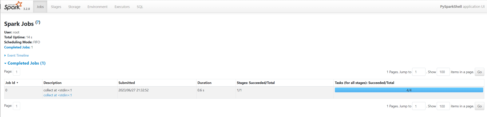
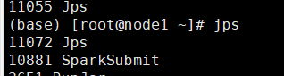

# Spark Local环境部署

## 下载地址

https://dlcdn.apache.org/spark/spark-3.2.0/spark-3.2.0-bin-hadoop3.2.tgz


## 条件


- PYTHON 推荐3.8
- JDK 1.8


## Anaconda On Linux 安装
本次课程的Python环境需要安装到Linux(虚拟机)和Windows(本机)上

参见最下方, 附: Anaconda On Linux 安装


## 解压

解压下载的Spark安装包

`tar -zxvf spark-3.2.0-bin-hadoop3.2.tgz -C /export/server/`


## 环境变量


配置Spark由如下5个环境变量需要设置


-  SPARK_HOME: 表示Spark安装路径在哪里 
-  PYSPARK_PYTHON: 表示Spark想运行Python程序, 那么去哪里找python执行器 
-  JAVA_HOME: 告知Spark Java在哪里 
-  HADOOP_CONF_DIR: 告知Spark Hadoop的配置文件在哪里 
-  HADOOP_HOME: 告知Spark  Hadoop安装在哪里 


这5个环境变量 都需要配置在: `/etc/profile`中

```shell
export JAVA_HOME=/export/server/jdk1.8.0_241
export PATH=$PATH:$JAVA_HOME/bin
export CLASSPATH=.:$JAVA_HOME/lib/dt.jar:$JAVA_HOME/lib/tools.jar
export HADOOP_HOME=/export/server/hadoop-3.3.0
export PATH=$PATH:$HADOOP_HOME/bin:$HADOOP_HOME/sbin
export SPARK_HOME=/export/server/spark
export PYSPARK_PYTHON=/export/server/anaconda3/envs/pyspark/bin/python3.8
export HADOOP_CONF_DIR=$HADOOP_HOME/etc/hadoop
export PATH=$JAVA_HOME/bin:$HADOOP_HOME/bin:$HADOOP_HOME/sbin:$PATH
```


PYSPARK_PYTHON和 JAVA_HOME 需要同样配置在: `/root/.bashrc`中

```shell
export JAVA_HOME=/export/server/jdk1.8.0_241
export PYSPARK_HOME=/export/server/anaconda3/envs/pyspark/bin/python3.8
```


## 上传Spark安装包


资料中提供了: `spark-3.2.0-bin-hadoop3.2.tgz`


上传这个文件到Linux服务器中


将其解压, 课程中将其解压(安装)到: `/export/server`内.

`tar -zxvf spark-3.2.0-bin-hadoop3.2.tgz -C /export/server/`


由于spark目录名称很长, 给其一个软链接:

`ln -s /export/server/spark-3.2.0-bin-hadoop3.2 /export/server/spark`
​


## 测试


### bin/pyspark

bin/pyspark 程序, 可以提供一个  `交互式`的 Python解释器环境, 在这里面可以写普通python代码, 以及spark代码


如图:


在这个环境内, 可以运行spark代码


图中的: `parallelize` 和 `map` 都是spark提供的API

`sc.parallelize([1,2,3,4,5]).map(lambda x: x + 1).collect()`
​


### WEB UI (4040)


Spark程序在运行的时候, 会绑定到机器的`4040`端口上.

如果4040端口被占用, 会顺延到4041 ... 4042...



打开监控页面后, 可以发现 在程序内仅有一个Driver，因为我们是Local模式, Driver即管理 又 干活.  同时, 输入jps


可以看到local模式下的唯一进程存在, 这个进程 即是master也是worker


### bin/spark-shell - 了解


同样是一个解释器环境, 和`bin/pyspark`不同的是, 这个解释器环境 运行的不是python代码, 而是scala程序代码


```shell
scala> sc.parallelize(Array(1,2,3,4,5)).map(x=> x + 1).collect()
res0: Array[Int] = Array(2, 3, 4, 5, 6)
```


> 这个仅作为了解即可, 因为这个是用于scala语言的解释器环境


### bin/spark-submit (PI)


作用: 提交指定的Spark代码到Spark环境中运行


使用方法:


```shell
# 语法
bin/spark-submit [可选的一些选项] jar包或者python代码的路径 [代码的参数]

# 示例
bin/spark-submit /export/server/spark/examples/src/main/python/pi.py 10
# 此案例 运行Spark官方所提供的示例代码 来计算圆周率值.  后面的10 是主函数接受的参数, 数字越高, 计算圆周率越准确.
```


对比

| 功能 | bin/spark-submit | bin/pyspark | bin/spark-shell |
| --- | --- | --- | --- |
| 功能 | 提交java\scala\python代码到spark中运行 | 提供一个`python`
解释器环境用来以python代码执行spark程序 | 提供一个`scala`
解释器环境用来以scala代码执行spark程序 |
| 特点 | 提交代码用 | 解释器环境 写一行执行一行 | 解释器环境 写一行执行一行 |
| 使用场景 | 正式场合, 正式提交spark程序运行 | 测试\学习\写一行执行一行\用来验证代码等 | 测试\学习\写一行执行一行\用来验证代码等 |


> Local模式将是我们7天Spark课程的主力使用模式


# Spark StandAlone环境部署
## 新角色 历史服务器


> 历史服务器不是Spark环境的必要组件, 是可选的.

> 回忆: 在YARN中 有一个历史服务器, 功能: 将YARN运行的程序的历史日志记录下来, 通过历史服务器方便用户查看程序运行的历史信息.


Spark的历史服务器, 功能: 将Spark运行的程序的历史日志记录下来, 通过历史服务器方便用户查看程序运行的历史信息.

搭建集群环境, 我们一般`推荐将历史服务器也配置上`, 方面以后查看历史记录
​

## 集群规划


课程中 使用三台Linux虚拟机来组成集群环境, 非别是:


node1\ node2\ node3


node1运行: Spark的Master进程  和 1个Worker进程


node2运行: spark的1个worker进程


node3运行: spark的1个worker进程


整个集群提供: 1个master进程 和 3个worker进程


## 安装


### 在所有机器安装Python(Anaconda)


参考 附1内容, 如何在Linux上安装anaconda


同时不要忘记 都创建`pyspark`虚拟环境 以及安装虚拟环境所需要的包`pyspark jieba pyhive`


### 在所有机器配置环境变量


参考 Local模式下 环境变量的配置内容

**`确保3台都配置`**


### 配置配置文件


进入到spark的配置文件目录中, `cd $SPARK_HOME/conf`


配置workers文件


```shell
# 改名, 去掉后面的.template后缀
mv workers.template workers

# 编辑worker文件
# 功能: 这个文件就是指示了  当前SparkStandAlone环境下, 有哪些worker
vim workers
# 将里面的localhost删除, 追加
node1
node2
node3
```

配置spark-env.sh文件

```shell
# 1. 改名
mv spark-env.sh.template spark-env.sh
```


```shell
# 2. 编辑spark-env.sh, 在底部追加如下内容

## 设置JAVA安装目录
JAVA_HOME=/export/server/jdk

## HADOOP软件配置文件目录，读取HDFS上文件和运行YARN集群
HADOOP_CONF_DIR=/export/server/hadoop/etc/hadoop
YARN_CONF_DIR=/export/server/hadoop/etc/hadoop

## 指定spark老大Master的IP和提交任务的通信端口
# 告知Spark的master运行在哪个机器上
export SPARK_MASTER_HOST=node1
# 告知sparkmaster的通讯端口
export SPARK_MASTER_PORT=7077
# 告知spark master的 webui端口
SPARK_MASTER_WEBUI_PORT=8080

# worker cpu可用核数
SPARK_WORKER_CORES=1
# worker可用内存
SPARK_WORKER_MEMORY=1g
# worker的工作通讯地址
SPARK_WORKER_PORT=7078
# worker的 webui地址
SPARK_WORKER_WEBUI_PORT=8081

## 设置历史服务器
# 配置的意思是  将spark程序运行的历史日志 存到hdfs的/sparklog文件夹中
SPARK_HISTORY_OPTS="-Dspark.history.fs.logDirectory=hdfs://node1:8020/sparklog/ -Dspark.history.fs.cleaner.enabled=true"
```


注意, 上面的配置的路径 要根据你自己机器实际的路径来写


在HDFS上创建程序运行历史记录存放的文件夹:


```shell
hadoop fs -mkdir /sparklog
hadoop fs -chmod 777 /sparklog
```

配置spark-defaults.conf文件

```shell
# 1. 改名
mv spark-defaults.conf.template spark-defaults.conf
```


```shell
# 2. 修改内容, 追加如下内容
# 开启spark的日期记录功能
spark.eventLog.enabled 	true
# 设置spark日志记录的路径
spark.eventLog.dir	 hdfs://node1:8020/sparklog/ 
# 设置spark日志是否启动压缩
spark.eventLog.compress 	true
```


配置log4j.properties 文件 [可选配置]


```shell
# 1. 改名
mv log4j.properties.template log4j.properties

# 2. 修改内容
#log4j.rootCategory=INFO, console
log4j.rootCategory=WARN, console
```
> 这个文件的修改不是必须的,  为什么修改为WARN. 因为Spark是个话痨
>  
> 会疯狂输出日志, 设置级别为WARN 只输出警告和错误日志, 不要输出一堆废话.


### 将Spark安装文件夹  分发到其它的服务器上


```shell
scp -r spark-3.2.0-bin-hadoop3.2 node2:/export/server/
scp -r spark-3.2.0-bin-hadoop3.2node3:/export/server/

#  在node2和node3上 给spark安装目录增加软链接
ln -s /export/server/spark-3.2.0-bin-hadoop3.2 /export/server/spark
```


### 检查


检查每台机器的:


JAVA_HOME


SPARK_HOME


PYSPARK_PYTHON


等等 环境变量是否正常指向正确的目录


### 启动历史服务器

`sbin/start-history-server.sh`


### 启动Spark的Master和Worker进程


```shell
# 启动全部master和worker
sbin/start-all.sh
```


### 查看Master的WEB UI


默认端口master我们设置到了8080


如果端口被占用, 会顺延到8081 ...;8082... 8083... 直到申请到端口为止


可以在日志中查看, 具体顺延到哪个端口上:

`Service 'MasterUI' could not bind on port 8080. Attempting port 8081.`


### 连接到StandAlone集群


#### bin/pyspark


执行:


```shell
bin/pyspark --master spark://node1:7077
# 通过--master选项来连接到 StandAlone集群
# 如果不写--master选项, 默认是local模式运行
```


#### bin/spark-shell


```shell
bin/spark-shell --master spark://node1:7077
# 同样适用--master来连接到集群使用
```


```scala
// 测试代码
sc.parallelize(Array(1,2,3,4,5)).map(x=> x + 1).collect()
```


#### bin/spark-submit (PI)


```shell
bin/spark-submit --master spark://node1:7077 /export/server/spark/examples/src/main/python/pi.py 100
# 同样使用--master来指定将任务提交到集群运行
```


### 查看历史服务器WEB UI


历史服务器的默认端口是: 18080


我们启动在node1上, 可以在浏览器打开:


`node1:18080`来进入到历史服务器的WEB UI上.


# Spark StandAlone HA 环境搭建


## 步骤
> 前提: 确保Zookeeper 和 HDFS 均已经启动


先在`spark-env.sh`中, 删除: `SPARK_MASTER_HOST=node1`


原因: 配置文件中固定master是谁, 那么就无法用到zk的动态切换master功能了.


在`spark-env.sh`中, 增加:


```shell
SPARK_DAEMON_JAVA_OPTS="-Dspark.deploy.recoveryMode=ZOOKEEPER -Dspark.deploy.zookeeper.url=node1:2181,node2:2181,node3:2181 -Dspark.deploy.zookeeper.dir=/spark-ha"
# spark.deploy.recoveryMode 指定HA模式 基于Zookeeper实现
# 指定Zookeeper的连接地址
# 指定在Zookeeper中注册临时节点的路径
```


将spark-env.sh 分发到每一台服务器上


```shell
scp spark-env.sh node2:/export/server/spark/conf/
scp spark-env.sh node3:/export/server/spark/conf/
```


停止当前StandAlone集群


```shell
sbin/stop-all.sh
```


启动集群:


```shell
# 在node1上 启动一个master 和全部worker
sbin/start-all.sh

# 注意, 下面命令在node2上执行
sbin/start-master.sh
# 在node2上启动一个备用的master进程
```


## master主备切换


提交一个spark任务到当前`alive`master上:


```shell
bin/spark-submit --master spark://node1:7077 /export/server/spark/examples/src/main/python/pi.py 1000
```


在提交成功后, 将alivemaster直接kill掉


不会影响程序运行:

当新的master接收集群后, 程序继续运行, 正常得到结果.


> 结论 HA模式下, 主备切换 不会影响到正在运行的程序.
>  
> 最大的影响是 会让它中断大约30秒左右.


# Spark On YARN 环境搭建
## 部署
确保:


- HADOOP_CONF_DIR
- YARN_CONF_DIR


在spark-env.sh 以及 环境变量配置文件中即可
​

## 连接到YARN中


### bin/pyspark


```shell
bin/pyspark --master yarn --deploy-mode client|cluster
# --deploy-mode 选项是指定部署模式, 默认是 客户端模式
# client就是客户端模式
# cluster就是集群模式
# --deploy-mode 仅可以用在YARN模式下
```


> 注意: 交互式环境 pyspark  和 spark-shell  无法运行 cluster模式


### bin/spark-shell


```shell
bin/spark-shell --master yarn --deploy-mode client|cluster
```


> 注意: 交互式环境 pyspark  和 spark-shell  无法运行 cluster模式


### bin/spark-submit (PI)


```shell
bin/spark-submit --master yarn --deploy-mode client|cluster /xxx/xxx/xxx.py 参数
```


## spark-submit 和 spark-shell 和 pyspark的相关参数


参见: 附2
​


# 附1 Anaconda On Linux 安装 (单台服务器)


## 安装


上传安装包:


上传: 资料中提供的`Anaconda3-2021.05-Linux-x86_64.sh`文件到Linux服务器上


安装:

`sh ./Anaconda3-2021.05-Linux-x86_64.sh`


输入yes后就安装完成了.

安装完成后, `退出SecureCRT 重新进来`: 


看到这个Base开头表明安装好了.

base是默认的虚拟环境.
​

## 国内源
如果你安装好后, 没有出现base, 可以打开:/root/.condarc这个文件, 追加如下内容:


```shell
channels:
  - defaults
show_channel_urls: true
default_channels:
  - https://mirrors.tuna.tsinghua.edu.cn/anaconda/pkgs/main
  - https://mirrors.tuna.tsinghua.edu.cn/anaconda/pkgs/r
  - https://mirrors.tuna.tsinghua.edu.cn/anaconda/pkgs/msys2
custom_channels:
  conda-forge: https://mirrors.tuna.tsinghua.edu.cn/anaconda/cloud
  msys2: https://mirrors.tuna.tsinghua.edu.cn/anaconda/cloud
  bioconda: https://mirrors.tuna.tsinghua.edu.cn/anaconda/cloud
  menpo: https://mirrors.tuna.tsinghua.edu.cn/anaconda/cloud
  pytorch: https://mirrors.tuna.tsinghua.edu.cn/anaconda/cloud
  simpleitk: https://mirrors.tuna.tsinghua.edu.cn/anaconda/cloud
```


# 附2 spark-submit和pyspark相关参数


客户端工具我们可以用的有:


- bin/pyspark: pyspark解释器spark环境
- bin/spark-shell: scala解释器spark环境
- bin/spark-submit: 提交jar包或Python文件执行的工具
- bin/spark-sql: sparksql客户端工具


这4个客户端工具的参数基本通用.


以spark-submit 为例:


`bin/spark-submit --master spark://node1:7077 xxx.py`


```shell
Usage: spark-submit [options] <app jar | python file | R file> [app arguments]
Usage: spark-submit --kill [submission ID] --master [spark://...]
Usage: spark-submit --status [submission ID] --master [spark://...]
Usage: spark-submit run-example [options] example-class [example args]

Options:
  --master MASTER_URL         spark://host:port, mesos://host:port, yarn,
                              k8s://https://host:port, or local (Default: local[*]).
  --deploy-mode DEPLOY_MODE   部署模式 client 或者 cluster 默认是client
  --class CLASS_NAME          运行java或者scala class(for Java / Scala apps).
  --name NAME                 程序的名字
  --jars JARS                 Comma-separated list of jars to include on the driver
                              and executor classpaths.
  --packages                  Comma-separated list of maven coordinates of jars to include
                              on the driver and executor classpaths. Will search the local
                              maven repo, then maven central and any additional remote
                              repositories given by --repositories. The format for the
                              coordinates should be groupId:artifactId:version.
  --exclude-packages          Comma-separated list of groupId:artifactId, to exclude while
                              resolving the dependencies provided in --packages to avoid
                              dependency conflicts.
  --repositories              Comma-separated list of additional remote repositories to
                              search for the maven coordinates given with --packages.
  --py-files PY_FILES         指定Python程序依赖的其它python文件
  --files FILES               Comma-separated list of files to be placed in the working
                              directory of each executor. File paths of these files
                              in executors can be accessed via SparkFiles.get(fileName).
  --archives ARCHIVES         Comma-separated list of archives to be extracted into the
                              working directory of each executor.

  --conf, -c PROP=VALUE       手动指定配置
  --properties-file FILE      Path to a file from which to load extra properties. If not
                              specified, this will look for conf/spark-defaults.conf.

  --driver-memory MEM         Driver的可用内存(Default: 1024M).
  --driver-java-options       Driver的一些Java选项
  --driver-library-path       Extra library path entries to pass to the driver.
  --driver-class-path         Extra class path entries to pass to the driver. Note that
                              jars added with --jars are automatically included in the
                              classpath.

  --executor-memory MEM       Executor的内存 (Default: 1G).

  --proxy-user NAME           User to impersonate when submitting the application.
                              This argument does not work with --principal / --keytab.

  --help, -h                  显示帮助文件
  --verbose, -v               Print additional debug output.
  --version,                  打印版本

 Cluster deploy mode only(集群模式专属):
  --driver-cores NUM          Driver可用的的CPU核数(Default: 1).

 Spark standalone or Mesos with cluster deploy mode only:
  --supervise                 如果给定, 可以尝试重启Driver

 Spark standalone, Mesos or K8s with cluster deploy mode only:
  --kill SUBMISSION_ID        指定程序ID kill
  --status SUBMISSION_ID      指定程序ID 查看运行状态

 Spark standalone, Mesos and Kubernetes only:
  --total-executor-cores NUM  整个任务可以给Executor多少个CPU核心用

 Spark standalone, YARN and Kubernetes only:
  --executor-cores NUM        单个Executor能使用多少CPU核心

 Spark on YARN and Kubernetes only(YARN模式下):
  --num-executors NUM         Executor应该开启几个
  --principal PRINCIPAL       Principal to be used to login to KDC.
  --keytab KEYTAB             The full path to the file that contains the keytab for the
                              principal specified above.

 Spark on YARN only:
  --queue QUEUE_NAME          指定运行的YARN队列(Default: "default").
```


# 附3 Windows系统配置Anaconda
## 安装
打开资料中提供的:Anaconda3-2021.05-Windows-x86_64.exe文件,或者去官网下载:[https://www.anaconda.com/products/individual#Downloads](https://www.anaconda.com/products/individual#Downloads)
​

打开后,一直点击`Next`下一步即可:


如果想要修改安装路径, 可以修改

不必勾选

最终点击Finish完成安装
​

打开开始菜单, 搜索Anaconda

出现如图的程序, 安装成功.
​

打开 `Anaconda Prompt`程序:

出现`base`说明安装正确.
​


## 配置国内源
Anaconda默认源服务器在国外, 网速比较慢, 配置国内源加速网络下载.
​

打开上图中的 `Anaconda Prompt`程序:
执行:
`conda config --set show_channel_urls yes`
​

然后用记事本打开:
`C:\Users\用户名\.condarc`文件, 将如下内容替换进文件内,保存即可:
```shell
channels:
  - defaults
show_channel_urls: true
default_channels:
  - https://mirrors.tuna.tsinghua.edu.cn/anaconda/pkgs/main
  - https://mirrors.tuna.tsinghua.edu.cn/anaconda/pkgs/r
  - https://mirrors.tuna.tsinghua.edu.cn/anaconda/pkgs/msys2
custom_channels:
  conda-forge: https://mirrors.tuna.tsinghua.edu.cn/anaconda/cloud
  msys2: https://mirrors.tuna.tsinghua.edu.cn/anaconda/cloud
  bioconda: https://mirrors.tuna.tsinghua.edu.cn/anaconda/cloud
  menpo: https://mirrors.tuna.tsinghua.edu.cn/anaconda/cloud
  pytorch: https://mirrors.tuna.tsinghua.edu.cn/anaconda/cloud
  simpleitk: https://mirrors.tuna.tsinghua.edu.cn/anaconda/cloud
```


## 创建虚拟环境


```shell
# 创建虚拟环境 pyspark, 基于Python 3.8
conda create -n pyspark python=3.8

# 切换到虚拟环境内
conda activate pyspark

# 在虚拟环境内安装包
pip install pyhive pyspark jieba -i https://pypi.tuna.tsinghua.edu.cn/simple 
```


# 安装Spark on Hive

- hive启动metastore服务

  ```shell
  vim /export/server/apache-hive-3.1.2-bin/conf/hive-site.xml
  
  <!-- 远程模式部署metastore metastore地址 -->
  <property>
      <name>hive.metastore.uris</name>
      <value>thrift://node1:9083</value>
  </property>
  ```

  

- 修改spark和hive的配置文件

  ```shell
  vim  /export/server/spark/conf/hive-site.xml
  
  <configuration>
    <property>
      <name>hive.metastore.warehouse.dir</name>
      <value>/user/hive/warehouse</value>
  <!--<value>/root/hivedata</value> -->
    </property>
  
    <property>
      <name>hive.metastore.uris</name>
      <value>thrift://node1:9083</value>
    </property>
  </configuration>
  ```


# 安装spark-ThriftServer

> 注意：需要已经配置好了 Spark On Hive

```shell
yum install zlib-devel bzip2-devel openssl-devel ncurses-devel sqlite-devel readline-devel tk-devel libffi-devel gcc make gcc-c++ python-devel cyrus-sasl-devel cyrus-sasl-plain cyrus-sasl-gssapi -y

pip install -i https://pypi.tuna.tsinghua.edu.cn/simple pyhive pymysql sasl thrift thrift_sasl
```


