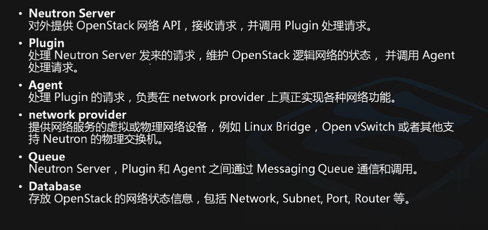
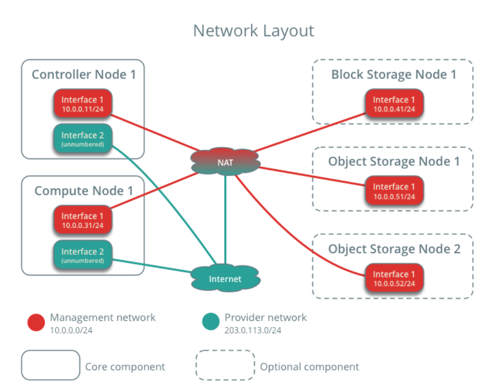

### Neutron：网络管理（Network）

- 提供云计算网络虚拟化技术
- 为openstack其他服务提供网络连接服务
- 为用户提供接口，可以定义Network、Subnet、Router，配置DHCP、DNS、负载均衡、L3服务，网络支持GRE、Vlan
- 提供类似于虚拟机中创建虚拟网络，隔离网段功能，但功能要强大很多

路由器的不同port不能配相同网络地址

虚机之间流量通信叫东西向流量   与外网通信叫南北向流量

