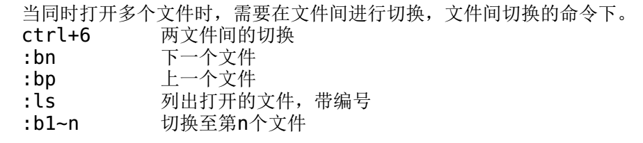
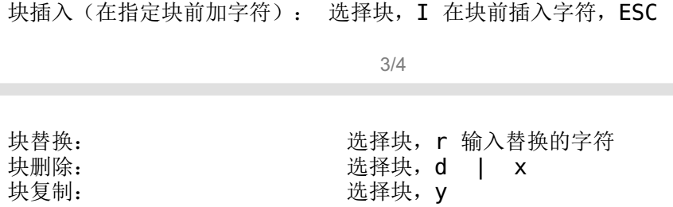

> **vim 有末行(命令模式ESC)  可视模式(v,V,ctrl+v)  插入模式(IAO) 命令模式(:commend)**

### 设置永久的环境修改VIM的环境配置文件`/etc/vimrc`

- `/etc/vimrc`：影响**所有**系统用户
- `~/.vimrc`：影响**当前**用户

| ·:set nu  |    nu=number     |   显示行号   |
| :-------: | :--------------: | :----------: |
|  :set ic  | ic=ignore  case  | 不区分大小写 |
|  :set ai  |  ai=auto indent  |   自动缩进   |
| :set list | 例如：换行、空格 | 显示控制字符 |

### 查找替换和另存

- **替换格式**：`：1,5 s/old/new/选项`：   **1,5**是范围行
  - `:% s/root/lhq/` ： `%`等于`1,$`所有的
  - `:s/^#//g` ：替换所有的以#开头的为无 `g:global`
  - `:% s#/dev/sda#/dev/sdb#g` ：把sda的内容写到sdb里去(`#`或者`\/`等于`/`) 
- **查找格式**：`:/查找的内容` 可用正则表达式
- 读、写、另存文件：
  - `w`  存储到当前文件
  - `w /tmp/aaa.txt` 另存
  - `1,3 w /tmp/aaa.txt` 另存多少行
  - `:r filename` 将文件写入到当前文档
  - `:5 r filename` 读入文件到第5行

### 复制，剪切，删除

- 末行模式（命令模式）下 ：
  - `nyy`  复制当前以下n行
  - `dd` 剪切当前行
  - `ndd` 剪切当前下n行
  - `p`小写  在光标下粘贴   `P`大写   光标上粘贴
  - `x` 删除光标处一个字符   `nx` 删除光标后n个
  - `dG` 删除光标到文件末尾
  - `D` 删除光标到行尾

### 重定向命令

| 命令    | 选项 | 文件名   |            结果            |
| ------- | ---- | -------- | :------------------------: |
| commend | >    | filename | 将结果**写成(替换)**到文件 |
| commend | >>   | filename |    将结果**追加**到文件    |
| commend | <    | filename | 将命令**写成(替换)**到文件 |
| commend | <<   | filename |    将命令**追加**到文件    |

### 多窗口显示模式

- 水平显示：`:sp filename`
  - 窗口直接切换：`Ctrl+w+k`(上一个窗口)`Ctrl+w+j`(下一个窗口)
  - `Ctrl+w+上下方向键`

- 垂直显示： `:vs filename`
  - 窗口直接切换：`Ctrl+w+h`(左一个窗口)`Ctrl+w+l`(右一个窗口)
  - `Ctrl+w+左右方向键`
- 垂直分割窗口：`vim -O ./a.txt ./b.txt`   大写O

- 水平分割窗口：`vim -o ./a.txt ./b.tx`   小写o

- 文件的切换

### 可视模式

v  		字符可视化

V 	  	行可视化

ctrl+v	块可视化

