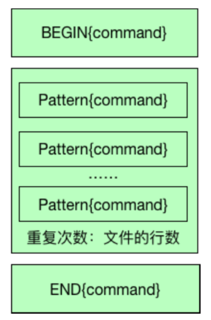
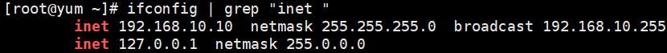
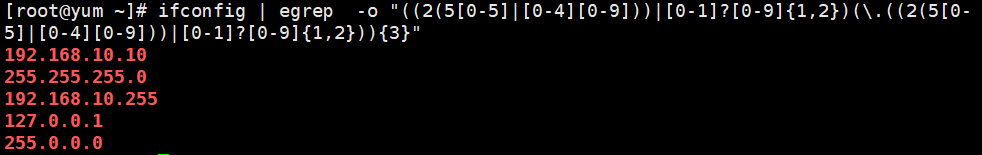
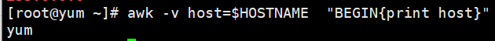
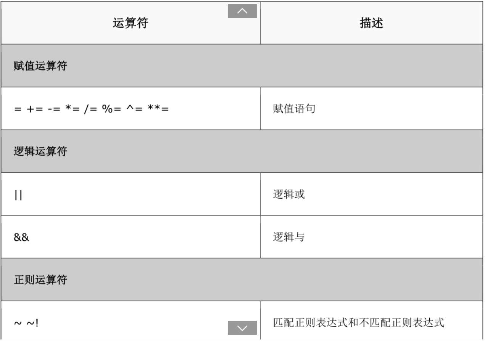
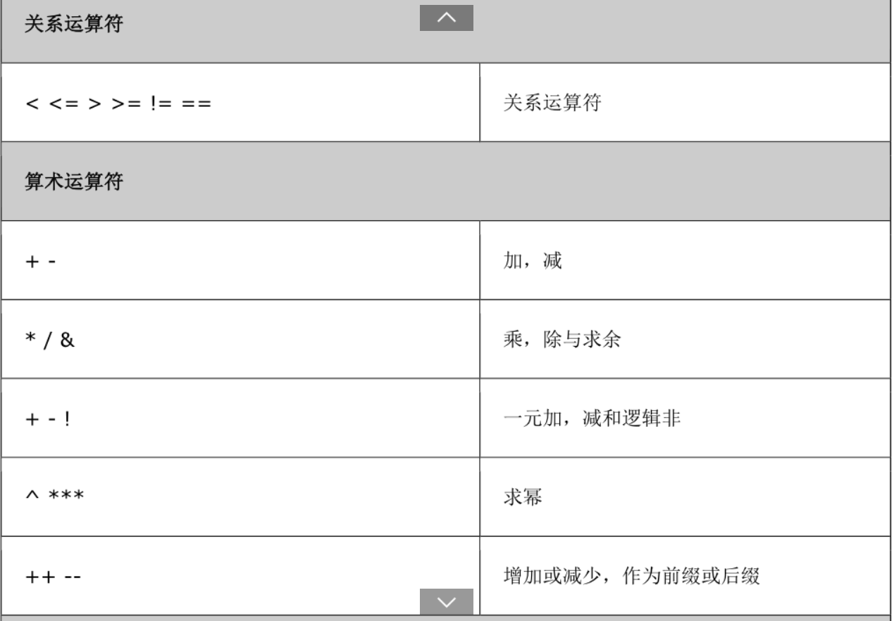
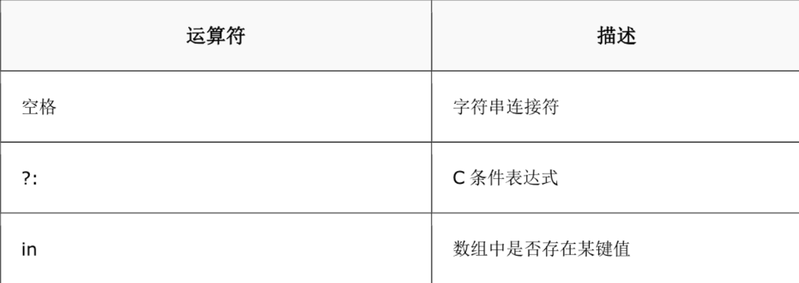
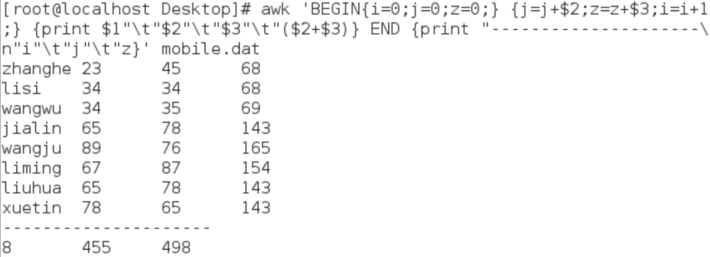
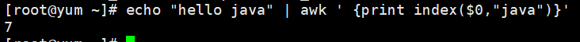

[TOC]

# `awk`的使用

## 1、`awk`简介
  `awk`是一个强大的文本分析工具，能够把文件逐行的读入，以空格为默认分隔符将每行切片，切开的部分再进行各种分析处理。
## 2.、使用方法
``` shell
   awk 'BEGIN {command} pattern {command} END {command}' {filenames}
```
**说明：**
> -''一定要使用单引号，single quote 
>
> - {}表示命令或者action
> - BEGIN{}表示开始命令，只执行一次
>  - pattern 正则表达式
> - command 命令
> - pattern{command}按行执行，如果文件有100行，需要执行100次
> - END{command}所有记录处理结束之后执行，只执行一次
> - filenames 文件名
## 3、AWK工作流程
> 
## 4、awk内置变量
| 变量名称  |                 作用                 |
| -------- | ----------------------------------- |
| ARGC     | 命令行参数个数                       |
| ARGV     | 命令行参数排列                       |
| ENVIRON  | 支持队列中系统环境变量的使用          |
| FILENAME | awk浏览的文件名                      |
| FNR      | 浏览文件的记录数                     |
| FS       | 设置输入域分隔符，等价于命令行 -F选项 |
| NF       | 浏览记录的域的个数                   |
| NR       | 已读的记录数                         |
| OFS      | 输出域分隔符                         |
| ORS      | 输出记录分隔符                       |
| RS       | 控制记录分隔符                       |
| $0       | 变量是指整条记录。                   |
| $1       | 表示当前行的第一个域                 |
## 5、应用举例
### 5.1 数据文件
``` data
zhangsan  23	45
lisi	  34	34
wangwu	  34	35
zhangsan1 65	78
wangwu1   89	76
lisi1	  67	87
zhangsan2 65	78
lisi2	  78	65
```
### 5.2 应用
1. 显示所有文件内容
```shell
awk '{print $0}' mobile.dat
```
运行结果：
```shell
zhangsan  23	45
lisi	  34	34
wangwu	  34	35
zhangsan1 65	78
wangwu1   89	76
lisi1	  67	87
zhangsan2 65	78
lisi2	  78	65
```
2. 增加标题后，显示所有内容
```shell
  Image: 134x91 (6.0 KB) awk 'BEGIN{print "姓名\t语言\t数学"}  {print  $1"\t"$2"\t"$3} END{print "----------"}' mobile.dat
```
运行结果

```shell
姓名	语言	数学
zhangsan	23	45
lisi	34	34
wangwu	34	35
zhangsan1	65	78
wangwu1	89	76
lisi1	67	87
zhangsan2	65	78
lisi2	78	65
----------
```


3. 增加标题，显示所有以w开头的用户信息

``` shell
Image: 134x91 (6.0 KB) awk 'BEGIN{print "姓名\t语言\t数学"} /^w/ {print  $1"\t"$2"\t"$3} END{print "----------"}' mobile.dat
```
运行结果：

```shell
姓名	语言	数学
wangwu	34	35
wangwu1	89	76
----------
```


3. 使用ifconfig查看网卡信息，使用awk打印出ip
``` shell
ifconfig
```
运行结果：

```shell
ens33: flags=4163<UP,BROADCAST,RUNNING,MULTICAST>  mtu 1500
        inet 192.168.10.10  netmask 255.255.255.0  broadcast 192.168.10.255
        inet6 fe80::20c:29ff:fea6:c3fc  prefixlen 64  scopeid 0x20<link>
        ether 00:0c:29:a6:c3:fc  txqueuelen 1000  (Ethernet)
        RX packets 7032  bytes 9904015 (9.4 MiB)
        RX errors 0  dropped 0  overruns 0  frame 0
        TX packets 1154  bytes 92872 (90.6 KiB)
        TX errors 0  dropped 0 overruns 0  carrier 0  collisions 0

lo: flags=73<UP,LOOPBACK,RUNNING>  mtu 65536
        inet 127.0.0.1  netmask 255.0.0.0
        inet6 ::1  prefixlen 128  scopeid 0x10<host>
        loop  txqueuelen 1000  (Local Loopback)
        RX packets 0  bytes 0 (0.0 B)
        RX errors 0  dropped 0  overruns 0  frame 0
        TX packets 0  bytes 0 (0.0 B)
        TX errors 0  dropped 0 overruns 0  carrier 0  collisions 0
```


使用grep进行过滤

```shell
ifconfig | grep "inet "
```
运行结果：

使用awk格式化输出

```shell
ifconfig | grep "inet "|awk -F '[: ]+' '{print $3}'
```
运行结果

**说明：**

> - -F指定分隔符，默认分隔符为空格
> - []使用中括号，可以指定多个分隔符，本例中，指定空格与`：`作为分隔符。
> - 可以直接使用egrep 正则表达式获取ip地址
> 
``` shell
ifconfig | egrep  -o "((2(5[0-5]|[0-4][0-9]))|[0-1]?[0-9]{1,2})(\.((2(5[0-5]|[0-4][0-9]))|[0-1]?[0-9]{1,2})){3}"
```
>  运行结果：
>  
> 缺点是正则表达式太复杂
## 6、扩展（awk编程）
### 6.1 变量
1. 在awk中可以自定义变量，
 > **语法：**
 ``` shell
 -v  自定义变量
 awk -v host=$HOSTNAME  "BEGIN{print host}"
 ```
 > 运行结果：
 > 
### 6. 2关系操作符
> `<`,`>`,`<=`,`>=`,`==`,`!=`,`~`,`!~` 用来判断前面的列是否匹配后面的内容，如`$7~/^\/bin/{print $0} /etc/passwd`
> !~ 不匹配







### 6.3 流程控制语句
**awk流程控制语句与C语言类似**

1. 条件
``` awk
 if(expression){action1}else{action2}
```
示例：
``` shell
seq 10 |awk '{if($0%2==0){print $0"是双数"}else{print $0"是单数"}}'
```
2. 循环
``` shell
while(expression){action}
```
示例：统计成绩总分
分析：在BEGIN部分定义两个变量，在pattern{command}部分对变量进行改变，在END{command}部分进行显示

```shell
awk  'BEGIN{i=0;j=0;z=0;}{j=j+$2;z=z+$3;i=i+1;} {print $1"\t"$2"\t"$3"\t"($2+$3)} END{print "------\n"i"\t"j"\t"z}' mobile.dat
```
> 运行结果：
> 统计某个文件夹下的大于100k文件的数量和总和
> 步骤：
>
>   1. 使用ls -l 获取文件夹下所有文件信息
>   2. 使用管道符链接到awk进行处理
>   3. 命令如下：
>   ```shell
>   ls -l|awk '{if($5>100){count++; sum+=$5}} END{print "Count:" count,"Sum: " sum}' 
>   ```
>   运行结果如下：
>
> ```shell
> Count:2 Sum: 1618
> ```
>
> 
### 6.4awk基本函数
#### 6.4.1 gsub
1. 作用：字符串替换
2. 语法：gsub(source,destination)
3. 示例：把java替换为python，并输出
```shell
echo "hello java java java" | awk 'gsub("java","python") {print $0}'
```

运行结果：

```shell
hello python python python
```

#### 6.4.2 index
1. 作用：查找字符串pattern出现在source串中的第一次位置
2. 语法：index(source,pattern)
3. 示例：统计"hello java"中java出现的第一次的位置
```shell
echo "hello java" | awk ' {print index($0,"java")}'
```

运行结果：



#### 6.4.3 length
1. 作用：获取字符串的长度
2. 语法：length($1)
3. 示例：统计"hello java"字符串的长度
```shell
echo "hello java" | awk ' {print length($0)}'
```
#### 6.4.4 match
1. 作用：正则表达式匹配
2. 语法：match("source","pattern"),找到返回出现的位置，未找到返回0
3. 示例：统计”hello java”中，“va”出现的位置
```shell
echo "hello java" | awk ' {print match($0,"va")}
```
#### 6.4.5 split
1. 作用：分隔字符串，返回数组的长度
2. 语法：split(source,arrayname,separator）
3. 示例： 统计“hello java"中以a作为分隔符
```shell
echo "hello java" | awk ' {split($0,ar,"a")}{print ar[1]}'
```
#### 6.4.6 sub
1. 作用：第一次出现的位置进行替换
2. 语法：sub(source,detination)
3. 示例："hello java java java"中把java替换为python，并输出
```shell
echo "hello java java java " | awk ' {sub("java","python")}{print $0}'
```
4. 运行结果：
```shell
hello python java java
```

#### 6.4.7 substr
1. 作用：获取子串
2. 语法：substr(source,start,end)
3. 示例："hello java java java"中输出hello
```shell
echo "hello java java java" | awk ' {print substr($0,1,5)}'
```
#### 6.4.8 从shell中向awk传入字符串
``` shell
$STR="mydoc.txt"
$ echo $STR | awk '{print subst($STR, 1, 5)}'
```