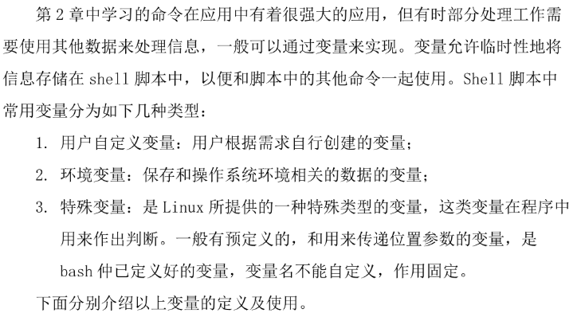
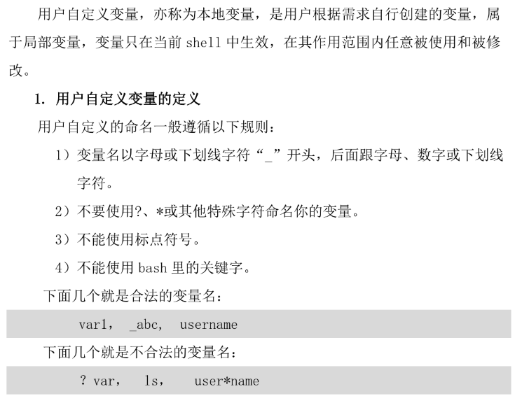
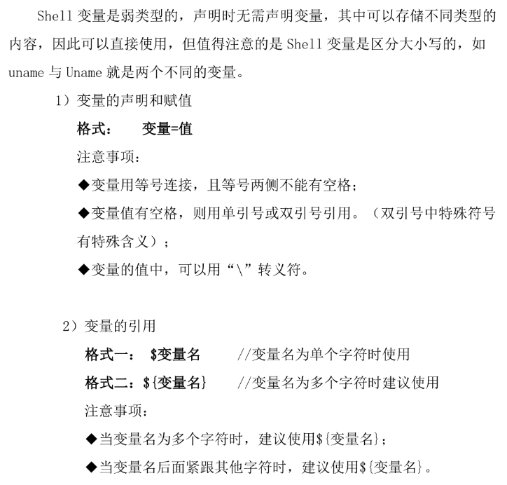
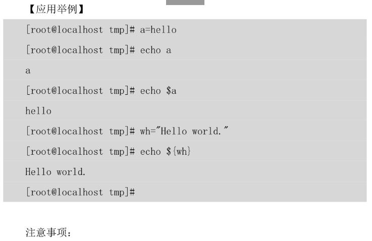
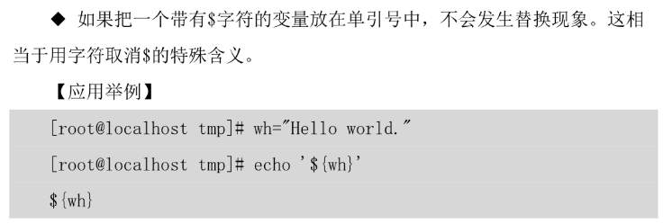
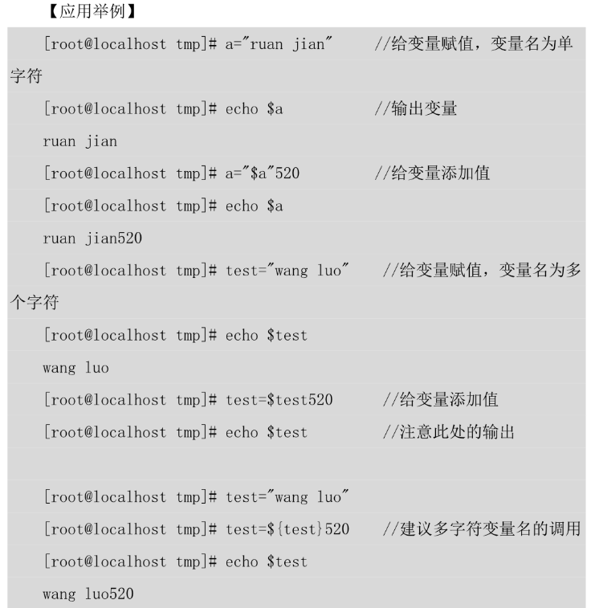
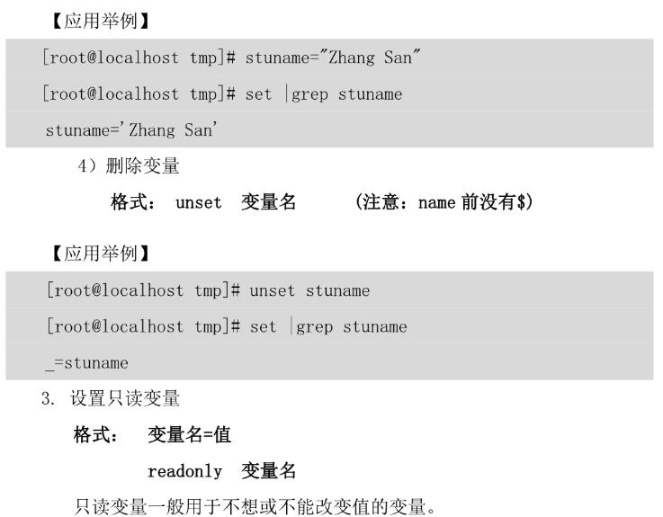
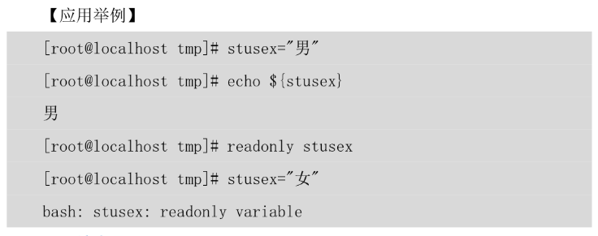
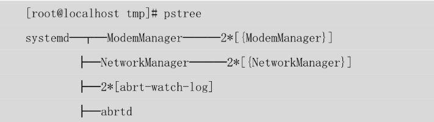
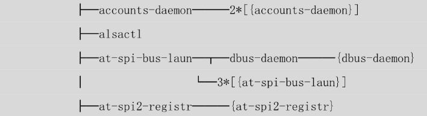

## .1. Linux编程基础

### 1.1 变量



#### 1.1.1用户自定义变量

















#### 1.1.2 环境变量

> 环境变量用于所有用户进程（通常称为子进程），在当前shell和子shell当中都生效。登录进程位父进程，通过pstree可以查看。





- 环境变量可以用于所有子进程，包括编辑器、脚本和应用

例如：

```
[root@yum shell.tmp]# cat a.sh 
#!/bin/bash
# 检测环境变量
echo "家目录是 $HOME"
[root@yum shell.tmp]# . a.sh 
家目录是 /root
```

- 

  1. 设置环境变量

     ```shell
     格式：
     variable-name=value
     export variable-name
     ```

  2. 显示环境变量

     ```shell
     格式：
     env  可以看见所以的环境变量
     echo $环境变量名   （显示一个变量）
     ```

  3. 清除环境变量

     ```shell
     格式：
     unset 环境变量名
     ```

     注意事项：

     - 设定全局环境变量的进程所创建的子进程中，该变量都是可见的；
     - 设置全局环境变量，先创建一个局部环境变量 ，然后再把它导入到全局变量中：通过export命令导入，变量前不要加$;
     - 修改子shell全局环境变量并不会影响父shell中该变量的值，设置无法使用export命令去改变父shell中全局环境变量的值。

     例如：

     ```
     //定义局部环境变量，使用export使其成为全局环境变量
     [root@yum shell.tmp]# varl="i am a stu"
     [root@yum shell.tmp]# export var1
     [root@yum shell.tmp]# echo ${varl}
     i am a stu
     // bash命令启动了一个子shell
     ```

     

#### 内置变量

|      |                                                            |
| :--- | :--------------------------------------------------------- |
| $0   | 当前脚本的文件名                                           |
| $n   | 传递给脚本或函数的参数。n表示第几个参数                    |
| $#   | 传递给脚本或函数的参数个数                                 |
| $*   | 传递给脚本或函数的所有参数                                 |
| $@   | 传递给脚本或函数的所有参数                                 |
| $?   | 上个命令的退出状态，或函数的返回值                         |
| $$   | 当前Shell进程ID。对于 Shell 脚本，就是这些脚本所在的进程ID |

> **$* 和 $@ 的区别**
>
> $* 和 $@ 都表示传递给函数或脚本的所有参数，**不被双引号(" “)包含时**，都以”$1" “2&quot;…&quot;2&quot; … &quot;2"…"n” 的形式输出所有参数
> 当它们**被双引号(" “)包含时**，”$*" 会将所有的参数作为一个整体，以"$1 $2 … n&quot;的形式输出所有参数；&quot;n&quot;的形式输出所有参数；&quot;n"的形式输出所有参数；"@" 会将各个参数分开，以"$1" “2&quot;…&quot;2&quot; … &quot;2"…"n” 的形式输出所有参数。

