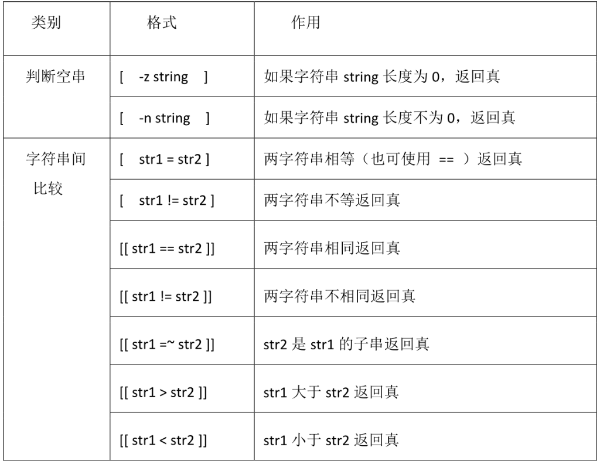

[TOC]

---

## 条件判断表达式

### 条件的值：

1. Bash中没有布尔类型变量
   - 退出状态为0表示命令成功或表达式为真
   - 1表示命令失败或表达式为假
2. 状态变量`$?`中保存了退出状态的值

### 条件语句

> 格式:

- test <测试表达式>
- [  <测试表达式> ]
- [[  <测试表达式>  ]]       (bash  2.x版本以上， bash  --version)

> 说明：

- 格式1和格式2是等价的，格式3是扩展的test命令

- 在   `[[]]`   中可以使用通配符进行模式匹配

- `&&，||，<和>`能够正常存在于`[[]]`中， 但不能在`[]` 中出现

- `[`和`[[`之后的字符串必须为空格，`]`和`]]`之前的字符串必须为空格

- 要对整数进行关系运算也可以使用`(())`进行测试

  条件测试表达式中可用的操作符有文件测试操作符、文件之间比较操作符、字符串测试操作符、字符串控制检测、整数二元比较操作符、逻辑运算符。

### 文件

> 文件测试主要是用来检测文件是否存在， 文件属性，访问权限等，具体见
> 表3-4。

​											表3-4 文件测试语句


- 要求在执行脚本时，检查传入参数名的文件是否存在，存在则提示文件存在，不存在则创建（如果路径不存在，则一并创建路径）。

  
  
  


### 文件比较


### 字符串

> 字符串测试时条件判断中常用的，可以用来判断字符串是否为空串，也可用来测试两个字符串是否相等等



> 真为0   假为1
>
> **字符串变量**要加`""`，以免引起报错
>
> 变量为**空或者未定义**，则长度都为**0**
>
> 


### 整数

- 整数测试用`[]`表示

  

  

- 整数测试用`[[]]`表示

  

- 整数测试用 `let`命令或`(())`表示

  

  

  以上针对整数测试的三种方式区别如下:

  - 使用的操作符不同
  - let 和双圆括号中可以使用算术表达式，而中号不能
  - let 和双圆括号中，操作符两边可以不留空格

### 逻辑

> 逻辑测试结果只有真或假两种情况，在进行逻辑测试时可以在`[]，[[],`
> `(())`中进行


> 说明：不能随便添加括号；不能在`(())`中做字符串比较

---


## 分支结构


### IF语句


#### 作业一：创建用户

```shell
if [];then
elif [];then
elif [];then
else
fi

[root@Xuan shell-works]# cat user.sh 
#!/usr/bin/bash
#add-user
read -p "Please input user_number:" num
#确定输入的是以数字
# =~ 包含
if [[ ! "$num" =~ ^[0-9]+$ ]];then
  echo "error number"
  exit
fi 
# 首字符为字母，且含有数字,下划线
read -p "PLease input prefix:" prefix
if [[ ! "$prefix" =~ ^[a-zA-Z] || ! "$prefix" =~ "_"+  ]];then
  echo "error prefix"
  exit
fi
# 检查名字长度
name=$prefix$num
name_len=${#name}
echo "name_len:" $name_len
if (( "$name_len" > 10 || "$name_len" < 4 ));then
  echo "error len"
  exit
fi
#创建用户
for i in `seq $num`
do
  user=$prefix$i
  useradd $user
  echo "123456" |passwd --stdin $user &>/dev/null
  if [ $? -eq 0 ];then
     echo "$user created"
  fi
done
```


#### 作业二：配置yum源

```shell
[xuan@Xuan shell-works]$ cat yum_config.sh 
#!/usr/bin/bash

os_version=`cat /etc/redhat-release |awk '{print $7}' \
|awk -F"." '{print $1"."$2}'`
echo "os_version:"$os_version

[ -d /etc/yum.repos.d ] || mkdir /etc/yum.repos.d/bak
mv /etc/yum.repos.d/*.repo /etc/yum.repos.d/bak

if [ "$os_version" = "7.0" ];then
	curl -o /etc/yum.repos.d/centos7.0.repo http://mirrors.aliyun.com/repo/Centos-7.repo
	echo "7.0 yum configure..."

elif  [ "$os_version" = "6.0" ];then
	curl -o /etc/yum.repos.d/centos6.0.repo http://mirrors.aliyun.com/repo/Centos-6.repo

elif [ "$os_version" = "5.0" ];then
	curl -o /etc/yum.repos.d/centos5.0.repo http://mirrors.aliyun.com/repo/Centos-5.repo
fi
```


### CASE


#### 作业：磁盘使用提醒

```shell
#!利用case语句完成操作：查看磁盘根分区利用率，当利用率小于50，提示“空间充足”；当利用率在50%~79%时，提示“请注意及时清理空间”；当超过80%，提示“系统会因此罢工的哦！

disk_used=`df |grep /$ |awk '{print $5}' |awk 'gsub("%","") {print $0}'`  #gsub  awk中替换字符的一个方法

echo "disk_used: " $disk_used
case "$disk_used" in					#	   十位  个位
[0-4]*)    #*号是通配符  []匹配只能写一位数字，或者写[0-4][0-9]表示0-49
	echo "空间充足" ;;
[5-7]*)
	echo "请及时清理空间" ;;
[8-10]*)
	echo "系统会因此罢工的哦！" ;;
*)  # *)代表else
	echo "error"
esac
```

### FOR

```shell
for i in {1..100}   # 1到100
do
	{
	......     		# 执行的内容
	}&         		# {}&的意思是把命令打包到后台执行，用不同的shell,也可以写在done的后面
done
wait				# wait命令 等待wait命令之前的内容执行完成才执行wait后面的
echo "finished！"
```


#### 作业：加法表

```shell
#!利用for语句完成操作：利用for语句完成阶梯式加法口诀表。
[root@Xuan shell-works]$ cat add_table_cbp.sh 
#!/usr/bin/bash
# 输出加法表
#行   column列
# 两层循环控制输出的行和列
for i in `seq 9`
do
	for j in `seq $i`
	do
	sum=$(( $i+$j ))
	if (( $sum > 9 ));then  #保持整齐
		echo -n "$i + $j = $sum  "
	else
		echo -n "$i + $j = $sum   "
	fi
	done
	echo ""
donepwd
```

#### 作业：查看系统目录数

```shell
#!查看指定系统下，指定后缀的文件的数目。（指定目录，和指定后缀通过read获取）
[root@Xuan shell-works]$ cat ls_file_cbp.sh 
#!/usr/bin/bash
# 查看指定目录下，指定后缀的文件的数

read -p "input path[/root/home/] and suffix[txt\sh...]:" path suffix
ls $path*.$suffix > ls.txt
j=0
for i in `cat ls.txt` ; do
	echo $i
	j=$(( $j+1 ))  # 要写成$(()),不然不会进行运算
done
echo "file count:$j"
rm -rf ls.txt
```


### while

> 当条件为真（执行）

#### 作业：加法表

```shell
#!/usr/bin/bash
row=1	#行
while (($row<=9));do
	col=1	#列
	while (($col<=$row));do
		sum=$(($col+$row))
		if (( $sum > 9 ));then	#保持整齐
			echo -n "$col + $row = $sum  "
		else
			echo -n "$col + $row = $sum   "
		fi
		col=$(($col+1))
	done
	echo ""  	#换行
	row=$(($row+1))
done
```


### until

> 当条件为假（执行）

```shell
#!/usr/bin/bash
row=1	#行
until (($row>9)) ;do
	col=1	#列
	until (($col>$row));do
		sum=$(($col+$row))
		if (( $sum > 9 ));then	#保持整齐
			echo -n "$col + $row = $sum  "
		else
			echo -n "$col + $row = $sum   "
		fi
		col=$(($col+1))
	done
	echo ""  	#换行
	row=$(($row+1))
done
```


---


## 输入输出重定向

> 在Linux系统的命令中，可以通过各种命令输出相应的信息，这些信息可以在屏幕上显示，也可以通过文件保存结果，并将其作为其他命令的输入或操作对象。

### Linux下标准输入与输出

> Linux每个命令通常从它的控制终端中获取输入，将输出打印到控制终端的屏幕上。根据应用类型，可以分为标准输入、标准输出、标准错误输出

- 标准输入(STDIN):它是命令的输入，缺省和终端的键盘联
- 标准输出(STDOUT):它是命令的输出，缺省和终端的屏幕关联
- 标准错误(STDERR):它是命令的错误信息输出，缺省也和终端的屏幕关联
- 如果进程打开了额外的文件进行输入和输出，则其被设置为下一一个可用的文件描述符，从3到9

**格式：**命令 `>` 文件

- `>`覆盖
- `>>` 追加
- 反向为输出

### 正确和错误输出同时保存


1. 检测系统内存使用情况，当内存使用超过70%，给出使用提醒（提醒内容自定），将提醒内容放入`/tmp/men_warn`文件夹中的以当前的日期和时间命名的文件

   
