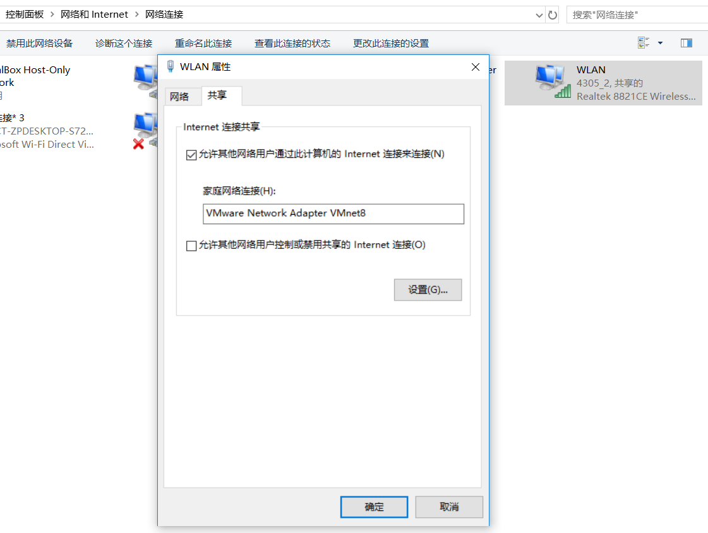
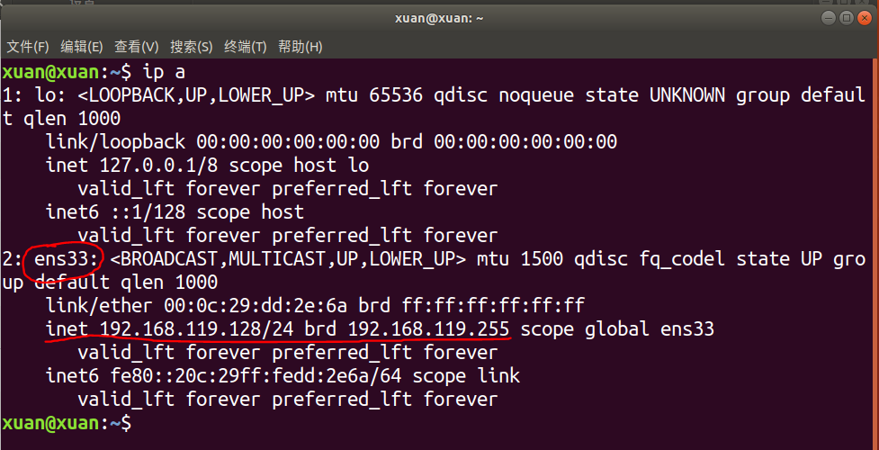
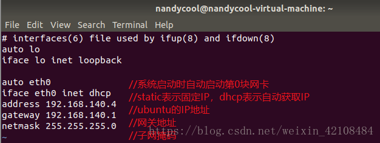
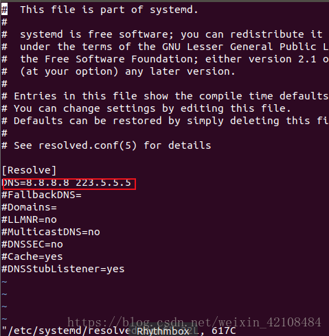
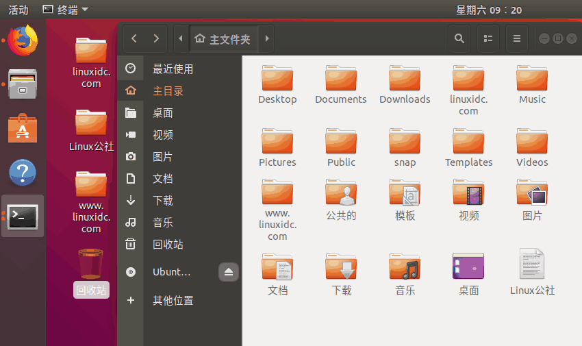

安装Ubuntu 18.04.2

* 说明: Ubuntu 18 的版本只能用**VMware-WorkSatation Pro(也就是vm 15)** 安装  不然产品不兼容

  

#### 刚安装完需要做的

#####  	 更换中文字体

​		 更换中文 需要下载中文字体包, 而说到下载, 就需要联网了,所以先来联网

- 一开始是没有网络的 , 似乎是因为之前上课的实验,虚拟机的网络配置改了, 所以现在连不上网 
- 于是只好重置虚拟网路编辑器  
- 这步之前先配置网络 ,先看下面的网络配置 , 网络配好后
  1. 
  2. 
  3. 找到**简体中文**, **勾选** 然后**确定**,就会自动联网安装了
  4. 然后重启 重启后会弹出来一个选择设置 选择**保留之前的名称**就大功告成了

##### 网络配置

1. 虚拟机-->编辑-->虚拟网络编辑器-->把里面原有的网络都移除了-->还原默认设置 

2.  配置网络:   网络共享中心-->更改适配器设置-->找到你实体机联网的网络-->右键属性-->共享-->允许......  -->下面的选项就选vm8(因为之前选的是NAT连接)

   

3. 打开命令窗口（右键单机桌面选择Open Terminal或者Ctrl+Alt+T），输入ip a查看自己的网卡编号

   

4. 输入命令`sudo vi /etc/network/interfaces`(如果vi出错,或者没有vim可以使用`gedit`代替`vi`)，编辑该文件。注意此处eth0处用自己的网卡编号替换，`address`和`gateway`也是要视情况定的。

   

5. 然后可以试试ping www.baidu.com 如果还不行就继续

6. 在命令行输入`sudo vi /etc/systemd/resolved.conf`(如果vi出错,或者没有vim可以使用`gedit`代替`vi`) 修改改文件：将DNS前的#号去掉，然后加上通用的DNS服务器地址即可。可以自行上网找，也可以和下面一样配置。

   

7. 重启网络服务：

   ​      `sudo /etc/init.d/networking force-reload`  ==> 重新加载网路配置文件

   ​      `sudo /etc/init.d/networking restart`

#####  安装vmtools

​			虚拟机->> 点击**安装vm-tools工具**然后看桌面会增加个文件, 双击打开-->把里面的压缩包拖出来-->使用terminal切换到**Desktop**然后解压 `tar -zxvf VMwareTools-10.2.0-7259539.tar.gz`   -->再使用ls查看,会多一个**vmware-tools-distrib**文件 --> cd进入-->有一个可执行文件**vmware-install.pl** -->然后`sudo ./vmware-install.pl`然后一直回车看见**enjoy**就说明安装完成了  **安装完成后需要`reboot`重启**

##### 设置sudo免密码

  注意: 在更改文件之前,最好先**拍快照**, 或者备份文件

- 在进行sudo操作的时候需要输入当前用户密码，用多了就比较烦，这个东西也可以关掉。输入`sudo nano /etc/sudoers`，找到sudo一行，修改为下面的样子。

- `%sudo   ALL=(ALL:ALL) NOPASSWD:ALL`  然后`ctrl+x`保存

  

#####  设置

- 再次单击图标可以自动缩小

  `gsettings set org.gnome.shell.extensions.dash-to-dock click-action 'minimize'`

##### 安装搜狗输入法

连接: https://pinyin.sogou.com/linux/

下载64位的   文件名是`sogoupinyin_2.2.0.0108_amd64.deb`

然后复制到虚拟机中

sudo dpkg -i sogoupinyin*.deb       *#安装搜狗拼音*
sudo apt-get install -f             *#修复搜狗拼音安装的错误*
sudo dpkg -i sogoupinyin*.deb       *#重新安装搜狗拼音*

