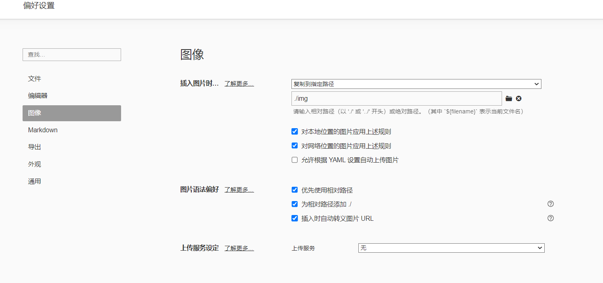
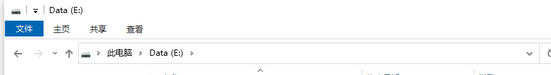
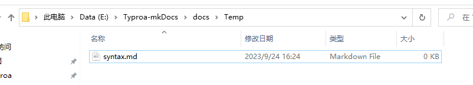
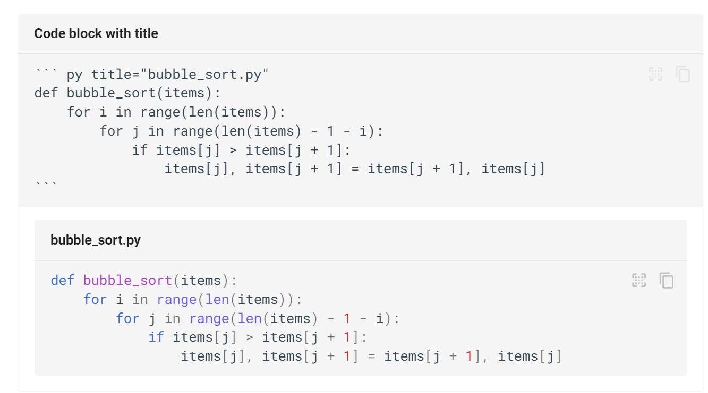
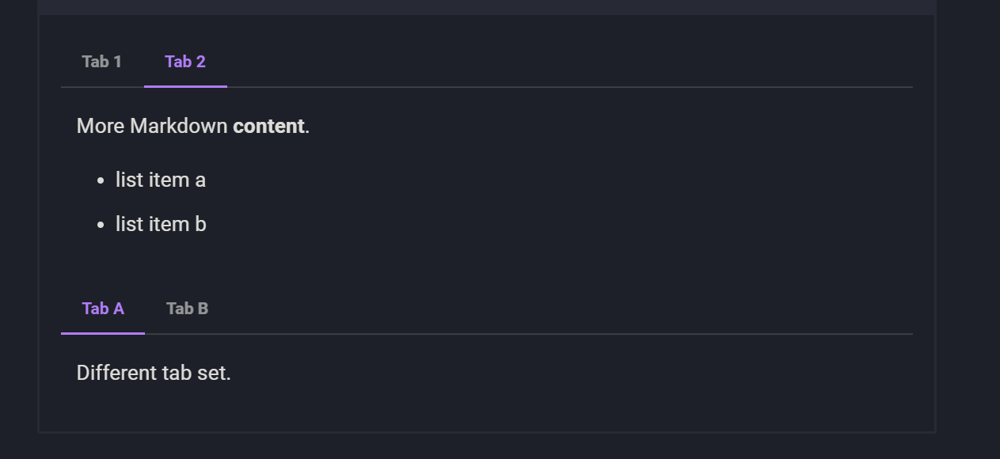

# about

> 将本地Typroa文档同步到云上，方便随时查看自己的文档
>
> 流程：Typroa -> github -> github.io
>
> **需要先安装 Typroa 和 Git 软件，百度即可**


## 1. 设置Typroa

进入Typroa的偏好设置，设置为如下图




## 2. 配置github库

> 如果要把文档存放在： `E:\Typroa`
>
> 那么就 在 E 盘打开cmd，也就是在你存放位置的上一级文件夹

- 在文件夹中点击地址栏，然后直接输入cmd然后按回车即可打开CMD

  

- 配置Git仓库

  ```basic
  # 最后的 Typroa 对应 E:\Typroa ,会自动 Typroa 创建文件夹
  git clone -b main --single-branch https://github.com/yixuan1912/typroa-git-mkdocs.git Typroa-MKDo
  
  cd Typroa
  
  
  ```

  此时，你的Typroa文件夹下会多一些文件


## 3. 同步markdown文件

在 `E:\Typroa-mkDocs\docs` 文件夹下 随便创建一个markdown文件，然后准备上传到github



使用  update.bat 文件即可推送


[mkdocs-material 文档](https://squidfunk.github.io/mkdocs-material/plugins/)


目录：

about1. 设置Typroa2. 配置github库3. 同步markdown文件一级标题二级标题三级标题流程图序列图


# 一级标题

## 二级标题

### 三级标题

|      |      |      |
| ---- | ---- | ---- |
|      |      |      |
|      |      |      |
|      |      |      |


> 引用

|      | score | 路径 |
| :--: | :---: | :--: |
|  1   |  90   | ABH  |
|  2   |  85   | ACH  |


- ==This was marked==
- ^^This was inserted^^
- ~~This was deleted~~

下标和上标

- H~2~O
- A^T^A

在代码块中突出显示变化

```
Text can be {--deleted--} and replacement text {++added++}. This can also be
combined into {~~one~>a single~~} operation. {==Highlighting==} is also
possible {>>and comments can be added inline<<}.

{==

Formatting can also be applied to blocks by putting the opening and closing
tags on separate lines and adding new lines between the tags and the content.

==}


```

代码块

```python title="bubble_sort.py"
"""
123123
"""
def main():
    pass

print(11)
```




公式代码块 -- mkdocs

```
\operatorname{ker} f=\{g\in G:f(g)=e_{H}\}{\mbox{.}}
```

$$
\operatorname{ker} f=\{g\in G:f(g)=e_{H}\}{\mbox{.}}
$$


记录扩展 ??? note

```
Lorem ipsum dolor sit amet, consectetur adipiscing elit. Nulla et euismod
nulla. Curabitur feugiat, tortor non consequat finibus, justo purus auctor
massa, nec semper lorem quam in massa.
```


> 图表详见  https://squidfunk.github.io/mkdocs-material/reference/diagrams/#using-flowcharts

# 流程图

```
graph LR
  A[Start] --> B{Error?};
  B -->|Yes| C[Hmm...];
  C --> D[Debug];
  D --> B;
  B ---->|No| E[Yay!];
Yes


No
Start
Error?
Hmm...
Debug
Yay!
```

# 序列图

```
sequenceDiagram
  autonumber
  Alice->>John: Hello John, how are you?
  loop Healthcheck
      John->>John: Fight against hypochondria
  end
  Note right of John: Rational thoughts!
  John-->>Alice: Great!
  John->>Bob: How about you?
  Bob-->>John: Jolly good!
AliceJohnBobloop[Healthcheck]Rational thoughts!Hello John, how are you?1Fight against hypochondria2Great!3How about you?4Jolly good!5AliceJohnBob
```


选项[卡式](https://facelessuser.github.io/pymdown-extensions/extensions/tabbed/)扩展允许使用内容选项卡

````
=== "Tab 1"
    Markdown **content**.

    Multiple paragraphs.

=== "Tab 2"
    More Markdown **content**.

    - list item a
    - list item b

===! "Tab A"
    Different tab set.

=== "Tab B"
More content.
```



# 任务列表
````

-  Lorem ipsum dolor sit amet, consectetur adipiscing elit
- Vestibulum convallis sit amet nisi a tincidunt
  -  In hac habitasse platea dictumst
  -  In scelerisque nibh non dolor mollis congue sed et metus
  -  Praesent sed risus massa
-  Aenean pretium efficitur erat, donec pharetra, ligula non scelerisque

```

- [x] Lorem ipsum dolor sit amet, consectetur adipiscing elit
- [ ] Vestibulum convallis sit amet nisi a tincidunt
  * [x] In hac habitasse platea dictumst
  * [x] In scelerisque nibh non dolor mollis congue sed et metus
  * [ ] Praesent sed risus massa
- [ ] Aenean pretium efficitur erat, donec pharetra, ligula non scelerisque

```
