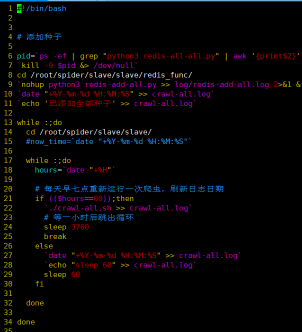

[TOC]

**分别放在master：192.168.0.106、 slave1:192.168.0.108上面**


## 框架文件目录

```
root@master:~/spider/slave/slave# pwd
/root/spider/slave/slave
```


## 脚本文件说明

- `crawl-one.sh`:  运行一个爬虫
  
- 比如运行编号为100的爬虫： `./crawl-one.sh 100`
  
- `crawl-all.sh`：运行`crawl_num`中预先配置的所有的爬虫爬虫编号
  
- 
  
- `crawl-time.sh`：  每天定时运行`crawl-all.sh`这个脚本文件

  - 6到11行代码： 调用自动添加爬虫种子的文件，添加种子文件的目录为master上的`/root/spider/slave/slave/redis_func`文件

- 自动添加种子的文件

  - 
  - 18行的`num = 60 * 30`即sleep60*30秒，大致半小时，如果要修改添加种子的频率可修改这里

  - 

  - 第21行  `if (($hours==00));then`  中间的00就是24小时制的0点，可自行修改
  - 

  ​	

- `get-crawl-count.sh`：  从日志文件中获取当天`crawl-all.sh`中的爬虫爬过的新闻数量


## 添加和运行一个新的爬虫：

1. 把爬虫文件放到需要运行此爬虫的服务器上的改目录下`/root/spider/slave/slave/parse`
2. 编辑  `vi conf/spider.cfg`，添加信源，例添加一个快手
   1. 
3. 运行`crawl-one.sh 爬虫编号`
   1. 例 
   2. 如果需要查看运行过程可以查看日志文件，可使用此命令`tail -fc1 logs/slave_100.log.2021-09-10` 
   3. 100是爬虫的编号，后面的是当天的日期
4. 确定没bug后可以在`crawl-all.sh`的shell文件中添加一个编号
   1. 添加了一个100
   2. 
5. 把添加种子的文件放到**master**下的`~/spider/slave/slave/redis_func`目录下即可每半小时自动加一次


### 对于需要无限添加种子的

在`crawl-all.sh`文件中配置

按下面的格式添加三行即可


## 国外网站的爬虫

在192.168.0.40上面运行，通过cmd运行


## 服务器重启后需要开启的服务

1. 启动全部的爬虫，在相应的节点上执行`crawl-time.sh` 即可
   - `root@master:~/spider/slave/slave# ./crawl-time.sh &`
   - `root@slave1:~/spider/slave/slave# ./crawl-time.sh &`
   - `root@slave2:~/spider/slave/slave# ./crawl-time.sh &`

2. 开启快手did获取程序，在192.168.0.40上面运行

   - 因为需要用到selenium无头模式并且使用代理

   - 进入文件位置： `cd /root/spider/slave/slave/parse/get_seed`
   - 运行程序： `nohup python3 ks_huakuai.py >> lo.ks.log &`


## 目前的爬虫网站对应编号

```python
100 tengxunnews.py add_prifile_tx.py 腾讯新闻
200 jstv.py add_prifile_jstv.py 荔枝新闻
300 tianya.py add_prifile_tianya.py 天涯论坛
400 pengpainews.py add_prifile_pengpainews.py 澎湃新闻
500 renmin.py add_prifile_renmin.py 人民日报(地方)、社会法治
510 rmw_nj.py add_prifile_rmw_nj.py 人民日报-南京
600 xinhuanet.py add_prifile_xinhuanet.py 新华网-江苏、上海
610 xinhuanetjs.py add_prifile_xinhuanetjs.py 新华网
700 cctv.py add_profile_cctv.py 央视网
800 jsnews.py add_prifile_jsnews.py 江苏网
900 chinadaily.py add_prifile_chinadaily.py 中国日报
1000 newschina.py add_prifile_newschina.py 中国网
1010 youth.py add_prifile_youth.py 中国青年网
1020 gmw.py add_prifile_gmw.py 光明网
1030 cnr.py add_prifile_cnr.py 央广网
1040 chinanews.py add_prifile_chinanews.py 中国新闻网
1050 souhu.py add_prifile_souhu.py 搜狐新闻
1060 百度新闻
1070 add_prifile_huanqiu.py huangqiu.py 环球网
1080 add_prifile_ycwb.py ycwb.py 金羊网
1090 add_prifile_yangtse.py yangtse.py 扬子晚报
1100 add_prifile_qs.py qs.py 求是网
1110 add_prifilr_wsw.py wsw.py 我苏网
1120 add_prifile_sinanews.py sina.py 新浪新闻
1130 add_prifile_emer.py emer.py 中国应急信息网
1140 add_prifile_wangyi.py wangyi.py 网易新闻
1150 凤凰新闻 	fenghuang
1160 新广网 	XGW
1170 百度贴吧 
1180  观察网           url:https://user.guancha.cn/main/content?id=339546&v=1626231413227
1190  今日头条	toutiao
1191 今日头条评论
1200 观察网用户	url:https://user.guancha.cn/main/content?id=339546&v=1626231413227
1201 观察网评论
1210 上观新闻     shangguan
1220 微博	weibo
1221 微博评论
1230 南方网		nanfangnews
1240 苏州新闻网	suzhounews
1250 中华网		zhonghuanews
1260 红网     	shongwang
1270 一点资讯  	yidianzixun	
1280 星岛环球网 	stnn
1290 参考消息   cankaoxiaoxi
1300 大公网    dagong
1310 中国文明网	wenming
1320 中国政府网	chinagovnews
1330 新华报业
1340 国际在线
1350 bbc						--192.168.0.40
1360 纽约时报					--192.168.0.40
1370 东亚日报					--192.168.0.40
1380 淮安新闻网
1390 网易新闻app
1400 博客中国
1410 今日六合app   http://app.luhetv.com/mag/city/v1/info/mediaInfoView?id=1323
1420 宣讲家
1430 浦口发布app    http://app.pukoufabu.com/mag/info/v1/info/infoView?id=10628
1440 今吴江
1450 最江阴
1460 今日张家港
1470 仪征发布           status_code: 401  Authorization
1480 东太湖论坛
1481 东太湖论坛评论
1490 今日高邮           status_code: 401  Authorization
1500 第三频道
1510 宜兴网
1520 溧阳时空网
1530 句广网
1540 扬中新闻网 
1550 泰兴网
1560 如东新媒体
1570 中共如皋市委新闻网
1580 如东新媒体
1590 东台报业网
1600 南通州网
1610 射阳新闻网
1620 洪泽新闻网
1630 赣榆新闻网
1640 名城扬州网
1650 扬州发布
1660 路透新闻网			--192.168.0.40
1670 美国之音		   	--192.168.0.40
1680 扬州网

下面的放slave1上跑，种子放master上
=============================
1690 南方周末
1700 法制网
1710  知乎用户
1712 知乎专栏
1720 半月谈
1730 中评网
1740 新京报  BjNews
1750 华商网
1760 快手推荐
1762 快手用户
1770 大河网
1780 南风窗
1790 广西新闻网
1800 消费日报
1810 抖音user
1820 黑龙江东北网
1830 新沂融媒
1840 东南网
1850 山西新闻网
1860 山东大众网

```

