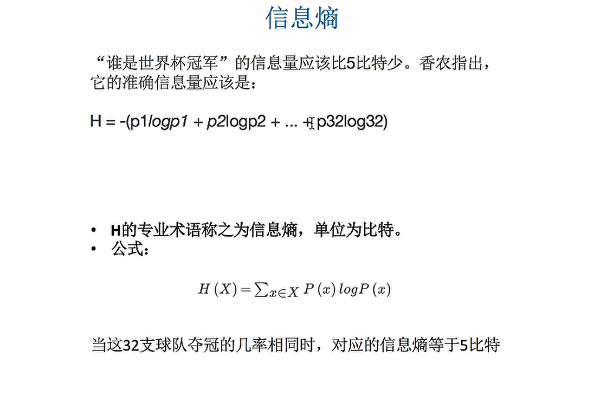
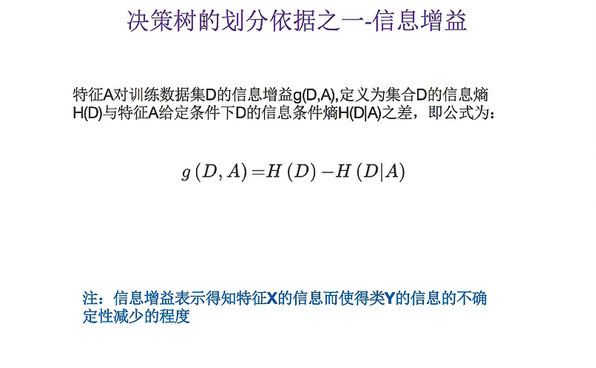
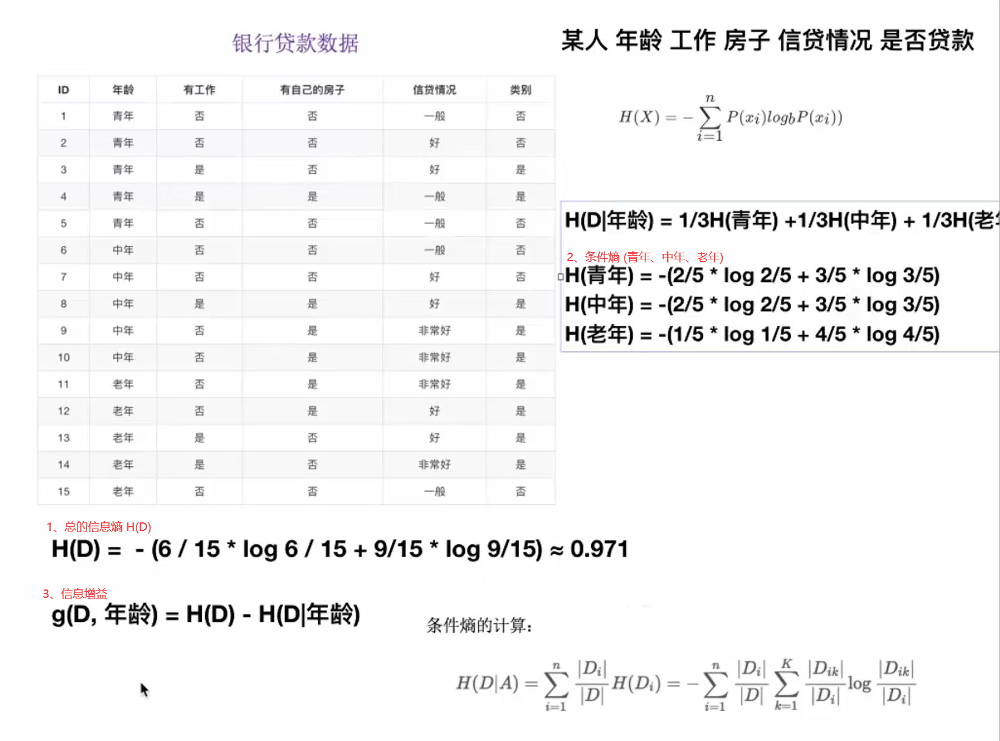
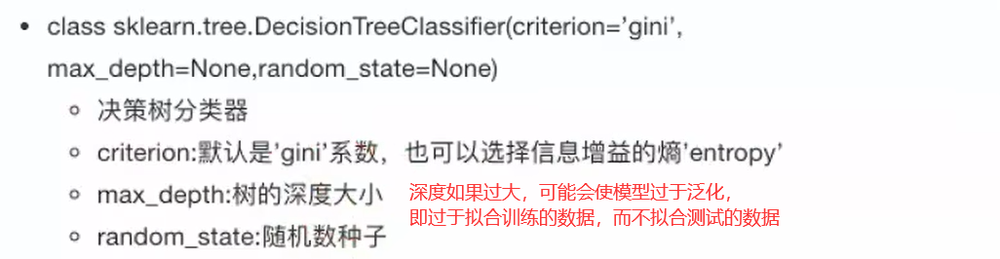
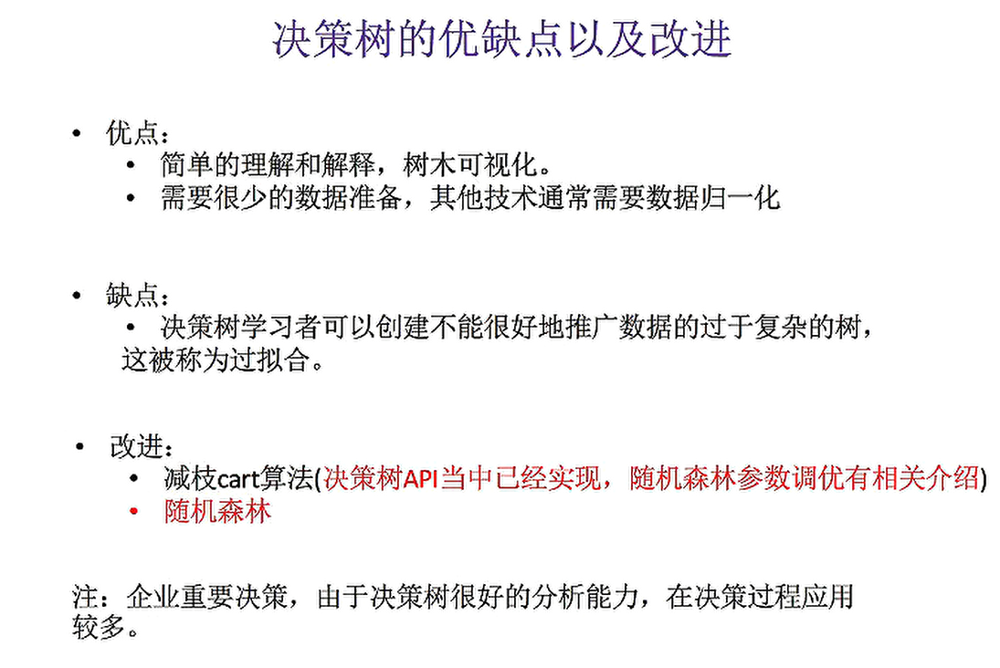
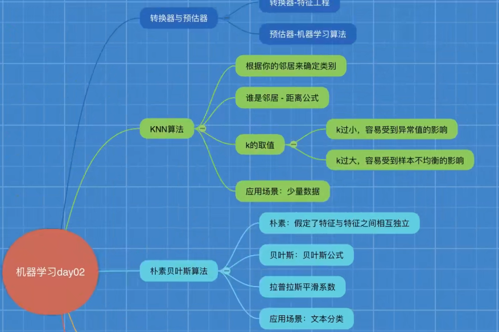
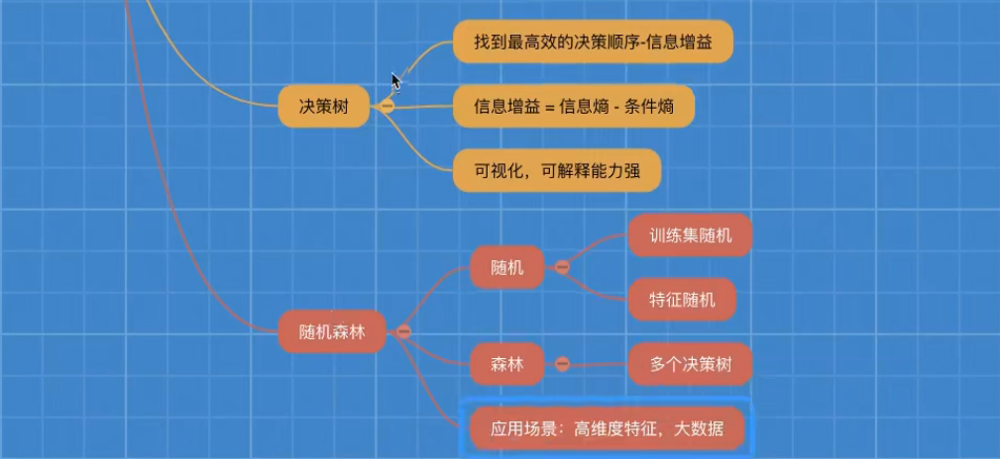

> 交叉验证：为了让被评估的模型更加准确可信
>
> 交叉验证会将所有的数据分成n等分的数据，然后将数据的验证集每次变换，得到n个模型结果，最后取平均值作为结果，这又叫做n折交叉验证

### 网格搜索

```
sklearn.model_selection.GridSearchCV(estimator, param_grid, cv)
```

- 对估计器的指定参数值进行详尽的搜索
- 参数：
  - estimator：估计器对象（使用的算法对象）
  - param_grid：估计器参数(dict){"n_neighbors":[1,3,5]}
  - cv:指定几折交叉验证
- 方法：
  - fit:输入训练数据
  - score：准确率
- 结果分析：
  - best_score_:在交叉验证中验证的最好结果
  - best_estimator_：最好的参数模型
  - cv_results_：每次交叉验证后的验证集准确率结果和训练集准确率结果


### 决策树

- 信息熵：

  

- 信息增益（越大越重要）：信息增益表示得知特征X的信息而信息的不确定性减少的程度是的类Y的信息熵减少的程度

  

#### 决策树分类

- ID3 信息增益：最大的准则
- C4.5 信息增益比：最大的准则
- CART 回归树：平误差：最小
- CART 分类树：基尼系数 最小的准则 在sklearn中可以选择划分的默认原则

### 决策树API






### 随机森林

> 工作原理：生成多个分类器/模型，各自独立的学习和做出预测。这些预测最后结合组成组合预测，因此优于任何一个单分类的做出预测。
>
> 随机森林就是一个包含多个决策树的分类器，并且其输出的类别是由个别树输出的类别的众数而定。
>
> 它属于集成学习方法的一种

#### 原理

随机方法可分为训练集随机和特征随机

- 训练集随机：使用bootstrap方法随机有放回抽样
  - 每次抽一个样本，然后放回去，循环这样直到随机生成一个完整的新的训练集
- 特征随机：从M个特征中随机抽取m个特征（M>m）


### 总结






