### 3.1线性回归

> 定义：线性回归利用回归方程对一个或者多个自变量(特征值)与因变量(目标值)之间关系进行建模的一种分析方式。其中自变量可以为一个或多个。
>
> 一元线性回归(单变量线性回归)：涉及的变量只有一个
>
> 多元线性回归：设计的变量有两个或者两个以上 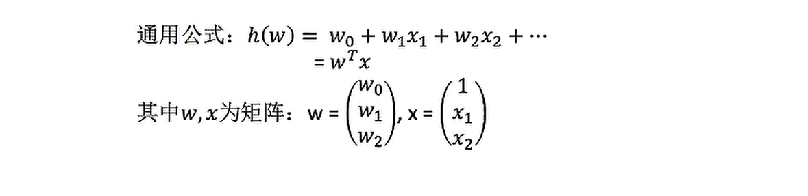

#### 广义线性模型

- 线性模型：
  - 自变量x是一次的（具有线性关系）：y=w1x1 + w2x2 + …… + b
  - 参数是一次的（不具有线性关系，但是还是线性模型）：y=w1x1 + w2x1^2 + w3x1^3 + …… + b

- 线性模型与线性关系的关系：
  - 线性关系一定是线性模型
  - 线性模型不一定具有线性关系

#### 回归步骤

1. 算法：线性回归

2. 选择损失函数(最小二乘法)

   

   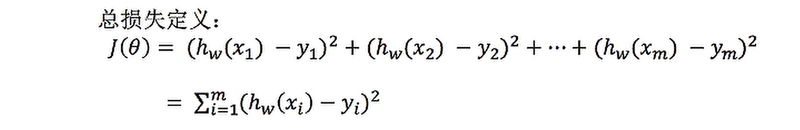

3. 优化损失函数，使得损失W最小

   - 正规方程：

     理解：X为特征值矩阵，y为目标值矩阵

     缺点：特征过于复杂时，求解速度很慢

     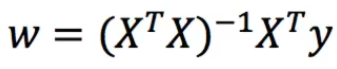

   - 梯度下降：

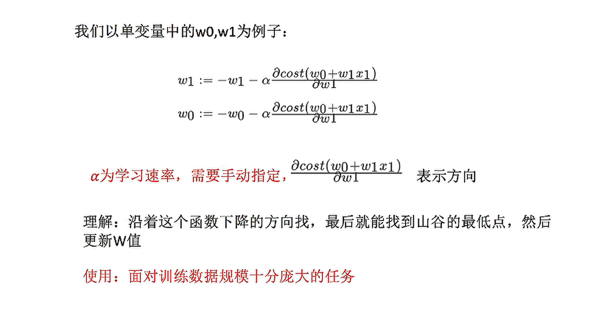

​			梯度下降过程：

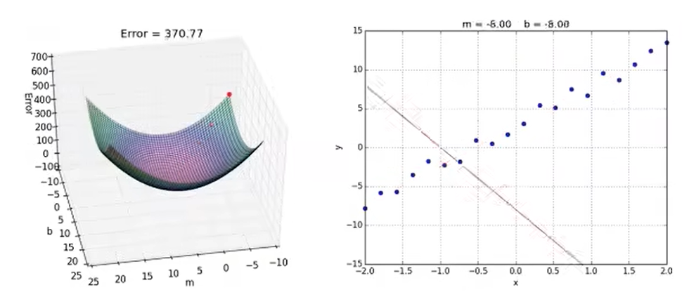

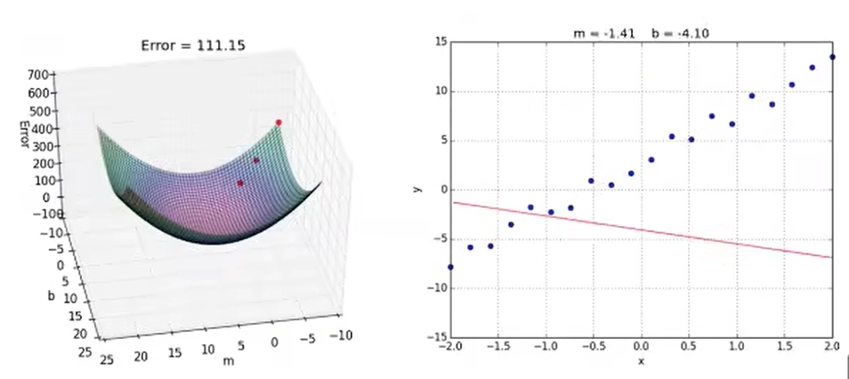

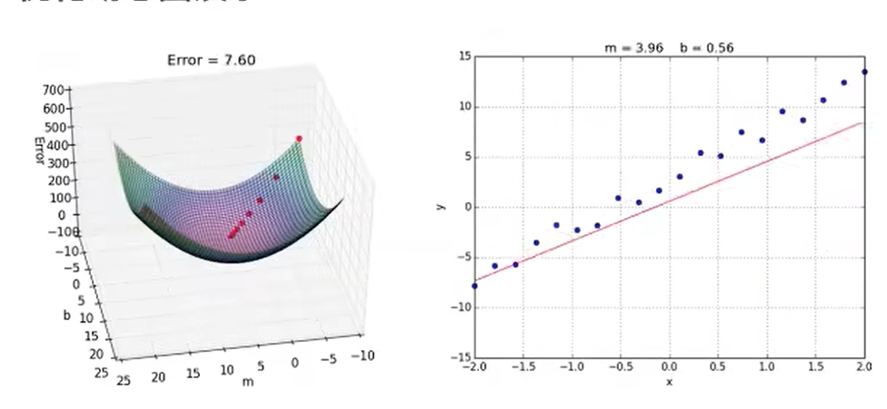

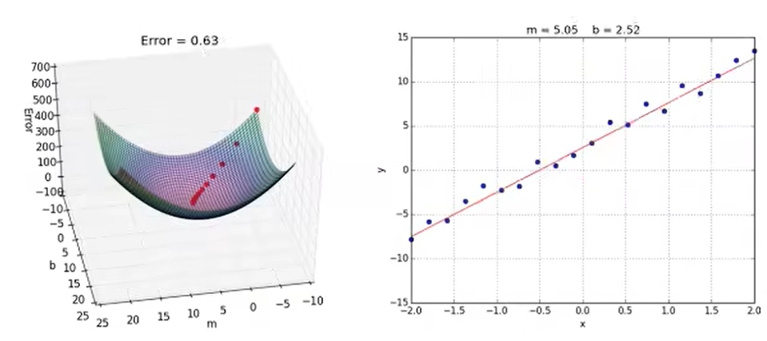

- API

  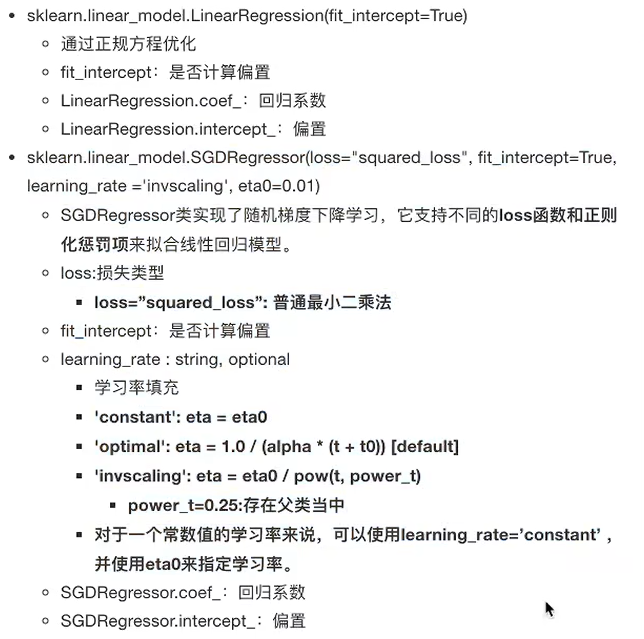

- 回归性能评估，使用均方误差评价机制

  > y^i为预测值，-y为真实值

  - 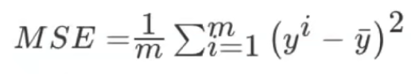
  - 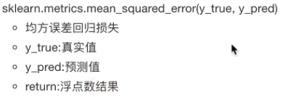

 

- 拓展-关于优化方法 GD、SGD、SAD
  - GD：梯度下降(Gradient Descent)，原始的梯度下降法需要计算所有样本的值才能够得出梯度，计算量大，所以才会有优化方法
  - SGD：随机梯度下降(Stochastic gradient descent)是一个优化方法。它在一次迭代时只考虑一个训练样本。
    - 优点：搞笑、容易实现
    - 缺点：SGD需要许多超参数：比如正则项参数、迭代数。SGD对于特征标准化是敏感的。
  - SAG：随机平均梯度下降法(Stochastic Average Gradient)，由于收敛的速度太慢，所以提出了SAG等基于梯度下降的算法
    - Scikit-learn：岭回归、逻辑回归等当中都有SAG优化

### 3.2过拟合与欠拟合

- 欠拟合：学习到的特征过少

  - 解决：增加一些特征数量

- 过拟合：学习到的特征过多，存在一些嘈杂的特征，模型过于复杂，只适合于训练集的数据。

  - 解决：使用正则化

    > 针对回归，一般选择正则化。但是其他的机器学习算法也有可能出现这样的问题，这时候就需要我们自己去做更多的特征选择，比如 删除或者合并一些特征。

- 过拟合与欠拟合图例：

​	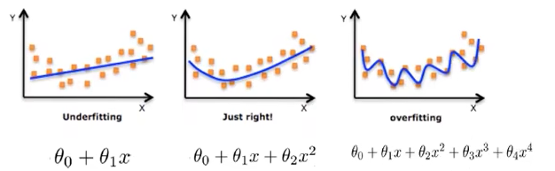

#### 正则化类别

- L2正则化(损失函数 + λ惩罚项，更常用)

  - 作用：可以使其中一些W的值变得很小，都接近于0，等于削弱某个特征的影响

  - 优点：越小的参数说明模型越简单，越简单的模型越不容易产生过拟合

  - Ridge回归(岭回归)

  - 加入L2正则化后的损失函数 J(W)：

    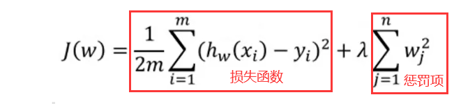

- L1正则化(损失函数 +  λ|惩罚项|)
  - 作用：可以使得其中的一些W系数直接为0，删除这个特征的影响
  - LASSO回归

### 3.3线性回归改进-岭回归

岭回归也是一种线性回归，只不过在算法建立回归方程的时候加入了正则化的限制，从而达到解决过拟合的问题

##### 1.岭回归API：

- sklearn.linear_model.Ridge(alpha=1.0, fit_intercept=True,solver="auto",normalize=False)
  - 具有2正则化的线性回归
  - alpha:正则化力度，也叫 λ
    - λ取值:0~1  1~10
  - solver:会根据数据自动选择优化方法
    -  sag:如果数据集、特征都比较大，选择该随机梯度下降优化
  - normalize:数据是否进行标准化
    - normalize=False:可以在fit之前调用preprocessing.StandardScaler标准化数据
  - Ridge.coef_:回归权重
  - Ridge.intercept_:回归偏置

##### 2.正则化程度的变化，对结果的影响

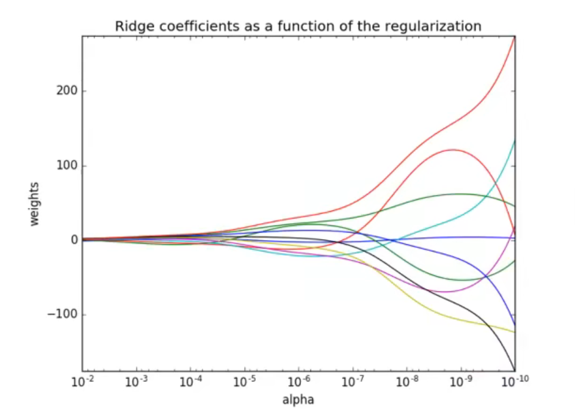

### 3.4逻辑回归

逻辑回归(Logistic Regression)是机器学习中的一种分类模型，逻辑回归是一种分类算法，虽然名字中带有回归，但是它与回归之间有一定的联系。由于算法的简单和高效，在实际中应用非常广泛。

> 逻辑回归一般用于解决二分类问题

#### 原理

1. 输入：逻辑回归的输入就是一个线性回归的结果

   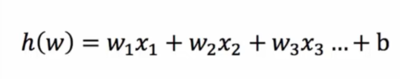

2. 激活函数

   - sigmoid函数( 1/1 + e^(-x) )

   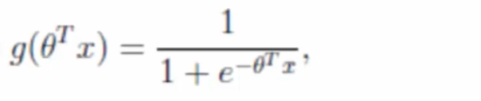

   - 线性回归的结果会输入到sigmoid的x中，从而得出输出：[0, 1]区间中的一个概率值，默认的预置为0.5

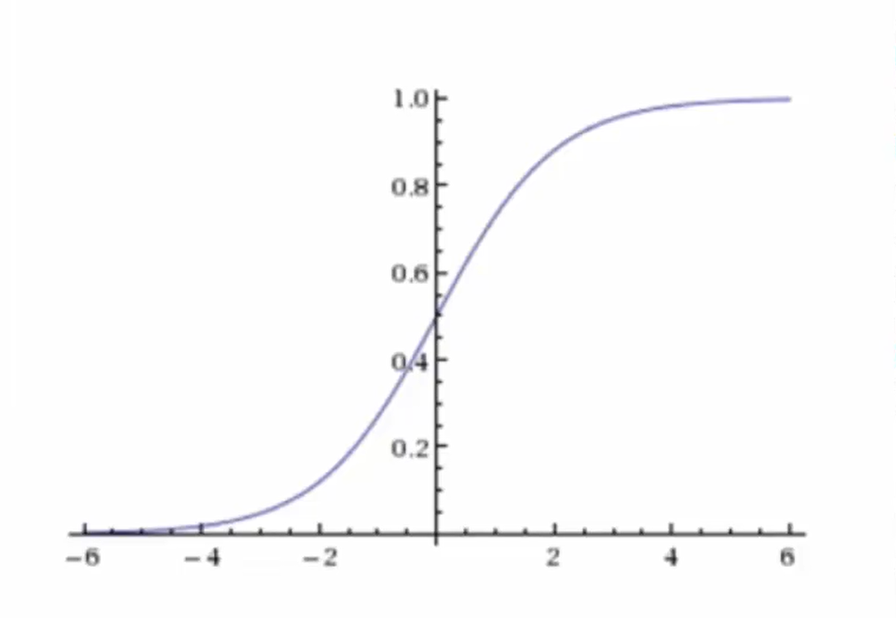

#### 逻辑回归过程

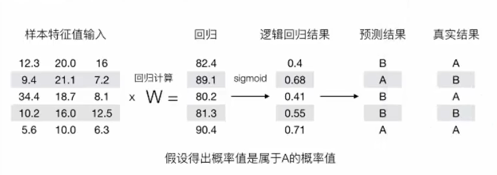

#### 逻辑回归的损失函数称为 对数损失函数

分段计算式子：

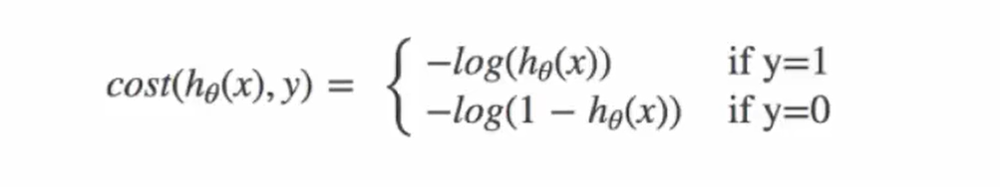

由于分段的式子不好计算，所以引入 完整的损失函数(完整的损失函数在分段条件下和分段式子的结果是一样的)：

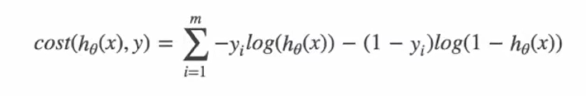

损失函数计算过程：把真实结果带入到上式即可

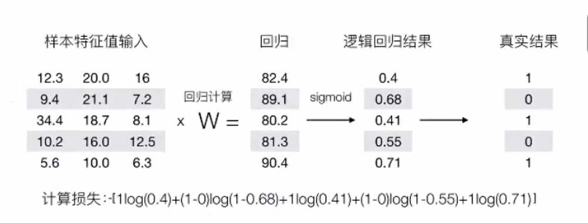

#### 优化损失函数

同样可以使用线性回归中使用固定方法，梯度下降优化算法，去减少损失函数的值。

#### 逻辑回归API

- sklearn.linear_model.LogisticRegression(solver='liblinear', penalty='l2', C =1.0)
  - solver:优化求解方式（默认开源的liblinear库实现，内部使用了坐标轴下降法来迭代优化损失函数)
    - sag:根据数据集自动选择，随机平均梯度下降
  - penalty:正则化的种类
  - C: 正则化力度

> 默认将类别数量少的当做正例

**LogisticRegression方法相当于SGDClassifier(Ioss="log",penalty=" "),SGDClassifier实现了一个普通的随机梯度下降学习，也支持平均随机梯度下降法(ASGD)，可以通过设置**
**average=True。而使用LogisticRegression(实现了SAG)**

#### 精确率与召回率

1. **混淆矩阵**

   在分类任务下，预测结果与真实结果之间存在四种不同的组合，构成混淆矩阵(适用于多分类)、

   TP: True Positive

   FN: False Negative

   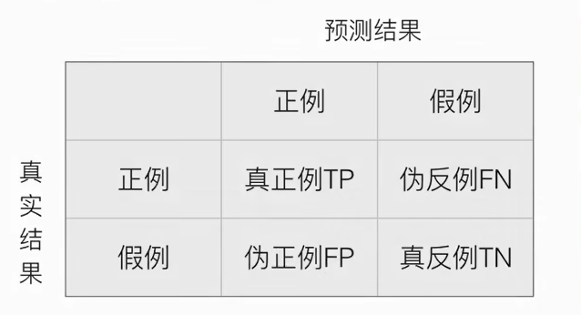

2. **精确率(Precision)与召回率(Recall)**

- 精确率：预测结果为正例样本中真实为正例的比例

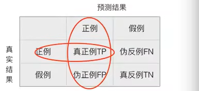

- 召回率：真实为正例样本中预测结果为正例的比例

- F1-score: 反应模型的稳健性

  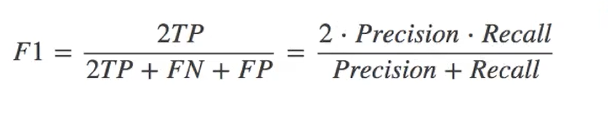

3. **API**
   - sklearn.metrics.classification_report(y_true, y_pred, labels=口,target_names=None )
   - y_true: 真实目标值
   - y_pred: 估计器预测目标值
   - labels:指定类别对应的数字
   - target_names:目标类别名称
   - return:每个类别精确率与召回率

#### ROC曲线与AUC指标

可用于评估样本分布不均衡的情况

1. **TPR与FPR**

   - TPR：TP / (TP + FN)：所有真实类别为1的样本中，预测类别为1的比例

   - FPR：FP / (FP + TN)：所有真实类别为0的样本中，预测类别为1的比例

2. **ROC曲线**

   当FPRate与TPRate相等是，就是中间的红色虚线，此时不论真实类别是0还是1，分类器的预测结果都是1，此时的AUC=0.5。

   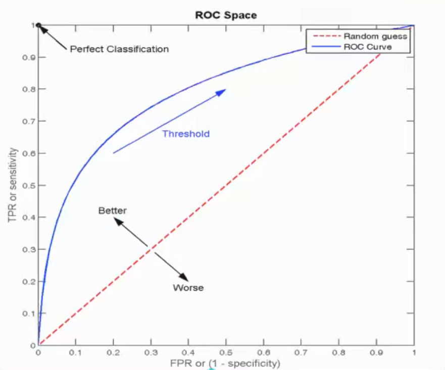

3. **AUC指标**

   - AUC的概率意义是随机取一对正负样本，正样本得分大于负样本的概率
   - AUC的最小值为0.5，最大值为1，取值越高越好
   - AUC=1，完美分类器，采用这个预测模型时，不管设定什么阈值都能得出完美预测。绝大多数预测的场合，不存在完美分类器。
   - 0.5<AUC<1，优于随机猜测。这个分类器（模型）妥善设定阈值的话，能有预测价值。

   > AUC的值在 [0.5, 1]之间，越接近1表示越好

4. **API**
   - from sklearn.metrics import roc_auc_score
   - roc_auc_score(y_true, y_score)
   - 计算ROC曲线面积，即AUC值
   - y_true:每个样本的真实类别，必须为0(反例),1(正例)标谦
   - y_score:预测得分，可以是正类的估计概率、置信值或者分类器方法的返回值

5. eg（模拟在评估样本分布不均衡的情况下）

   - 总共有100个人，如果有99个样本癌症，1个样本非癌症–样本不均衡

     不管怎样全都预测为正例(默认癌症为正例)-则该模型是一个不负责任的模型
     	准确率:99/100=99%
     	召回率: 99/99 = 100%精确率:99%
     	F1-score: 2*99%/ 199% = 99.497%

     ​	AUC:0.5(不好的模型)
     ​		TPR = 100%
     ​		FPR = 1 / 1 = 100%

     

### 聚类 k-means算法

- k-means是无监督学习，没有目标值，一般用于分类

- 无监督学习包括：
- 聚类：
  - k-means(k均值聚类)
- 降维：
  - PCA

#### 原理

1. 随机设置K个特征空间内的点作为初始的聚类中心（初始点为均值点）
2. 对于其他每个点计算到K个中心的距离，未知的点选择最近的一个聚类中心点作为标记类别
3. 接着对着标记的聚类中心之后，重新计算出每个聚类的新中心点（平均值)
4. 如果计算得出的新中心点与原中心点一样，那么结束，否则重新进行第二步过程

#### k-means性能评估

1. **轮廓系数**(1 >= SCi >= -1，越接近1越好)

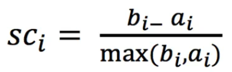

> 注:对于每个点 i 为已聚类数据中的样本，b_i 为 i 到其它族群的所有样本的距离最小值, a_i 为 i 到本身簇的距离平均值。最终计算出所有的样本点的轮廓系数平均值

- 轮廓系数最好要使得，外部距离最大化，内部距离最小化，即 高内聚、低耦合

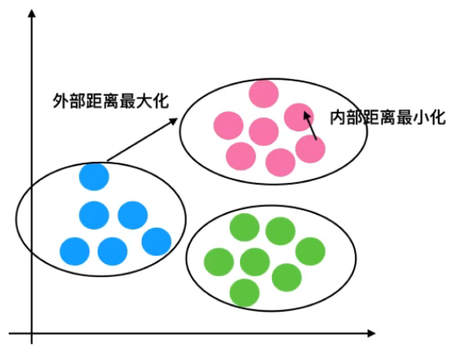

#### K-means总结

- 特点分析：采用迭代式算法，直观易懂且非常使用
- 缺点：容易收敛到局部最优解（即初始特征点k在一起的情况），可采用多次聚类去随机取k点，选取不收敛的情况

### 总结

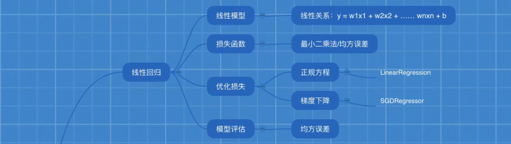

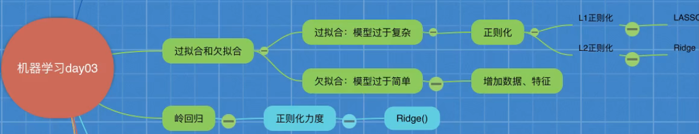

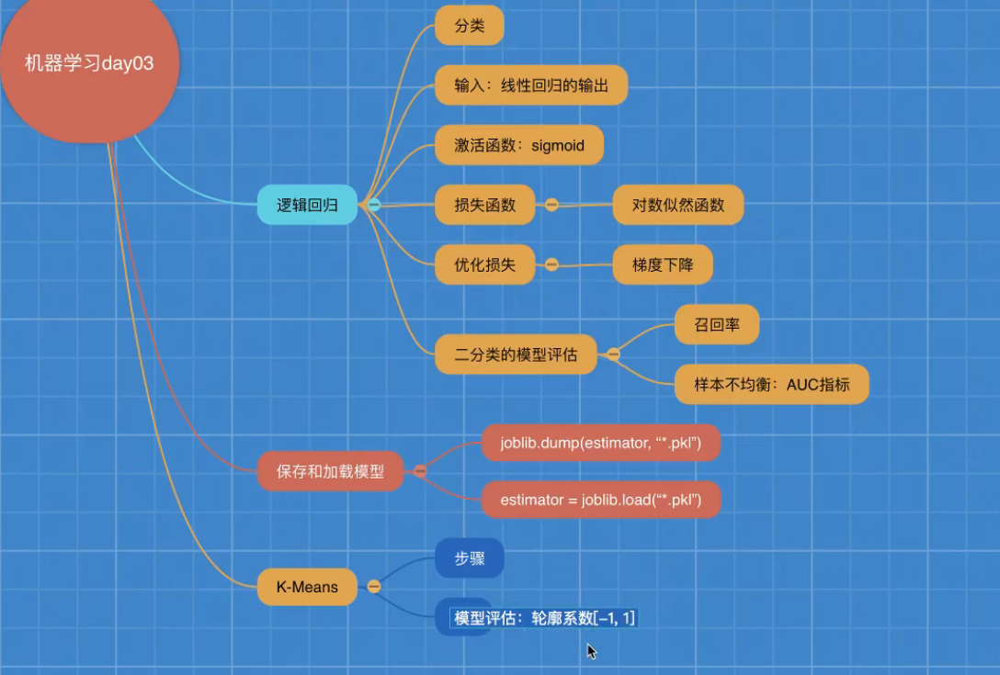

