[TOC]

# 整体结构


## 1. items.py

`items.py` 配置数据存储字段 

如果需要添加新字段。需要对`pipelines.py  `同时添加到`dict_content_name`（评论同理）如下

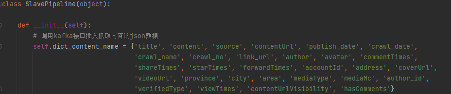

`slaveItem` 和`CommentItem`

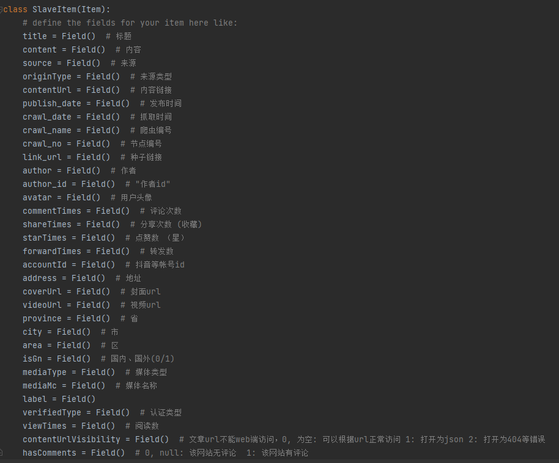

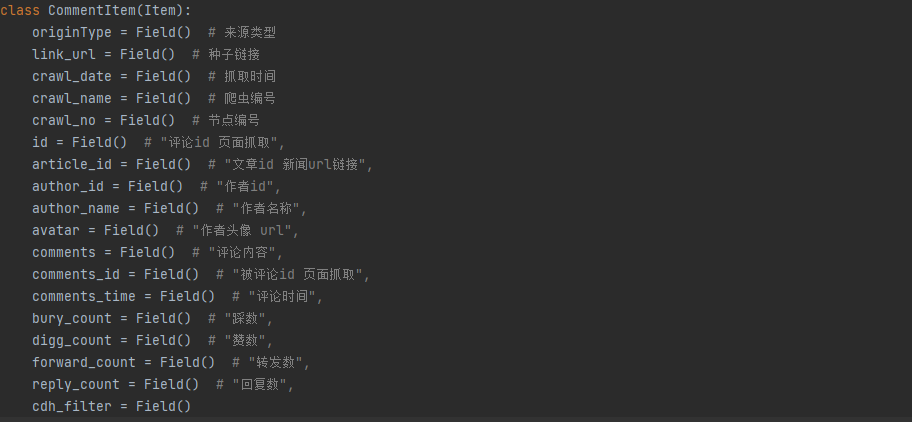


## 2. middlewares.py

配置不同的`middlewares`可以实现不同的效果。可以配置代理，请求头等

### `ProxyMiddleware`

代理池--代理`ip`添加到`redis`中，代理真实数量不低于20个

```python
redisClient = redis.Redis(host='192.168.0.106', port='6379')
excle_path = "D:\slave\slave\Proxy\Proxy.xls"
excel_book = xlrd.open_workbook_xls(excle_path)
sheet1 = excel_book.sheet_by_index(0)
for i in range(1, sheet1.nrows):
    ip = sheet1.cell_value(i, 0)
    port = sheet1.cell_value(i, 1)
    # 格式： 117.28.246.17,80,2021-05-25,zdaye
    proxy = str(ip) + ',' + str(int(port)) + ',2021-06-25 15:37:38,proxy'
    redisClient.lpush('zdyProxy', proxy)
```


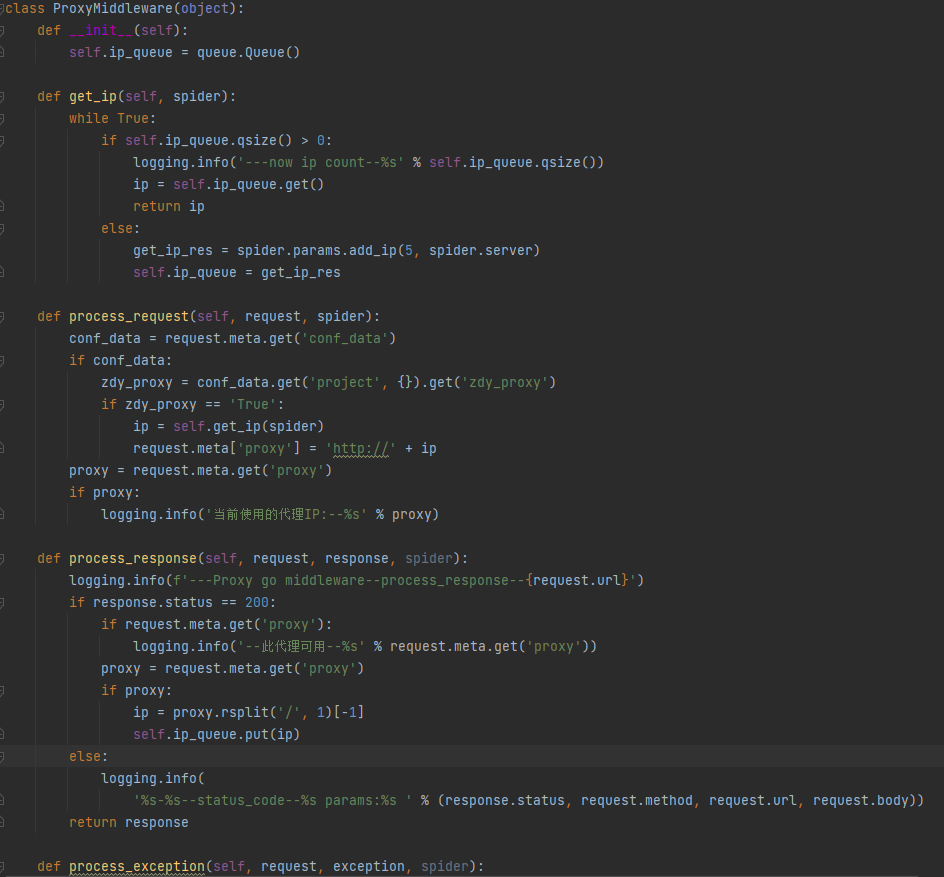

### `TunnelProxyMiddleware`

```python
# 隧道代理，此处使用亿牛云的，需要配置用户名和密码等， 具体参考：https://www.16yun.cn/help/ss_demo/
# 在下面这里配置用户名密码等：
proxyHost = "u6880.10.tn.16yun.cn"
proxyPort = "6442"
proxyUser = "16IXHCPW"
proxyPass = "281792"
```

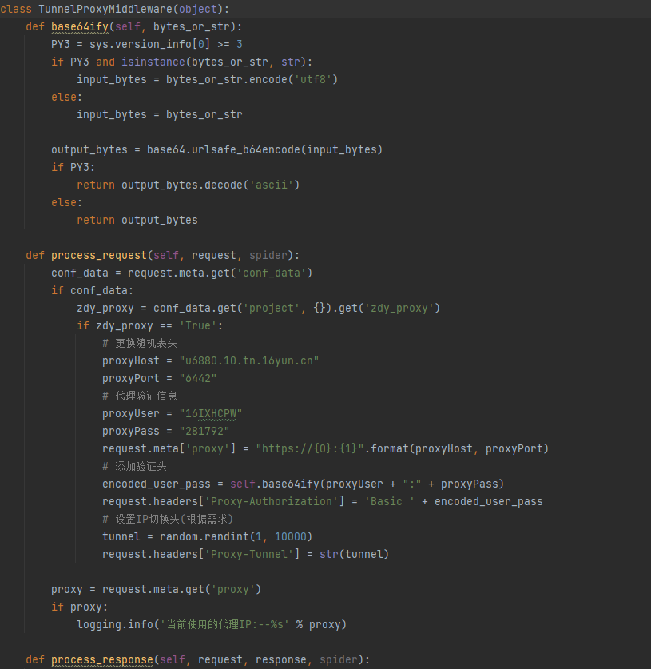

### `AbroadProxyMiddleware`

如果本机开了代理，无法进行爬虫，可以尝试使用此middleware

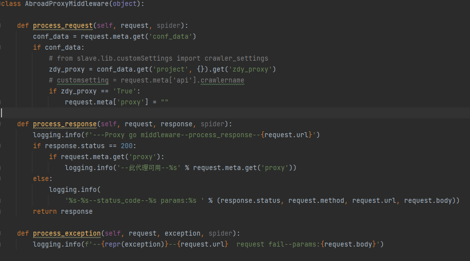

### `BaiduMiddleware`

可以通过百度旋转验证

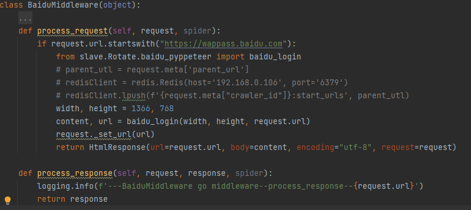


## 3. pipelines.py

```python
# 用于处理数据，分为`CommentPipeline`和`SlavePipeline`
# CommentPipeline --> 用于调用评论的kafka接口
# SlavePipeline   --> 用于调用文章的kafka接口
```

- `SlavePipeline`
  
  - 用于存储的字段
    
  - 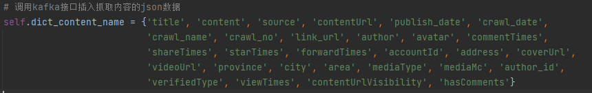
    
  - 在标题和正文中查找省和市字段：
    - 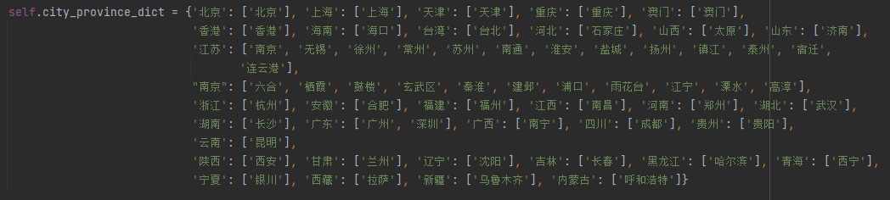
    
    - 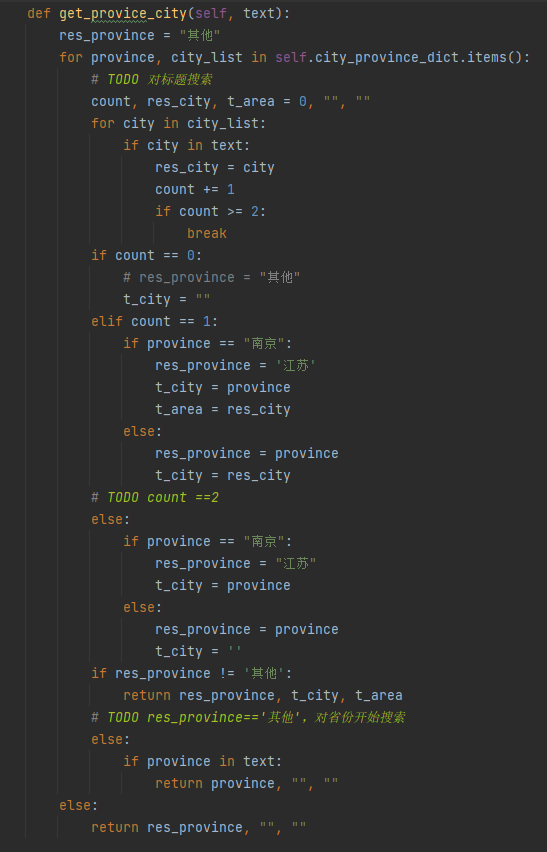
    
  -  重新映射认证类型（用于识别微博头条的用户认证）
  
    - 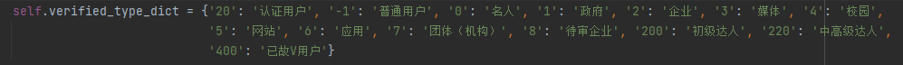
    - 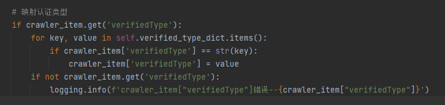
  
  - 对数据进行处理， 去掉注释 script标签等，和解决img链接不完整的问题
    
  - 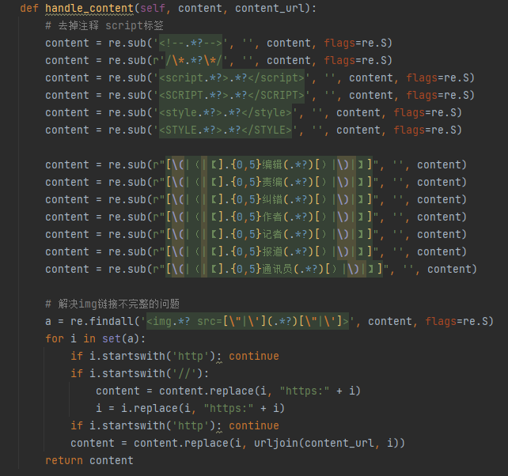
    
  - 具体实现
    
    - 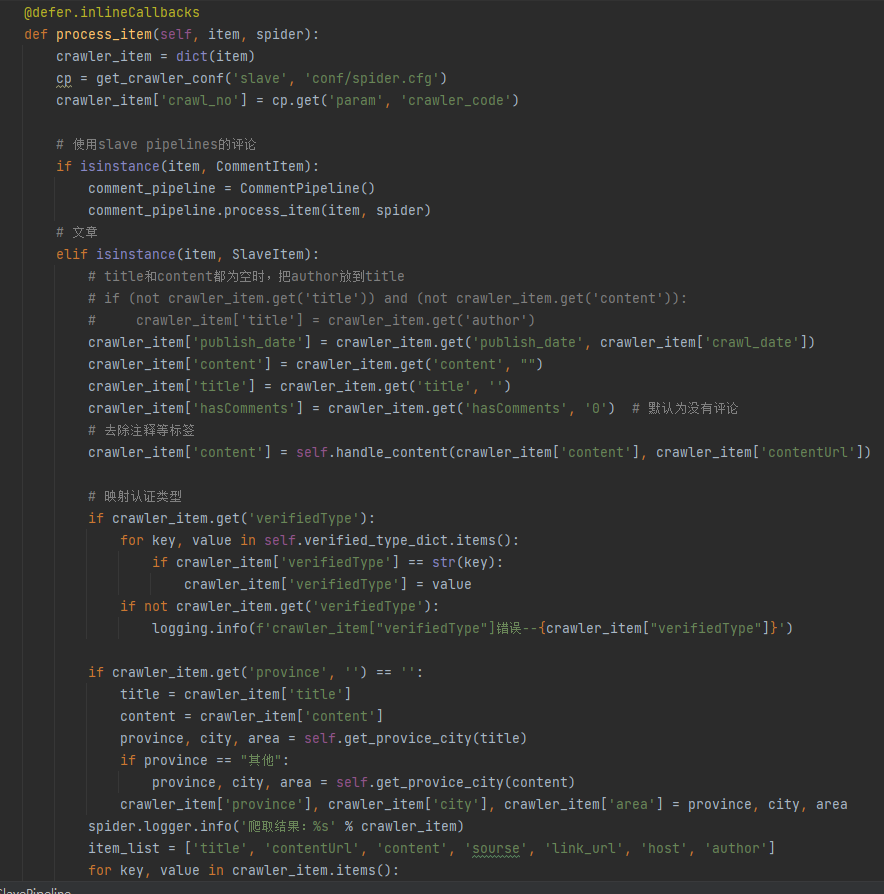

- 对数据进行特殊字符处理和编码
  - 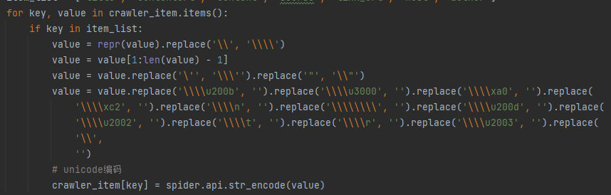
- 通过`kafka`发送数据
  - 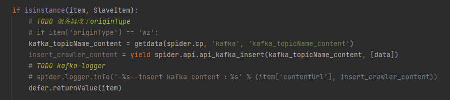

## 4. setting.py

`setting.py`对整体框架的配置，对于单个爬虫的配置可以使用`lib`文件夹下的`customSettings.py`

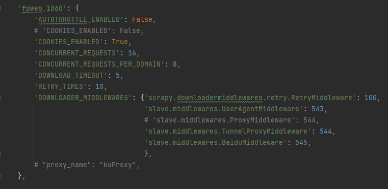


## 5.`conf`文件夹

`spider.cfg`文件

- redis 配置
  
- 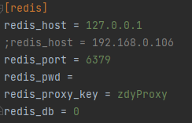
  
- 配置kfk请求地址：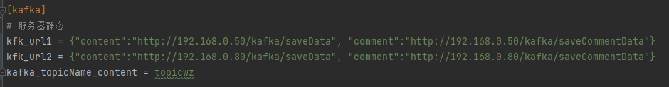
  - kfk备用地址具体实现：
  - 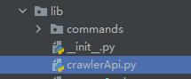
  - 配置具体地址url
  - 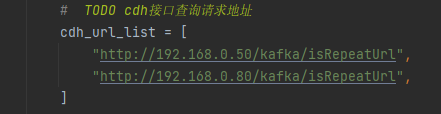
  - 备用地址请求实现（如果第一个地址不可用，则请求下一个地址）：
  - 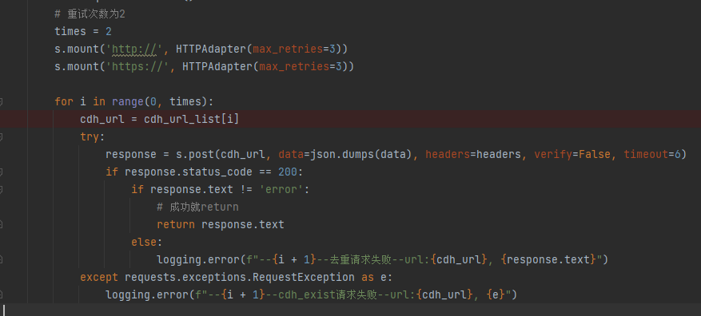
  - kfk备用请求：
  - 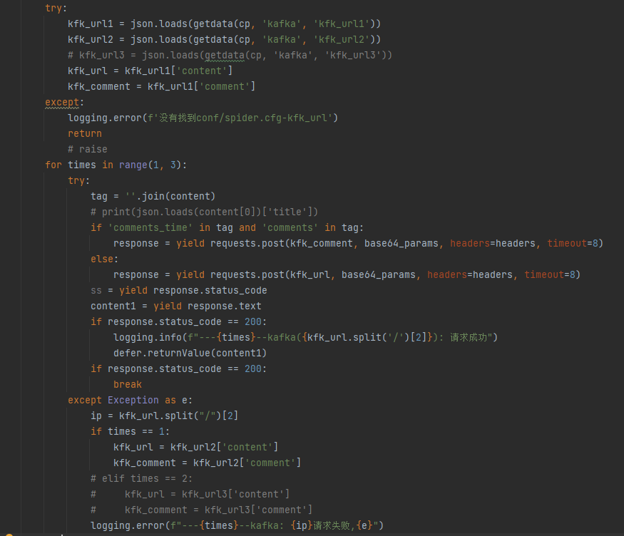

- 当前需要运行的爬配置，爬虫编号node编号等
  
- 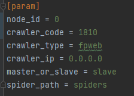
  
- 配置采集信源信息 ，配置爬虫配置，爬虫文件名，是否开启代理，时间过滤天数，是否使用cdh去重等

  - 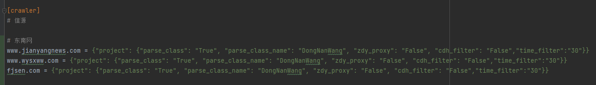

  - 一个爬虫文件 可以对应多个域名，上图一个文件对应了三个不同的域名

  - `parse_class_name` 为爬虫文件名字（也就是parse文件夹下对应的爬虫文件名） 

  - `zdy_proxy` True 表示使用代理，False不使用 

  - `cdh_filter` True 表示使用 kafka 接口去重，False 不使用 

  - 注意：域名需要与你添加的爬虫的种子链接的域名一致

  - 每新创建一个爬虫文件，对应一条或多条配置信息 

  - 例：

  - ```py
    http://news.fjsen.com/node_163753.htm
    http://taihai.fjsen.com/tw_politics.htm
    http://www.jianyangnews.com/node_159259.htm
    http://www.wysxww.com/node_173.htm
    ```


## 6. `parse`文件夹

爬虫存放目录

- 爬虫文件：
  - 例:百度新闻，BBC，参考消息，大公网等等
  - 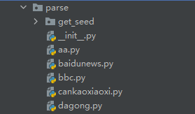


- 评论文件名格式: `网站名_comment.py`，comment用于识别是否为评论
  -  


## 7. `redis_func文件夹`

- 种子文件存放地方，名字格式为`add_prifile_爬虫文件名.py`
- add_prifile不能打错，否则linux自动加种子的shell脚本可能识别不了是加种子的文件
- 运行的地方需要加一个限制，例如
  - 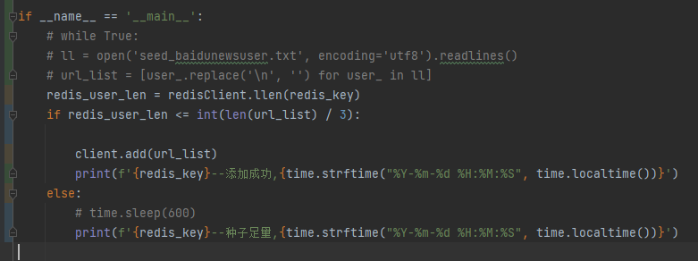
- 也可用一个固定的数字
  - 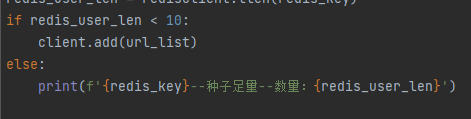


## 8. `logs`文件夹

- 爬虫日志存放地方

- 文件名格式和`conf`文件夹下的`spider.cfg`相关联：

- 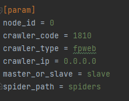
- 格式为： `master_or_slave 加 _ 加 node_id 加 当天日期`
- 例：`slave_0.log.2021-09-07 16`


## `9. Rotate文件夹`

- 用于通过百度的旋转图片验证


## `10.spiders文件夹`

- `spider.py` 封装整体爬虫运行逻辑，如下
  - 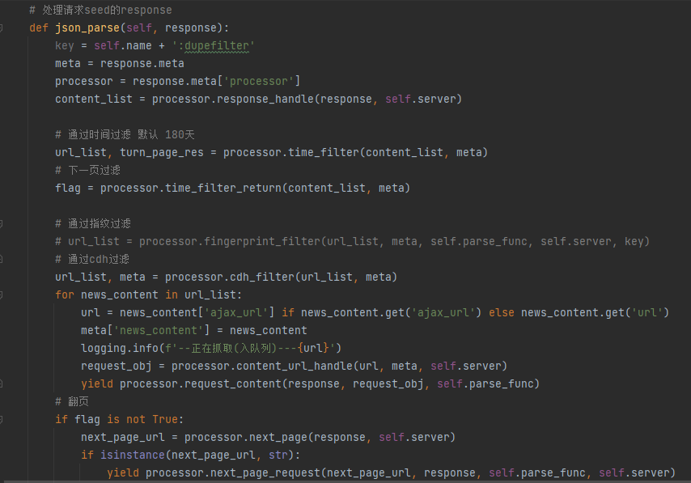
  - 时间过滤，默认180天
  - 指纹过滤，使用文章链接进行去重（指纹存在redis中），配置是否开启指纹过滤在parse文件中，
  - 例： `dont_filter` : 是否开启指纹过滤，默认为不开启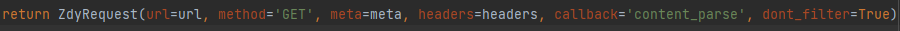
  - `cdh`过滤，通过调用`kafka`的接口实现去重，判断文章链接是否存在和是否需要重复抓取
  - `kafka`接口配置和实现在`lib`文件夹下的 `crawlerApi.py`的 `api_cdh_exist`函数中


## `11.lib`文件夹

- `commands` 创建模板使用的文件
- `crawlerApi` 封装一些调用接口，如： `kafka` 去重接口， `kafka` 存储接口
- `customSettings`  自定义配置文件，如下图，配置并发请求数
- `DateTimeFormat` 封装对于任何格式的时间处理（例：三天前，时间戳等转换为正常时间格式）
- `loaders` 封装一些小功能（例：对表情数据进行转换）
- `log` 配置日志文件
- `spiders_param` 封装对代理处理的方法
- `tools` 封装时间处理方法
- `useragent` 设置请求头 

- `utils` 读取爬虫配置文件，并处理（文件为 `conf` 文件夹下） 


# 使用例子

### 1. 创建一个新爬虫文件

- 进入`slave\slave`目录下
- 执行命令 `scrapy genparse JinRiTouTiao wz parse`
- `JinRiTouTiao` 为爬虫名称， `wz` 为网站缩写， `parse` 代表创建到某目录下
- 创建成功如下图：

- 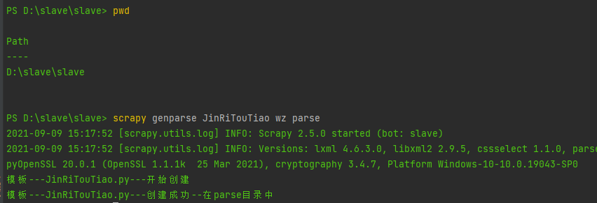

- parse 文件夹下就多了一个爬虫文件

### 2.新增一条配置信息

- 写到`conf`文件夹下的`spider.cfg`下面

- ```python
  toutiao.com = {"project": {"parse_class": "True", "parse_class_name": "JinRiTouTiao", "zdy_proxy": "True", "cdh_filter": "False", "time_filter": "30"}}
  ```

- 种子：https://www.toutiao.com/api/pc/list/feed?category=pc_profile_article&token=MS4wLjABAAAAaUhxLC10yf766zvPm3RSYweRiaom2ui_ZccXzB1r4vo&max_behot_time=1630138098654
- 域名： toutiao.com

### 3. 修改配置

- node_id 和crawler_code一致
  - 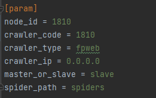


### 4. 爬虫文件解析：

- 种子解析函数，用处理从 `redis` 读取的种子，处理成自己需要的格式，以列表形式返回 

  - 可以使用此方法重新构造种子
  - 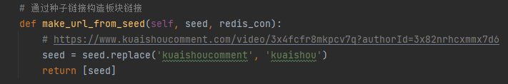

- 种子 `url` 请求，也就是第一步请求，获取板块下面新闻链接 

  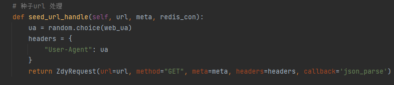

  - `callback` 回调函数，具体调用，查看 `spider.py` 文件 

- `response_handle`处理第一步请求响应的结果，解析出板块下新闻链接

  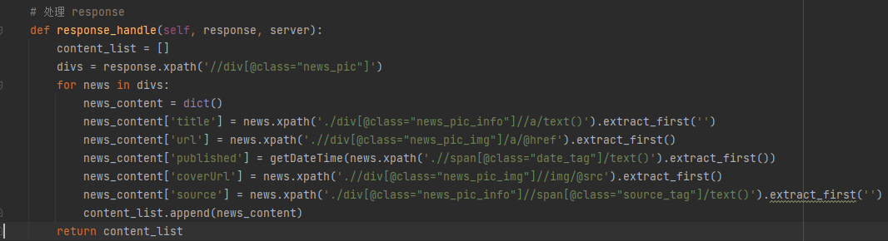

  - url 为文章链接，用来去重 
  - published 为文章的发时间， 用于时间过滤
  - **注意：**调用 `getDateTime` 对时间进行处理，转换为常规时间格式（ 2021-05-26 10:51:57 ） 

- 详情页请求， 就是对`response_handle`函数获取到的文章的`url`进行请求

  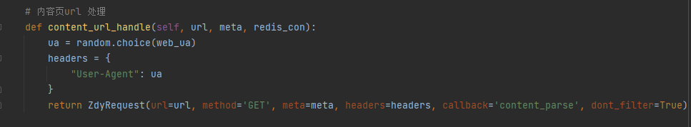

- 如果有下一页，则需要对下一页函数进行编辑，在`next_page`函数中构造好下一页链接并返回

  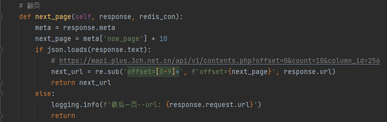

- 请求下一页

  - 下一页的请求函数，`headers`等的处理，调用`json_parse`函数

  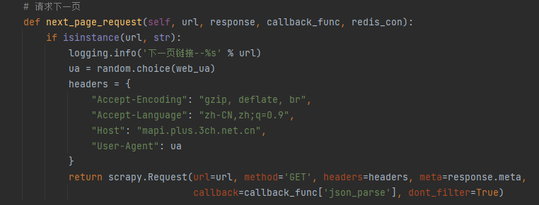

- 详情页内容解析，提取存储入库 

- 对需要提取的字段，依次添加即可 `loader.add_value(key, value)`

  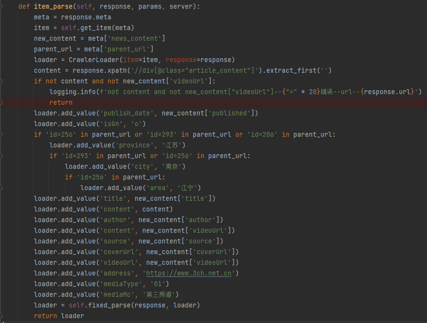


### 5. 执行命令运行爬虫

- cmd执行 `scrapy crawl fpweb_1810`,  1810  为你的爬虫文件的编号,  也可执行`run`文件

- 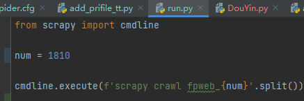

- 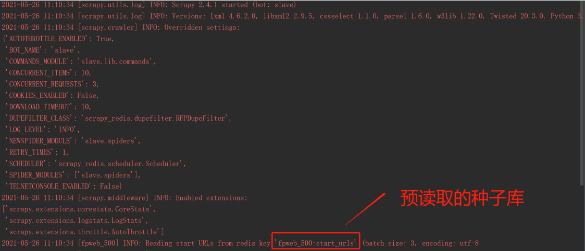

- 上述打印一些配置信息，以及爬虫编号，种子库，并发数等等 
- 添加种子 运行文件 `add_prifile_爬虫名.py`（线上需要独立程序，不断往种子库中添加种子） 

- 种子添加成功后，可以看到如下图： 

  - 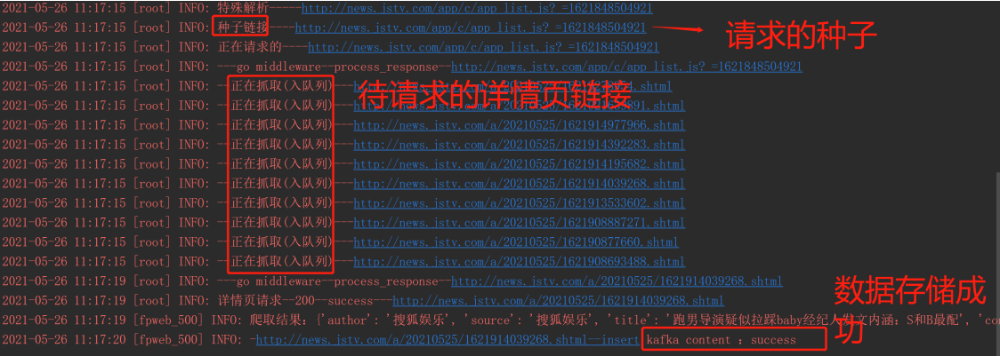

  - 去重效果，如下图： 

    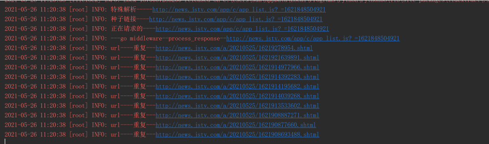

  - 当没有可消耗的种子后，爬虫程序处于等待中...， 如下图： 

    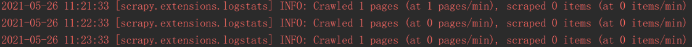


# END