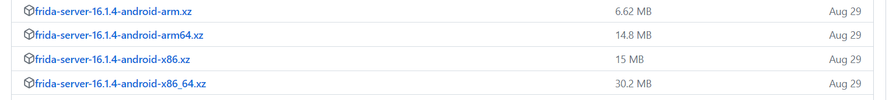

[TOC]


# 工具介绍

> 反编译工具都需要 jre，可以选择直接安装jdk(内置了jre)


## [JADX](https://github.com/skylot/jadx)

将apk包或者 dex 文件反编译成java代码


## JEB


## GDA


# Hook

## [frida](https://github.com/frida/frida)

> hook 框架，使用python+js代码


### 安装：

- PC: frida

  ```
  pip install frida-16.1.4 frida-tools-12.3.0
  ```

- phone: frida-server [16.1.4](https://github.com/frida/frida/releases/tag/16.1.4)（pc和phone的frida版本需要一致）

  查看系统架构类型：`adb [-s device_name] shell getprop ro.product.cpu.abi`

  
  
  ```shell
  # 解压后传到手机里
  adb push .\frida-server-16.1.4-android-arm64 /data/local/tmp
  # 修改为可执行权限
  adb shell chmod +x /data/local/tmp/frida-server-16.1.4-android-arm64
  ```


### 使用：

- phone

  启动frida

  ```
  adb shell
  su -
  cd /data/local/tmp
  ./frida-server-16.1.4-android-arm64
  ```

- PC

  把电脑端frida的请求转发到手机上

  ```
  adb forward tcp:27042 tcp:27042
  adb forward tcp:27043 tcp:27043
  ```


### 编写Hook脚本

```python
import frida
import sys

# 远程adb连接手机
rdev = frida.get_remote_device()

# Hook手机上的apk
session = rdev.attach('com.ss.android.ugc.aweme')

scr = """
Java.perform(function(){
    // 设置Hook的类名
    var UploadContactsApi = Java.use("com.ss.android.ugc.aweme.contact.api.UploadContactsApi")

    // Hook 替换类名的某一个方法，  implementation 是固定的
    UploadContactsApi.UploadContactsService.implementation = function(arg1, arg2){
        console.log(arg1, arg2);
        //执行原来的方法
        this.UploadContactsService();
        console.log(666);
    }

});
"""


def on_message(message, data):
    print(message, data)


if __name__ == '__main__':
    # 注入
    scrpit = session.create_script(scr)
    scrpit.on('message', on_message)
    # 加载替换注入的代码
    scrpit.load()
    # 等待接收输入
    sys.stdin.read()
```


