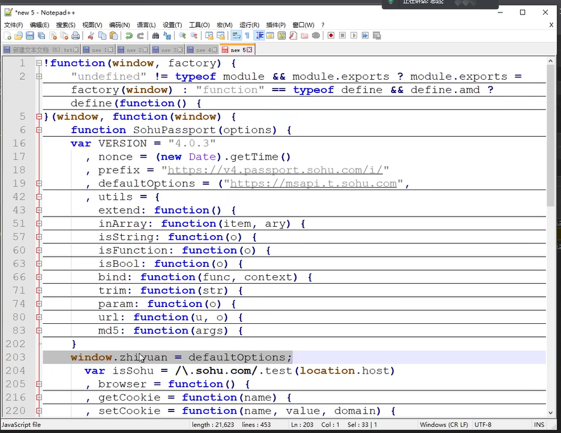
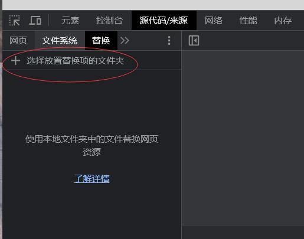
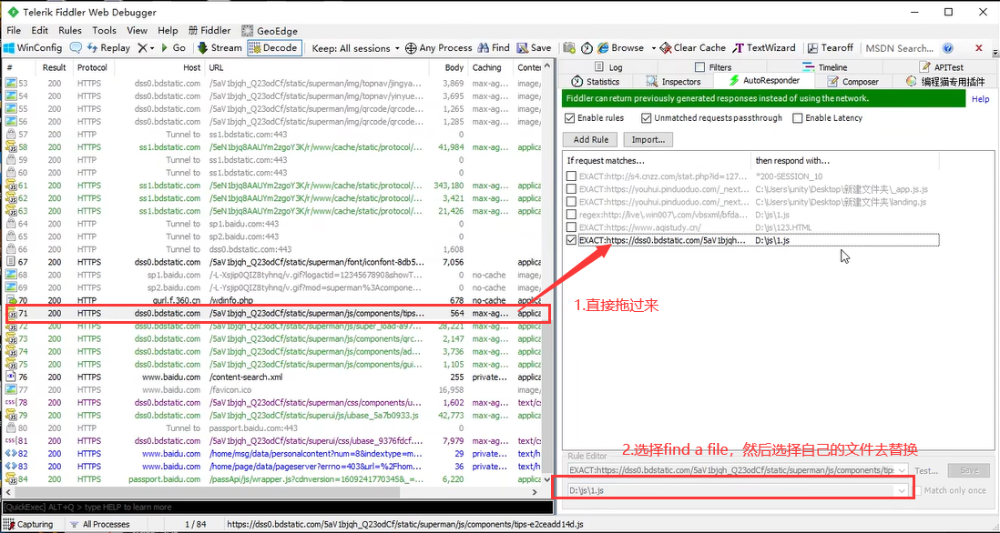

[TOC]

1. 调试

   搜索相关字段或者加密固定的标识符

   XHR调试

2. 扣取js

3. 改写js

4. 本地运行出值


## 加密方式

​	**取盐效验，不可逆：**

- MD5、MD2、MD4、hmac（带密码的MD5）

  - 长度一般为16位、32位

  - 123456的MD5：

    ​               	   49ba59abbe56e057

  ​			e10adc3949ba59abbe56e057f20f883e

  - MD5关键词：123456789

- sha1、sha256、sha512

  - 40位、64位、128位

  - 123456的sha

    7c4a8d09ca3762af61e59520943dc26494f8941b


**对称加密：**

- AES
- DES
- 3DES

**非对称加密：**

RSA（公钥、私钥），同一个明文可以生成不同的密文


插桩，全局导出变量




## 反调试基础

1. 检测是否在调试

   1. 键盘监听（F12）
   2. 检测浏览器内外的高度差值
   3. 检测开发者人员的工具变量是否为 true
   4. 利用console
   5. 利用代码时间差，时间差太大说明被调试（插装）
   6. 利用toString方法，在使用开发者工具时，显示的变量的实际值都是用了toString方法，来展示的
   7. 检测栈的层数 caller
   8. 检测是否为非浏览器环境

2. 显性检测

   - deggbuer语句

     - 非虚拟机检测

       - 可以把debugger语句右键设置为false

       - 直接替换代码

         

         - 可以使用直接编辑文件替换，或者浏览器插件替换，或者油猴插件

         - 代理替换（Fiddler），浏览器设置代理为Fiddler

           

     - 虚拟机方式检测（eval  Function）函数

       - 可以通过hook方式去反调

         ```js
         // 先暂时保存原来的变量，然后再hook
         var aaa = Function.prototype.constructor
         
         Function.prototype.constructor = function(x){
             if (x!='debugger'){  // 如果不是 debugger 就返回正常的逻辑函数
                 return aaa(x);
             }
             return function(){};  // 如果是 debugger 就执行空函数
         }
         ```

         

     - 一般的debugger有以下方式：死循环 `while (true)、 while (1) 、while (!false)`、for循环 `for(;;)`、无限递归、两个方法互相调用、计时器（）

3.  隐性（暗装）

   判断是否在调试，如果在调试就把你引向错误 的逻辑

 

## AST


### babel

> 官网： https://www.babeljs.cn/docs/
>
> 文档：https://github.com/jamiebuilds/babel-handbook/blob/master/translations/zh-Hans/README.md


#### 安装

```shell
# -g:全局安装    --save-dev：安装到本地调试环境
npm install --save-dev @babel/core @babel/cli @babel/preset-env
```


example

```javascript
//将JS源码转换成语法树
var parser = require("@babel/parser");
//为parser提供模板引擎
var cemplate = require("@babel/template").default;
//词历AST
var traverse = require("@babel/traverse").default;
//操作节点，比如判断节点类型,生成新的节点等
var t = require("@babel/types");

//可以直接用type同明—段新的代码//将语法树转换为源代码
var generator = require("@babel/generator").default;

var fs = require("fs");

var jscode = fs.readFileSync("read.js", {
    encoding: "utf-8"
});

console.log(jscode)

var ast = parser.parse(jscode);

var traverses = {
    VariableDeclarator(path){
        path.node.init = t.stringLiteral("重新赋值")
    }
}

// ast重新赋值
traverse(ast, traverses)

// 从ast生成源代码
var new_code = generator(ast);


console.log(new_code.code)
```


## RPC通信

> 通过在浏览器中创建websocket对象，使用websocket通信调用加密函数
>
> 在调用加密函数地方的上面插入下面的代码即可
>
> 优点：不用扣 js、补环境，适用于复杂的js逆向代码或者混淆代码
>
> 缺点：需要一个win电脑，开一个浏览器环境和websocket进程

```javascript

!(function){
    window.enc = e;
    
    var ws = new Websocket("ws://127.0.0.1:9999") // websocket服务端的地址
    ws.onopen = function(evt){
        
    };
    ws.onmessage = function(){
        ws.send(window.enc.RSA.encrypt(evt.data));  // 调用加密函数，发送接收到的加密后的数据
    };
}()

```


## 补环境

