- 逻辑运算符

  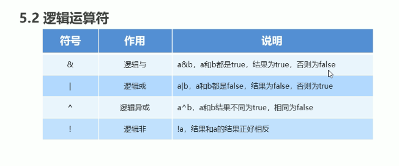

- 短路逻辑运算符

  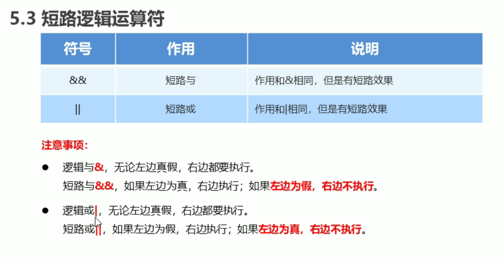

- 三元运算符

  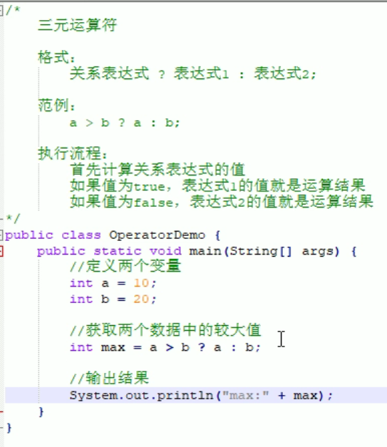

- if语句

  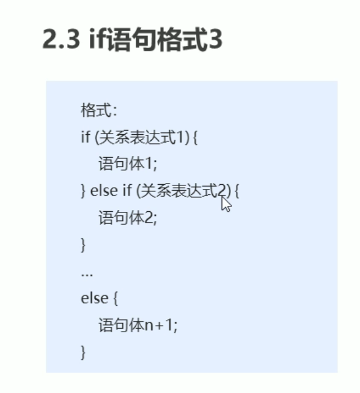

- case语句

  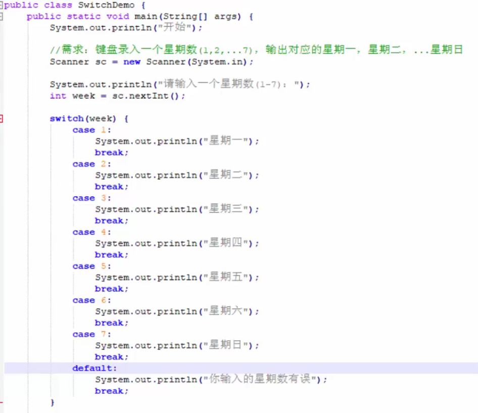

## 黑马--理论

### 类型转换

#### 自动类型转换

- 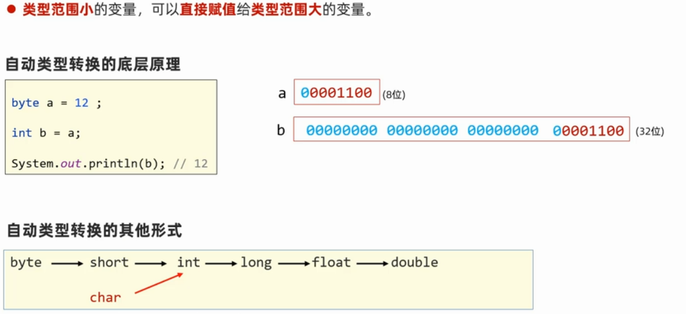

#### 强制类型转换

- 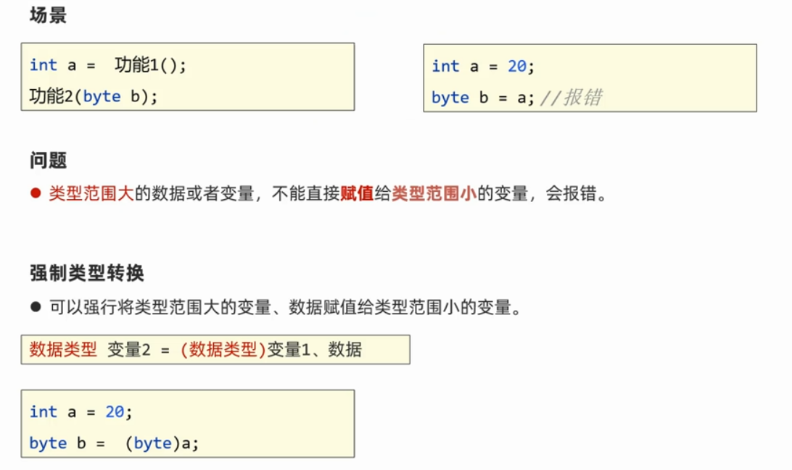
- 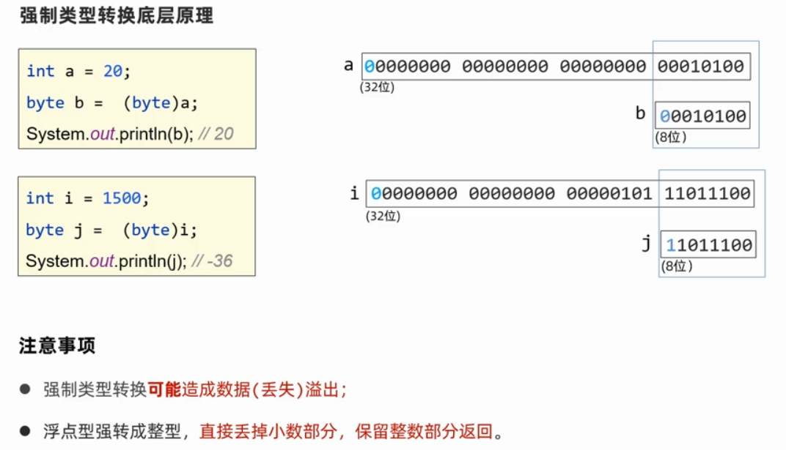

### `==`和`.equals()`

- `==`是比较栈里的， `.eqals()`是比较堆里的，是比较的字符串等等

### 内存分配(堆栈)

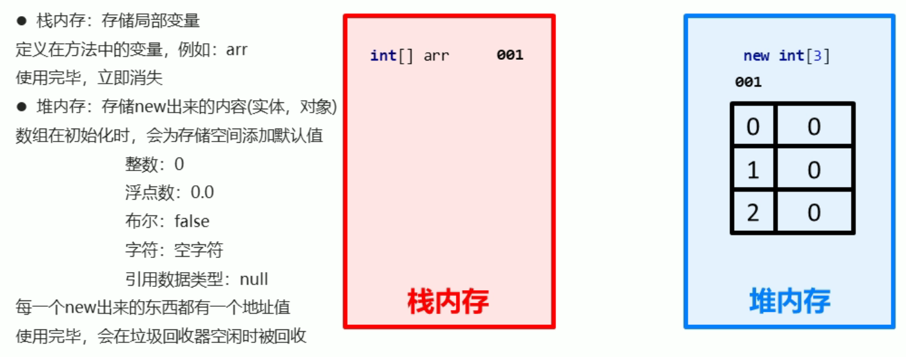

多个数组指向相同

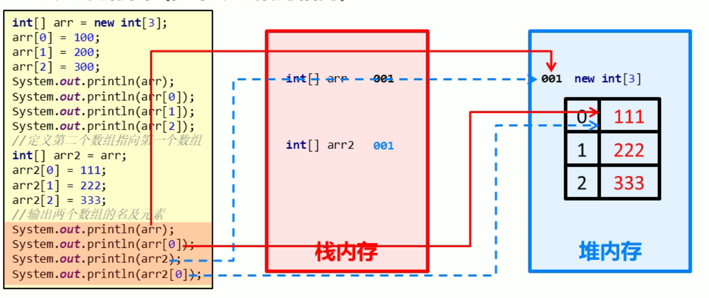

### 形参、实参

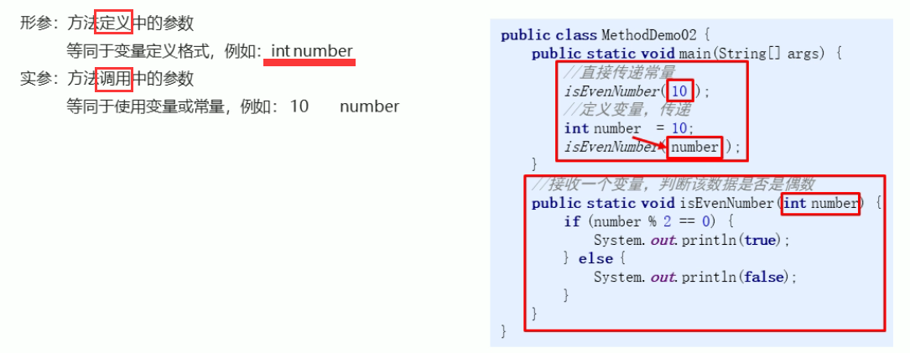

### 带返回值的函数

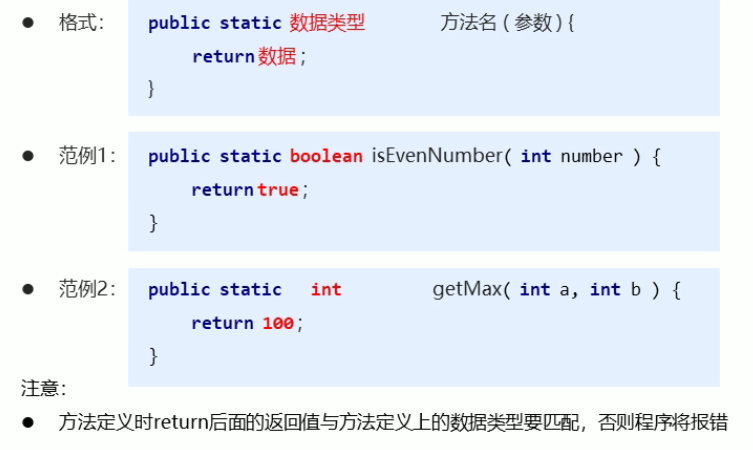

- return的数据类型一定要和定义此方法的数据类型一致

### 方法注意事项

- 方法不能嵌套定义
- void表示无返回值，可以省略return，也可以单独写一个return，后面不加数据

### 方法重载

方法重载指同一个类中的多个方法之间的关系，需满足下列条件

- 多个方法在同一类中
- 多个方法具有相同的方法名
- 多个方法的参数不相同，类型不同或者数量不同

特点：

- 重载仅对应方法的定义，与方法的调用无关，调用方式参照标准格式
- 重载仅针对用一个类中方法的名称与参数进行识别，与返回值无关，换句话说就是不能通过返回值来判断两个方法是否互相构成重载

