[TOC]

## VMware vSphere5.0 高级特性

1. **第六章  虚拟机迁移**`vMotion`

2. **第七章  分布式资源调配**`VMware Distributed Resource Scheduler（VDRS）`

## ADSERVER1

启动主机时要先启动ADServer1，然后启动vCenterServer1，vCenterServer1的一些服务是基于ADServer1的服务的

### 安装Active Directory服务

- 服务器管理器-->角色-->添加角色-->选择Active Directory服务-->下一步-->安装-->启动图中蓝字

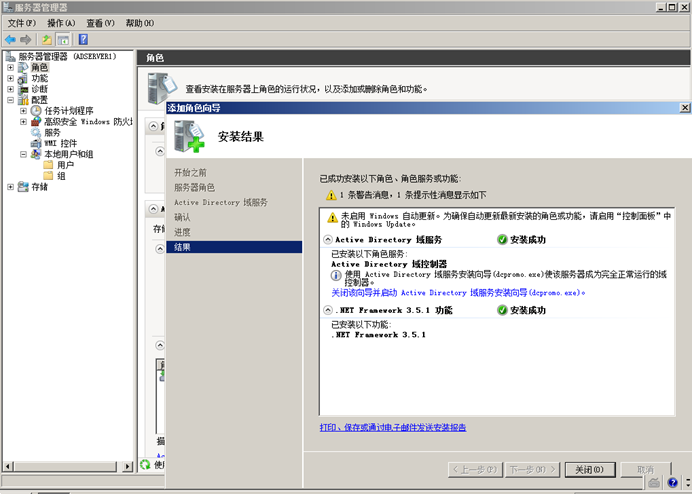

- 使用高级模式安装-->在新林中新建域-->目录林根级域的FQDN（域名）-->

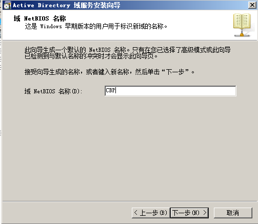

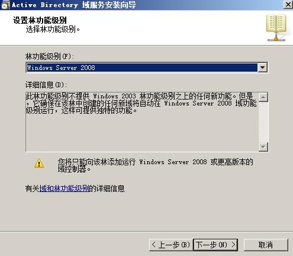

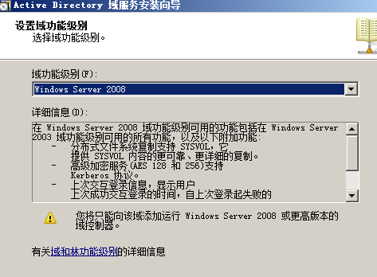

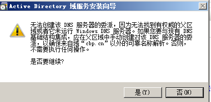点是

稍后创建DNS服务器

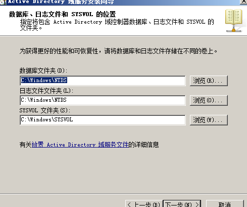默认文件夹

然后下一步-->然后确认重启

 

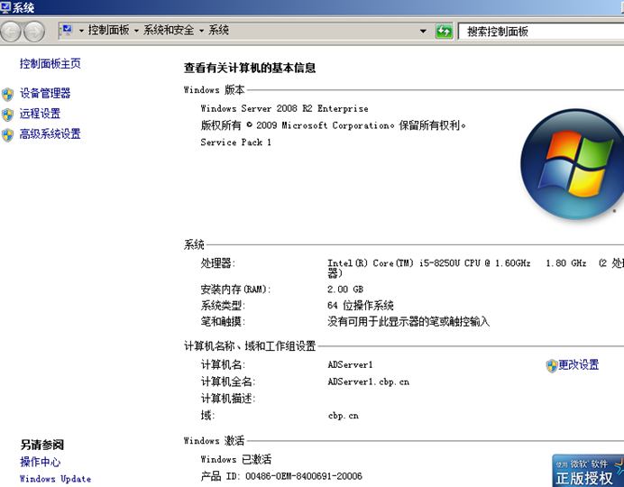

计算机全名，看是否该变，成功

 

### 创建反向查找区域

开始-->管理工具-->DNS

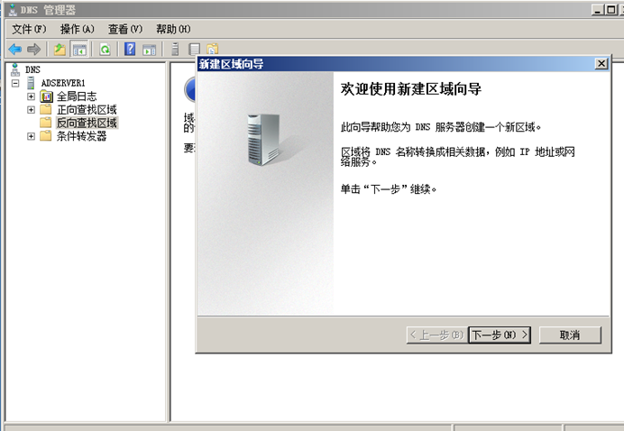

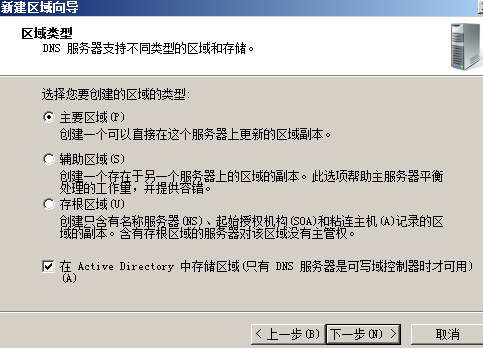

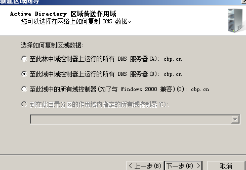

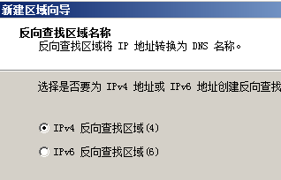

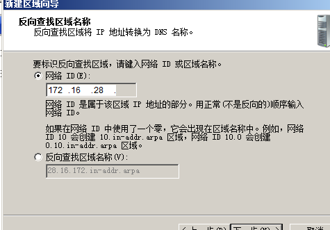

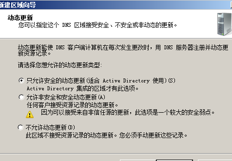完成

### 新建指针

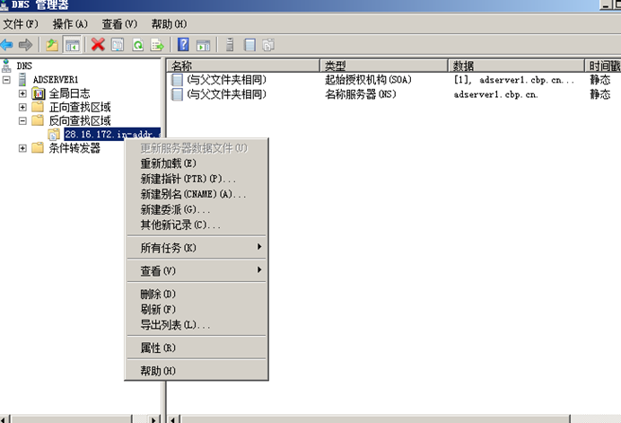

 

主机名点浏览      ADSERVER1-->正向查找-->cbp.cn-->adserver1-->确定

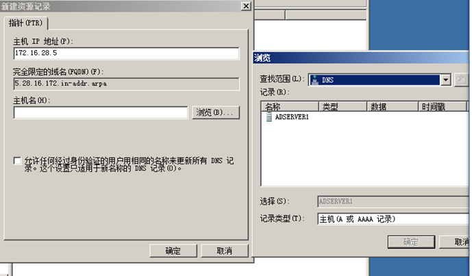

 

### 创建反向查找区域

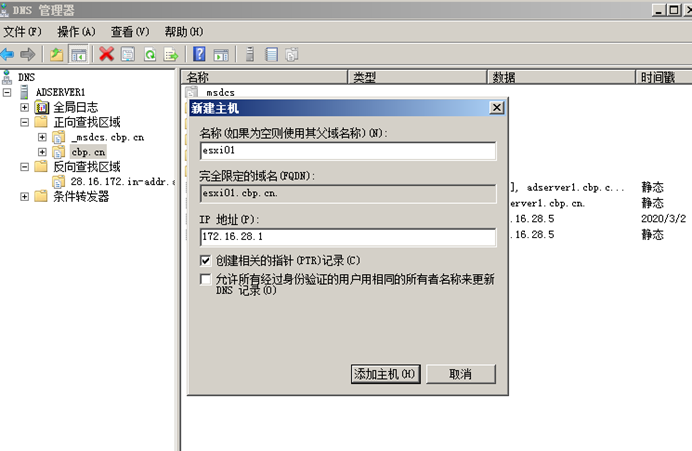

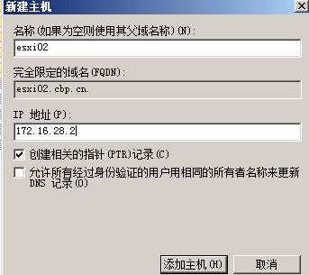

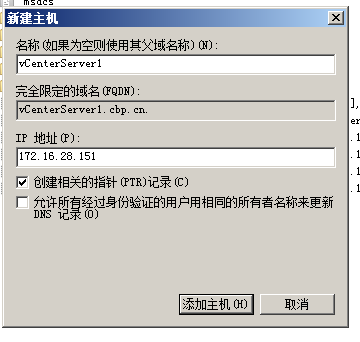

 

## vCenterServer1

验证是否成功

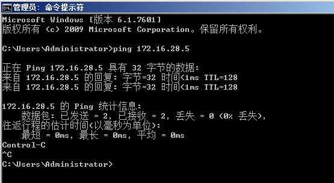

设置DNS地址为172.16.28.5

 

查看当前DNS服务器（验证操作）

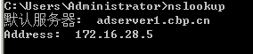

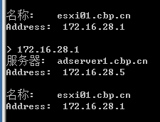

 

把vCenterServer1加入到域中（才能对其他的主机进行管理）

计算机属性à更改名称

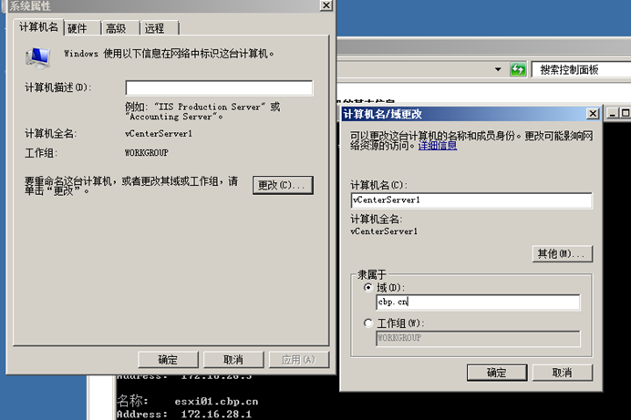

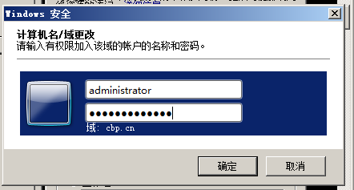

确认立即重新启动

 

添加iso镜像文件

VMware-VIMSetup-all-5.0.0-456005.iso

打开计算机à打开下面这个

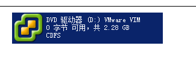

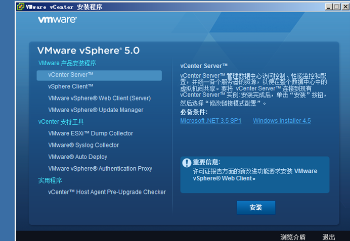

安装

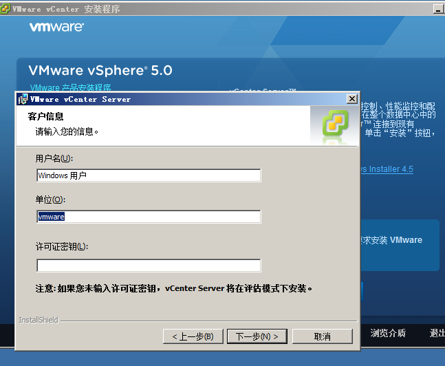

一直下一步到完成安装，如果安装失败就重新安装试下，或者重启然后重新安装

 

## VMware client

连接172.16.28.151，添加数据中心和主机（esxi1和esxi2的地址）

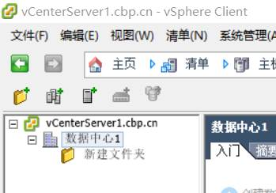

## 6. 迁移虚拟机(vMotion)理论

### 01 虚拟机迁移类型

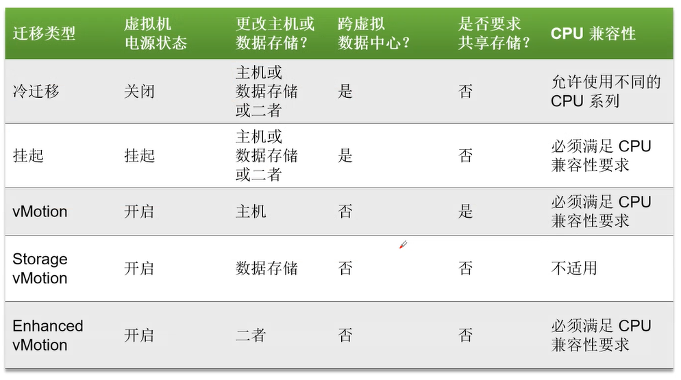

### 02 实时迁移的原理

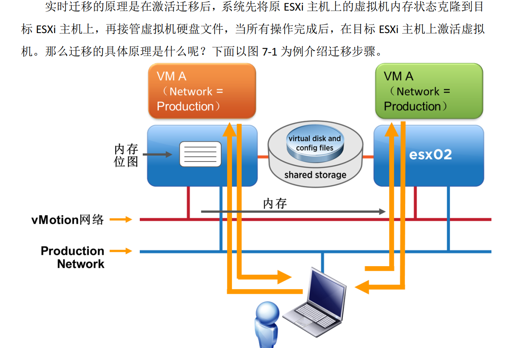

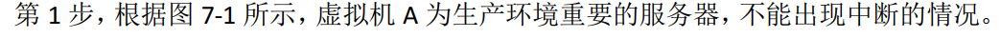

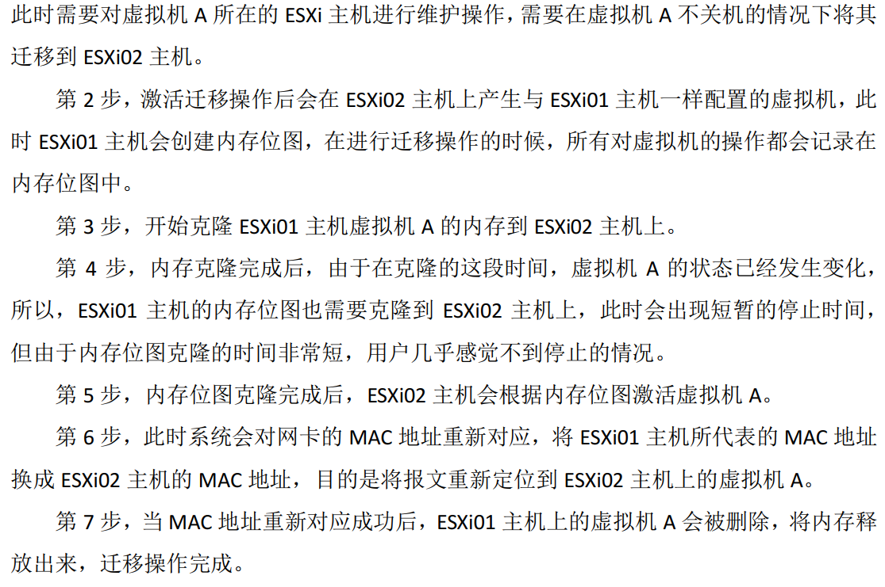

### 03 实时迁移对虚拟机的要求

>  在 vSphere 虚拟化环境中，对要实施迁移的虚拟机也存在一定的要求。

-  虚拟机所有文件必须存放在共享存储上。
- 虚拟机不能与装载了本地映像的虚拟设备（如 CD-ROM、 USB、串口等）连接。
-  虚拟机不能与没有连接上外部网络的虚拟交换机连接。
- 虚拟机不能配置 CPU 关联性。
- 如果虚拟机使用 RDM，目标主机必须能够访问 RDM。
- 如果目标主机无法访问虚拟机的交换文件， vMotion 必须能够创建一个使用目标
  主机可以访问的交换文件，然后才能开始迁移。 

### 04 实时迁移对 ESX 主机的要求 

>  ESXi 主机的硬件配置对 vMotion 同样重要，其标准如下

- 源主机和目标主机的 CPU 功能集必须兼容，可以使用增强型 vMotion 兼容性（EVC）
  或隐藏某些功能。
- 至少 1 张千兆以太网卡。 1 张千兆以太网卡可以同时进行 4 个并发的迁移， 1 张
  万兆以太网卡可以同时进行 8 个并发的迁移。
- 对相同物理网络的访问权限。
- 能够看到虚拟机使用的所有存储，每个VMFS数据存储可以同时进行128个迁移。 

### 05 实时迁移对 CPU 的限制 

在不同ESXi主机之间进行迁移操作时，对于CPU来说存在很多的限制

| CPU 特性                                  | 是否要求完全匹配                          | 原因                           |
| ----------------------------------------- | ----------------------------------------- | ------------------------------ |
| 时钟频率、缓存大小、 核心数量、超线程支持 | 否                                        | 由 VMkernel 虚拟化             |
| 制造商以及产品系列                        | 是                                        | 指令集存在许多区别             |
| 指令集                                    | 是                                        | 应用程序可以直接使用多媒体指令 |
| 虚拟化硬件辅助                            | 32 位虚拟机：否                           | 由 Vmkernel 虚拟化             |
| Intel 64 位虚拟机：是                     | VMware 在 Intel 64 位平台上利用了 VT 技术 |                                |
| 执行—禁用（NX/XD 位）                     | 是（自定义）                              | 操作系统依赖于 NX/XD 位        |

## 6.1 迁移虚拟机操作

>  实时迁移时，建议使用专用的通信端口，因为迁移过程会占用大量的网络带宽，如果
> 迁移与 iSCSI 存储通信端口共用，会严重影响 iSCSI 存储的性能。

### 创建基于 `VMkernel`的迁移通信端口

1. 移除之前实验用的分布式交换机端口

   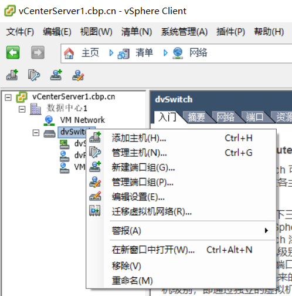

   >  显示正在使用，无法移除，解决方法是删除之前实验用的vmk1

   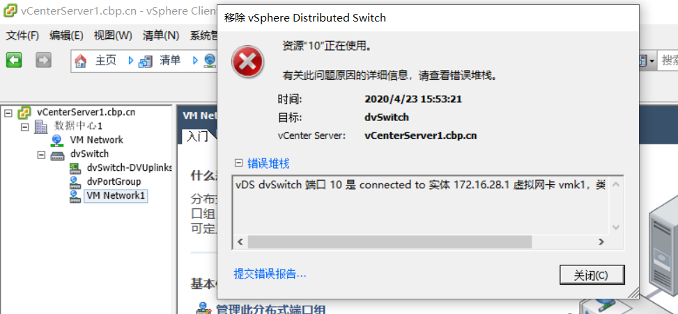

   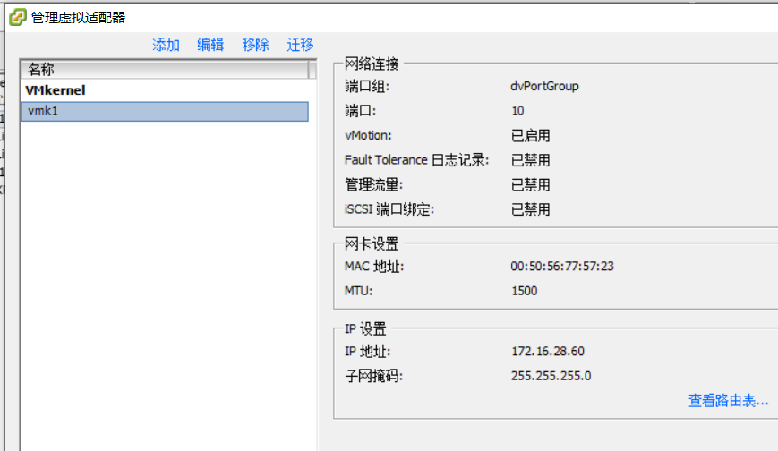

   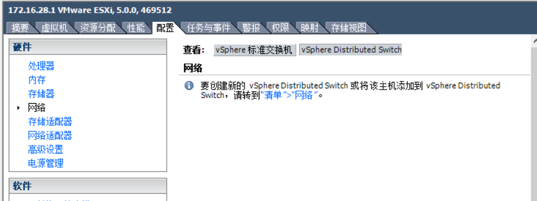

2. 释放`vmnic1`适配器

   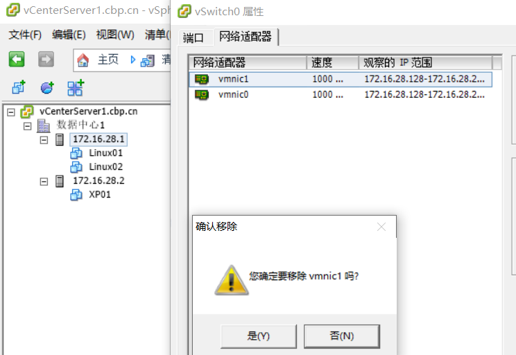

3. 创建`vMotion`和`iscsi`端口，给两台主机添加两个`VMKernel`网络如下图

   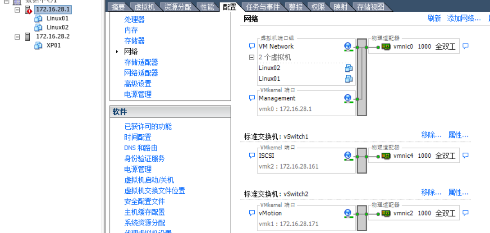

   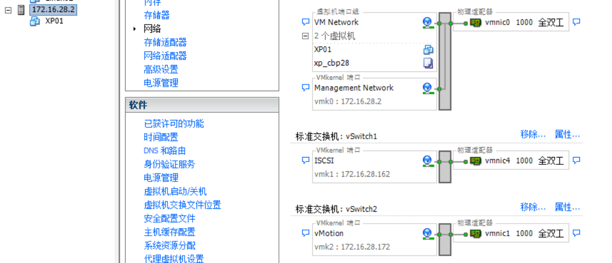

4. 此时的ISCSI端口还没绑定ISCSI存储适配器，需要绑定

   > 主机1，2都需要同样的操作

   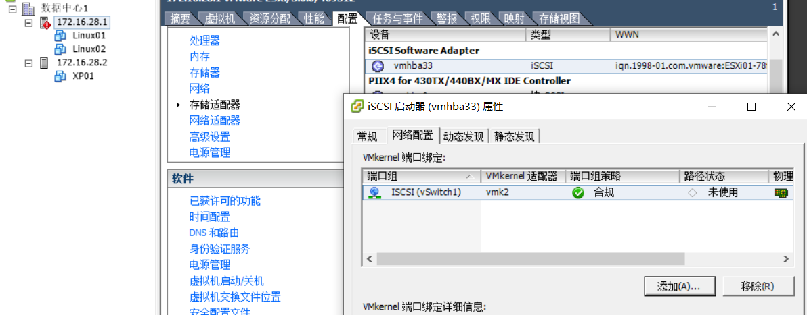

   ISCSI显示已启用

   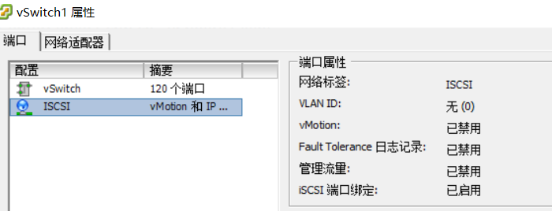

### 创建NFS(共享存储)存储和ISCSI(openfiler存储)存储

EXSI01和EXIS02由于之前已经创建过了，所以就不需要再次创建了

### 虚拟机关机下迁移主机和数据存储（冷迁移）

- Linux01-->迁移-->更改数据中心和存储-->选择EXSI02和存储位置ISCSI

### 虚拟机关机下迁移存储

- Linux01-->迁移-->更改数据存储-->选择`nfs`存储

### 虚拟机开机下迁移存储

- Linux01-->开机-->迁移-->更改数据存储-->选择`ISCSI`存储

## 7. 分布式资源调配DRS

### 创建群集

- 数据中心-->新建群集-->打开vSphere DRS-->手动、优先级3-->电源管理关闭(不支持)-->禁用EVC-->交换文件用相同目录

### 添加主机到群集

- 拖动主机到群集-->下一步-->完成

### 使用分布式资源调配DRS

> 前提：确定虚拟机要在外部存储里（NFS\ISCSI）**不能**在datastore里

- DRS规则：群集-->编辑设置-->规则-->添加规则

## 8. 虚拟资源池

## 9. 高可用性HA

### 简介

> ​    **High Availability**即高可用性 **实施成本和管理成本是相当高昂的。**
>
> ​    **vSphere**虚拟化架构提供的**HA**功能属于**低成本**的解决方案。**当某台ESXi**主机发生故障时，上面运行的虚拟机可以自动迁移到其他**ESXi**主机上进行重新启动，重新启动完成后继续提供服务，最大限度地保证重要的服务不中断。
>
> ​    **HA**也存在缺点，发生故障迁移时，HA存在一定的停机时间。

### 使用HA前提条件

- 集群
  - 主机ESXi01和主机ESXi02已经**加入到集群**cluster01中。
- 共享存储
  - 测试虚拟机的存储在共享存储中，在**共享存储NFS或iSCSI**中皆可。
- 网络配置
  - 各主机中已配置好**管理**网络(**双网卡**)、**存储**网络（ISCSI）和**迁移**(vMotion)网络。 
- 主机资源的计算
  - 计算各ESXi主机的资源，以满足虚拟机的自动迁移。
- VMware Tools的安装
  - 各测试虚拟机必须安装**VMware Tools**软件。
    - 打开虚拟机手动挂载
    - 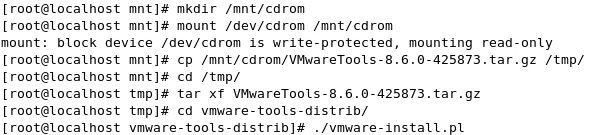

### 配置HA

- 集群-->编辑设置-->打开vSphere HA-->vSphere HA-->启用主机监控(网络维护之后)-->数据存储检测信号-->NFS、ISCSI

### 测试HA

- 虚拟机-->断开EXSI01的网卡-->查看虚拟机是否自动重新启动了

## 10. 双机热备FT

### Fault Tolermace简介 

> **vLockstep 技术**(虚拟锁步) 
>
> vSphere 虚拟化架构中的FT使用 vLockstep 技术来实现双机热备，其本质是**录制/播放**
> 功能，**2 台**ESXi 主机运行虚拟机，一主一从，主虚拟机做的**任何操作**都会立即通过录制播放的方式传递到从虚拟机。但由于录制播放操作，主/从虚拟机肯定会存在一定的时间差（基本可以忽略），这个时间差称之为 vLockstep Interval，其时间差取决于 ESXi 主机以及网络的整体性能。当主虚拟机所在的 **ESXi 主机发生故障时**，**从虚拟机立即接替工作**，**同时提升为主虚拟机**，接替的时间在**瞬间完成**，用户几乎感觉不到故障切换
>
> 应用服务**不会出现任何中断**，和HA 相比， FT 更具优势

### 使用FT的限制和要求

- **vSphereFT的要求和限制**
  - **确保有足够的** **ESXi** **主机用于托管容错虚拟机：**
    - 任何一台主机上的容错虚拟机（主虚拟机或辅助虚拟机）
       都不能超过四个
  - **在共享存储上存储** **ISO** **映像，以实现连续访问：**
    - 尤其要用于重要操作时
  - **禁用基于** **BIOS** **的电源管理：**
    - 防止辅助虚拟机的 CPU 资源不足

- Fault Tolerance 的**群集**要求

  - 主机证书检查功能已启用  

  - 至少有两台通过 FT 认证的主机运行相同的 Fault Tolerance 版本号或主机内部版本号

  - ESXi 主机可以访问相同的虚拟机数据存储和网络

  - 配置了 **Fault Tolerance 日志记录网络**和 **vMotion 网络(管理流量)**  

  - **vSphere HA 群集**已创建并启用

- Fault Tolerance 的**主机**要求
  - 主机上的处理器必须来自与 FT 兼容的处理器组。此外，强烈建议主机的处理器之间也相互兼容。  
  - 主机必须获得 Fault Tolerance 的许可。
  - 主机必须已通过 Fault Tolerance 认证。
  - 在配置每台主机时，都必须在 BIOS 中启用硬件虚拟化 (HV)。

- Fault Tolerance 的**虚拟机**要求
  - 没有不受支持的设备连接到虚拟机。  
  - 虚拟机必须存储在**虚拟 RDM** 或**厚置备的虚拟机磁盘 (VMDK)** 文件中。如果虚拟机存储在精简置备的 VMDK 文件中，则在尝试启用 Fault Tolerance 时将会出现一则指示必须转换 VMDK 文件的消息。要**执行该转换**，必须关**闭虚拟机电源**。
  - 不兼容的功能一定不能与容错虚拟机一起运行。

  - 虚拟机文件必须存储在**共享存储器**上。

  - 只有带有**单个 vCPU** 的虚拟机才能与 Fault Tolerance 功能兼容。

  - 虚拟机必须在一个受支持的**客户机操作系统**上运行。

- **Fault Tolerance不支持的 vSphere 功能**
  - **容错虚拟机不支持以下** **vSphere** **功能**：

    - **快照。**在虚拟机上启用 Fault Tolerance 前，必须移除或提交快照。此外，不能对已启用 Fault Tolerance 的虚拟机执行快照。

    - **Storage vMotion。**不能为已启用 Fault Tolerance 的虚拟机调用 Storage vMotion。要迁移存储器，应当先暂时关闭 Fault Tolerance，然后再执行 Storage vMotion 操作。在完成迁移之后，可以重新打开 Fault Tolerance。  

    - **链接克隆。**不能在为链接克隆的虚拟机上启用 Fault Tolerance，也不能从启用了 Fault Tolerance 的虚拟机创建链接克隆。

    - **虚拟机备份。**不能使用 Storage API for Data Protection、VMware Data Recovery 或需要使用虚拟机快照（如 ESXi 所执行的那样）的类似备份产品来备份启用了 FT 的虚拟机。要以这种方式备份容错虚拟机，首先必须禁用 FT，然后在执行备份后重新启用 FT。基于存储阵列的快照不影响 FT。

- **不与  Fault Tolerance 兼容的功能和设备以及纠正操作**

  | **不兼容的功能或设备**                                       | **纠正操作**                                                 |
  | :----------------------------------------------------------- | :----------------------------------------------------------- |
  | 对称多处理器   (SMP) 虚拟机                                  | 将虚拟机重新配置为单个 vCPU。配置为单   vCPU 后，许多工作负载均有较好的性能表现 |
  | 物理裸磁盘映射   (RDM)                                       | 请重新配置具有支持物理 RDM   的虚拟设备的虚拟机以使用虚拟 RDM |
  | 由物理或远程设备支持的 CD-ROM   或虚拟软盘设备               | 移除 CD-ROM   或虚拟软盘设备，或使用共享存储器上安装的 ISO 重新配置备用功能 |
  | USB 和声音设备                                               | 从虚拟机移除这些设备                                         |
  | 使用精简置备的存储器或未启用群集功能的厚置备磁盘备份的虚拟磁盘 | 当您打开 Fault   Tolerance 时，系统会默认执行到适当磁盘格式的转换。必须先关闭虚拟机电源，才能触发此转换 |
  | 热插拔设备                                                   | 容错虚拟机的热插拔功能将自动禁用。要热插拔设备（添加或移除），必须临时关闭   Fault Tolerance，完成热插拔操作，然后重新启用 Fault   Tolerance |
  | 串行或并行端口                                               | 从虚拟机移除这些设备                                         |
  | IPv6                                                         | 将 IPv4   地址与 FT 日志记录网卡配合使用                     |

[结合word文档配置FT   前提条件(word引用)：]: ./10_实训项目10+使用虚拟机双机热备.pdf

### 截图

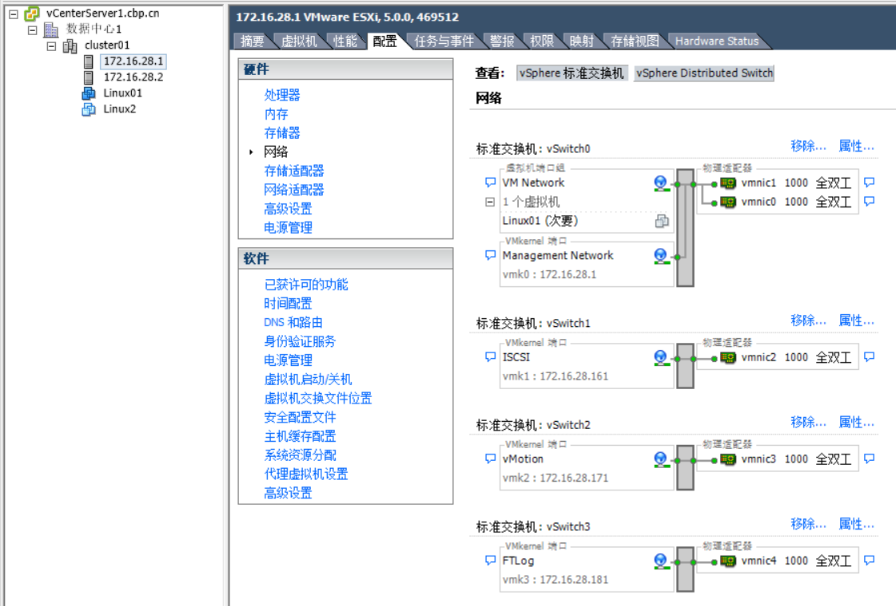

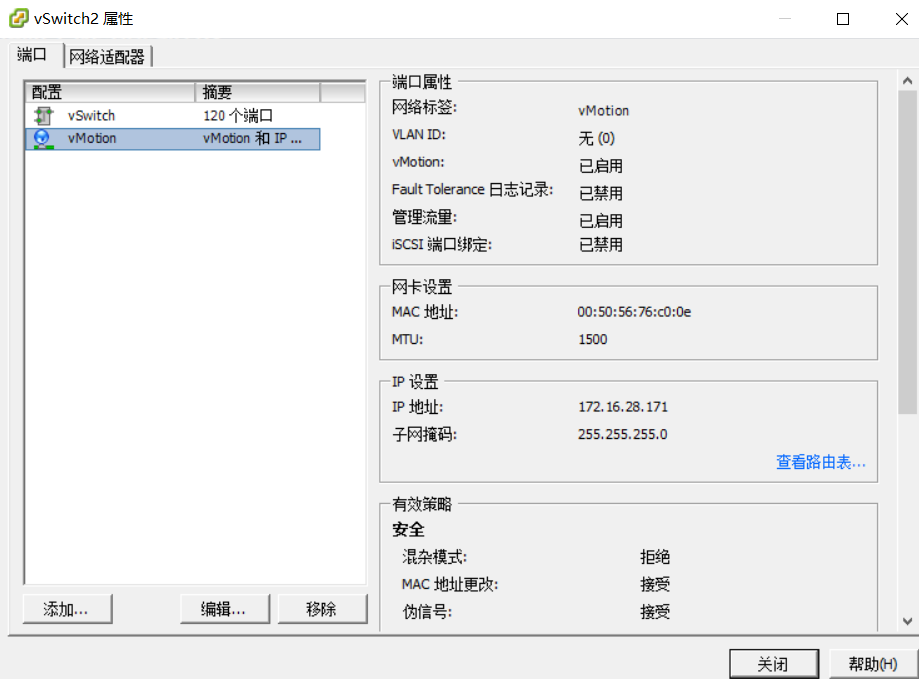

#### CPU不确定是否调整

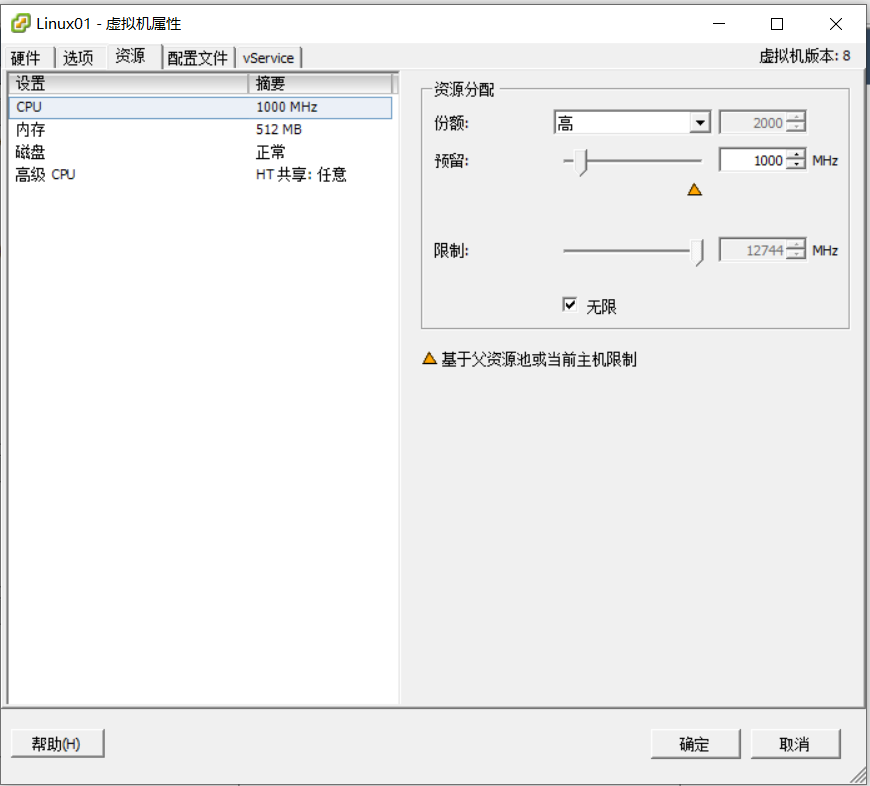